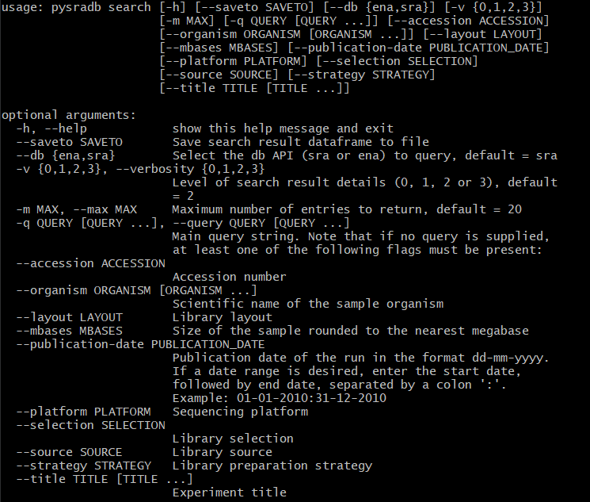

# Weekly Writeup for GSoC 2020

## Weeks 1 & 2 (1 June - 14 June)

---
&nbsp;
### What I have done:

I have completed implementing a basic search module which can query either
SRA or ENA (specifically for read runs, list of results IDs in figure 2)
APIs. The search feature currently supports the following arguments:

*Fig. 1: Arguments currently implemented for pysradb search*

&nbsp;

*Fig. 2: The list of results that can be queried from ENA*

&nbsp;

I have encapsulated the search feature in 3 classes: QuerySearch and its 2
subclasses, EnaSearch and SraSearch. The rationale for this organisation is
to abstract the implementation of querying APIs, while storing the query as
an object that can be referenced for the secondary search feature.

---
&nbsp;
### Questions/Thoughts:

1. Querying SRA and ENA are quite different in the following ways:

    - ENA does not have the equivalent of a [All Fields] category found in
    SRA. For my current implementation, if the user does not specify the
    category of their search query, the query will be matched to
    study_title or sample_title or experiment_title. I am not sure if this
    is the best implementation.

    - Getting search results from SRA requires 2 GET requests: an esearch
    request to retrieve the list of unique IDs, each corresponding to a
    sample run. An efetch request comprising these UIDs is then sent for
    the detailed search results. The results are in xml files, which I used
    ElementTree to convert to a pandas dataframe.

    - SRA and ENA queries yield a somewhat different set of data, and the
    same entry have a different set of fields/attributes returned at the
    highest verbosity. This leads on to the next question...

2. What fields/attributes should be provided for the user at different
verbosity levels? And in what order?

    I have saved the search results for the following two commands in the
    corresponding csv files:

    `pysradb search --saveto test.csv --db ena --platform illumina -v 1 Escherichia coli`

    [ENA output](./docs/GSoC/Week1/test_ena.csv)

    `pysradb search --saveto test.csv --db sra --platform illumina -v 1 Escherichia coli`

    [SRA output](./docs/GSoC/Week1/test_sra.csv)

    ENA has 123 fields for each entry and SRA has 86 as shown in the csv files.
    Personally I have not queried these databases before during my research.
    I will need to find out the importance of the information in each of these
    fields so that we can order the columns in order of importance, and determine
    what should be displayed in the output at different verbosity levels. This
    will also help me to determine which fields are important enough that
    we should specifically implement flags for them so that the user can fine-tune
    their search results.

3. Testing as well as other design considerations

    I am confused about how to properly test the search feature, as the output
     of the search feature depends on online databases, which are constantly
     updated. Can I also ask about some of the additional considerations for
     the search feature? for example should I implement limits on the number
     of API requests? Should I also implement a progress bar using tqdm for
     the search feature?

&nbsp;
---
&nbsp;
### What I will be working on:

Leftovers:

- Adding the required tests for the search feature

- Finalising the implementation of the verbosity of the program output

Week 3 targets:

- Enable saving search results as text, json or csv format

- Add fine-tune parameters for the search feature

---

## Week 3 (15 - 21 June)

---
&nbsp;
### What I have done:

I have finished implementing the search feature based on our discussions. in addition to the main query, I have also
included several flags that allows finetuning of the search query, as follows:

*Fig. 1: Arguments implemented for pysradb search*

&nbsp;

There are two main challenges this week:

- As I have pointed out last week, the queryable fields are somewhat different between ENA and SRA, most notably that ENA
does not have a [All Fields] category to query. Based on what I have managed to find out, the experiment_title field is
a good alternative to query from the ENA database, as it contains the information from several key fields: strategy,
source, organism, as well as a brief experimental design. In my program, I have also matched the user's main query to
ENA to the various accession numbers associated with each run.

- The second challenge lies in how to properly test the search module. As the search module is built to query databases,
the best way is probably to query SRA and ENA databases and match the retrieved search results against the expected
search result. However, this is somewhat difficult in practice, as the online databases are constantly being updated, and
so after rerunning the tests a day after writing it, the tests no longer pass. Therefore, I have fine-tuned the search query
 to only those that have been published between October, 2012 and January, 2013 (chosen arbitrarily). However, this is
 still not guaranteed to work, as the owners of the data on ENA and SRA have the ability to make modifications to them.

As such, I am planning to perform more developer tests, as well as to include more unit tests to ensure that the
search feature is working as expected.

## Week 4 (22 - 28 June)

---
&nbsp;
### What I have done:

I have performed some system and acceptance testing of the search feature. In this process, I have also made some edits
to the search feature to resolve some issues / bugs that has surfaced.

I have also written unit tests for the search feature, ensuring that the components are working as expected and also
setting up for regression testing for future iterations of the search feature. Overall, the search feature has a test
coverage of about 70%.

I have also created a [notebook](https://github.com/bscrow/pysradb/blob/basic-search-feature/notebooks/07.query_search.ipynb)
explaining in detail the syntax and features of the search module. I have also included both terminal and python
examples on how to use the search module.

---
&nbsp;
### Questions/Thoughts:

1. SRA queries are at times very slow:

    The most notable issue I have faced during acceptance testing is that SRA queries with a large number of outputs is very
     slow (In the order of minutes or even longer). This is especially obvious comparing to ENA queries of the same size,
     which should complete within 20 seconds.

    This is because each ENA query only requires 1 GET request, while each SRA query requires at least 2. For each SRA
    query, the query is first sent via a GET request to NCBI's esearch API, returning a list of uids. Each uid represents
    1 entry in the search output. This list of uids must then be sent to the efetch API to retrieve the metadata for each
    entry. However, the ncbi efetch API seems to only accept up to about 300 uids within each GET request. For pysradb
    search queries that produces more than 300 uids, I have to divide the uids into batches and send a GET request for each
    batch.

    [Officially](https://www.ncbi.nlm.nih.gov/books/NBK25499/) it is stated that there
    is no hard limit for the number of uids in each request, but a POST request is recommended for queries with more than
    200 uids. During this week's meeting, we have discussed replacing the GET requests for the uids to a POST request, which
    I will try out next week.

2. How to properly test the search feature (continued from week 3):

    While writing unit tests for the search feature this week, I have deliberately avoided testing the search function
    which queries the online databases. This is due to my concern from week 3, where search results from the online
    databases may change over time. However, from the discussion with my mentors on Thursday, Saket pointed out that it
    is still important to test the search function. In addition, it is ok for the test cases to fail due to changes in
    the online databases - it would reflect an interesting update on the online databases. I will be adding more tests
    for the search feature, which should improve the test coverage for the search module.

---
&nbsp;

### What I will be working on:

- Switching to POST requests for accessing metadata from the efetch API

- Together with my mentors, perform additional testing and debugging of the search feature, and add additional test
cases

- Adding additional commonly used fine-tune flags (for example filter for only GEO studies)

- Formatting the flags for pysradb search

