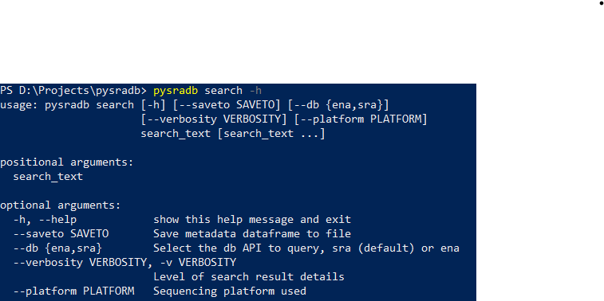
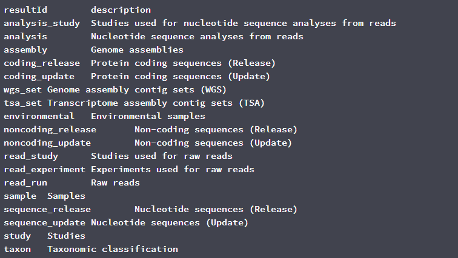

# Weekly Writeup for GSoC 2020

## Weeks 1 & 2 (1 June - 14 June)

---
&nbsp;
### What I have done:

I have completed implementing a basic search module which can query either
SRA or ENA (specifically for read runs, list of results IDs in figure 2)
APIs. The search feature currently supports the following arguments:

*Fig. 1: Arguments currently implemented for pysradb search*

*Fig. 2: The list of results that can be queried from ENA*

I have encapsulated the search feature in 3 classes: QuerySearch and its 2
subclasses, EnaSearch and SraSearch. The rationale for this organisation is
to abstract the implementation of querying APIs, while storing the query as
an object that can be referenced for the secondary search feature.

---
&nbsp;
### Questions/Thoughts:

1. Querying SRA and ENA are quite different in the following ways:

    - ENA does not have the equivalent of a [All Fields] category found in
    SRA. For my current implementation, if the user does not specify the
    category of their search query, the query will be matched to
    study_title or sample_title or experiment_title. I am not sure if this
    is the best implementation.

    - Getting search results from SRA requires 2 GET requests: an esearch
    request to retrieve the list of unique IDs, each corresponding to a
    sample run. An efetch request comprising these UIDs is then sent for
    the detailed search results. The results are in xml files, which I used
    ElementTree to convert to a pandas dataframe.

    - SRA and ENA queries yield a somewhat different set of data, and the
    same entry have a different set of fields/attributes returned at the
    highest verbosity. This leads on to the next question...

2. What fields/attributes should be provided for the user at different
verbosity levels? And in what order?

    I have saved the search results for the following two commands in the
    corresponding csv files:

    `pysradb search --saveto test.csv --db ena --platform illumina -v 1 Escherichia coli`

    [ENA output](./docs/GSoC/Week1/test_ena.csv)

    `pysradb search --saveto test.csv --db sra --platform illumina -v 1 Escherichia coli`

    [SRA output](./docs/GSoC/Week1/test_sra.csv)

    ENA has 123 fields for each entry and SRA has 86 as shown in the csv files.
    Personally I have not queried these databases before during my research.
    I will need to find out the importance of the information in each of these
    fields so that we can order the columns in order of importance, and determine
    what should be displayed in the output at different verbosity levels. This
    will also help me to determine which fields are important enough that
    we should specifically implement flags for them so that the user can finetune
    their search results.

3. Testing as well as other design considerations

    I am confused about how to properly test the search feature, as the output
     of the search feature depends on online databases, which are constantly
     updated. Can I also ask about some of the additional considerations for
     the search feature? for example should I implement limits on the number
     of API requests? Should I also implement a progress bar using tqdm for
     the search feature?

&nbsp;
---
&nbsp;
### What I will be working on from now until next Friday:

Leftovers:

- Adding the required tests for the search feature

- Finalising the implementation of the verbosity of the program output

Week 3 targets:

- Enable saving search results as text, json or csv format

- Add finetune parameters for the search feature
