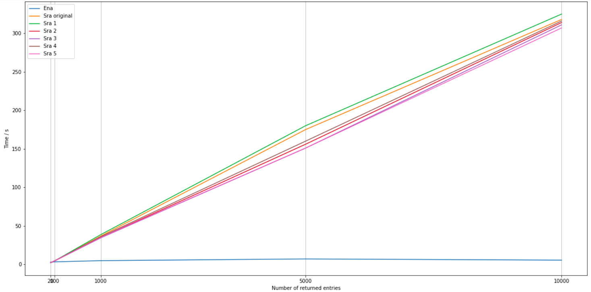

# Weekly Writeup for GSoC 2020

## Weeks 1 & 2 (1 June - 14 June)


---
&nbsp;
### What I have done:

I have completed implementing a basic search module which can query either
SRA or ENA (specifically for read runs, list of results IDs in figure 2)
APIs. The search feature currently supports the following arguments:


*Fig. 1: Arguments currently implemented for pysradb search*

&nbsp;


*Fig. 2: The list of results that can be queried from ENA*

&nbsp;

I have encapsulated the search feature in 3 classes: QuerySearch and its 2
subclasses, EnaSearch and SraSearch. The rationale for this organisation is
to abstract the implementation of querying APIs, while storing the query as
an object that can be referenced for the secondary search feature.

---
&nbsp;
### Questions/Thoughts:

1. Querying SRA and ENA are quite different in the following ways:

    - ENA does not have the equivalent of a [All Fields] category found in
    SRA. For my current implementation, if the user does not specify the
    category of their search query, the query will be matched to
    study_title or sample_title or experiment_title. I am not sure if this
    is the best implementation.

    - Getting search results from SRA requires 2 GET requests: an esearch
    request to retrieve the list of unique IDs, each corresponding to a
    sample run. An efetch request comprising these UIDs is then sent for
    the detailed search results. The results are in xml files, which I used
    ElementTree to convert to a pandas dataframe.

    - SRA and ENA queries yield a somewhat different set of data, and the
    same entry have a different set of fields/attributes returned at the
    highest verbosity. This leads on to the next question...

2. What fields/attributes should be provided for the user at different
verbosity levels? And in what order?

    I have saved the search results for the following two commands in the
    corresponding csv files:

    `pysradb search --saveto test.csv --db ena --platform illumina -v 1 Escherichia coli`

    [ENA output](./docs/GSoC/Week1/test_ena.csv)

    `pysradb search --saveto test.csv --db sra --platform illumina -v 1 Escherichia coli`

    [SRA output](./docs/GSoC/Week1/test_sra.csv)

    ENA has 123 fields for each entry and SRA has 86 as shown in the csv files.
    Personally I have not queried these databases before during my research.
    I will need to find out the importance of the information in each of these
    fields so that we can order the columns in order of importance, and determine
    what should be displayed in the output at different verbosity levels. This
    will also help me to determine which fields are important enough that
    we should specifically implement flags for them so that the user can fine-tune
    their search results.

3. Testing as well as other design considerations

    I am confused about how to properly test the search feature, as the output
     of the search feature depends on online databases, which are constantly
     updated. Can I also ask about some of the additional considerations for
     the search feature? for example should I implement limits on the number
     of API requests? Should I also implement a progress bar using tqdm for
     the search feature?

&nbsp;
---
&nbsp;
### What I will be working on:

Leftovers:

- Adding the required tests for the search feature

- Finalising the implementation of the verbosity of the program output

Week 3 targets:

- Enable saving search results as text, json or csv format

- Add fine-tune parameters for the search feature

---


## Week 3 (15 - 21 June)


---
&nbsp;
### What I have done:

I have finished implementing the search feature based on our discussions.
In addition to the main query, I have also included several flags that
allows finetuning of the search query, as follows:


*Fig. 1: Arguments implemented for pysradb search*

&nbsp;

There are two main challenges this week:

- As I have pointed out last week, the queryable fields are somewhat
different between ENA and SRA, most notably that ENA does not have a
[All Fields] category to query. Based on what I have managed to find out,
the experiment_title field is a good alternative to query from the ENA
database, as it contains the information from several key fields: strategy,
source, organism, as well as a brief experimental design. In my program, I
have also matched the user's main query to ENA to the various accession
numbers associated with each run.

- The second challenge lies in how to properly test the search module. As
the search module is built to query databases, the best way is probably to
query SRA and ENA databases and match the retrieved search results against
the expected search result. However, this is somewhat difficult in
practice, as the online databases are constantly being updated, and so
after rerunning the tests a day after writing it, the tests no longer pass.
Therefore, I have fine-tuned the search query to only those that have been
published between October, 2012 and January, 2013 (chosen arbitrarily).
However, this is still not guaranteed to work, as the owners of the data
on ENA and SRA have the ability to make modifications to them.

As such, I am planning to perform more developer tests, as well as to
include more unit tests to ensure that the search feature is working as
expected.


## Week 4 (22 - 28 June)


---
&nbsp;
### What I have done:

I have performed some system and acceptance testing of the search feature.
In this process, I have also made some edits to the search feature to
resolve some issues / bugs that has surfaced.


I have also written unit tests for the search feature, ensuring that the
components are working as expected and also setting up for regression
testing for future iterations of the search feature. Overall, the search
feature has a test coverage of about 70%.


I have also created a
[notebook](https://github.com/bscrow/pysradb/blob/basic-search-feature/notebooks/07.query_search.ipynb)
explaining in detail the syntax and features of the search module. I have
also included both terminal and python examples on how to use the search
module.


---
&nbsp;
### Questions/Thoughts:

1. SRA queries are at times very slow:

    The most notable issue I have faced during acceptance testing is that
    SRA queries with a large number of outputs is very slow (In the order
    of minutes or even longer). This is especially obvious comparing to
    ENA queries of the same size, which should complete within 20 seconds.

    This is because each ENA query only requires 1 GET request, while each
    SRA query requires at least 2. For each SRA query, the query is first
    sent via a GET request to NCBI's esearch API, returning a list of uids.
     Each uid represents 1 entry in the search output. This list of uids
    must then be sent to the efetch API to retrieve the metadata for each
    entry. However, the ncbi efetch API seems to only accept up to about
    300 uids within each GET request. For pysradb search queries that
    produces more than 300 uids, I have to divide the uids into batches
    and send a GET request for each batch.

     it is
    stated that there is no hard limit for the number of uids in each
    request, but a POST request is recommended for queries with more than
    200 uids. During this week's meeting, we have discussed replacing the
    GET requests for the uids to a POST request, which I will try out
    next week.

2. How to properly test the search feature (continue[Officially](https://www.ncbi.nlm.nih.gov/books/NBK25499/)d from week 3):

    While writing unit tests for the search feature this week, I have
    deliberately avoided testing the search function which queries the
    online databases. This is due to my concern from week 3, where search
    results from the online databases may change over time. However, from
    the discussion with my mentors on Thursday, Saket pointed out that it
    is still important to test the search function. In addition, it is ok
    for the test cases to fail due to changes in the online databases - it
    would reflect an interesting update on the online databases. I will be
    adding more tests for the search feature, which should improve the
    test coverage for the search module.


---
&nbsp;

### What I will be working on:

- Switching to POST requests for accessing metadata from the efetch API

- Together with my mentors, perform additional testing and debugging of
    the search feature, and add additional test
cases

- Adding additional commonly used fine-tune flags (for example filter for
    only GEO studies)

- Formatting the flags for pysradb search


## Week 5 (29 June - 5 July)

---
&nbsp;
### What I have done:

I have tested out various ways of retrieving metadata from the SRA
database through the efetch API, and benchmarked their speed for 20, 100,
1000, 5000, 10000 and 50000 entries.

[link](https://colab.research.google.com/drive/1HuQRwfc0e5-aAFtAXgGc2jRN0f2pwUHT?usp=sharing)

These includes:

    0. Sending a GET request per 300 uids (Current implementation)
    1. Sending a GET request per 200 uids (Recommended limit for efetch API, according to <A General Introduction to the E-utilities>)
    2. Sending a POST request per 1000 uids (Arbitary, typical POST request limit for many APIs)
    3. Sending a POST request for all the uids
    4. Posting search results to the history server, before retrieving from efetch in batch size of 500 (From Application 3: Retrieving large datasets)
    5. Posting search results to the history server, before retrieving all entries from efetch

As a control, I have also tested out retrieving metadata from the ENA
database using the current implementation



Based on these results, there is hardly any difference in the speed of
retrieving metadata via these different implementations. There is a
positive linear relationship between number of entries and time taken to
download all of the metadata. For all of the above implementations, every
1000 entries takes about 30 seconds to download. This linear relationship
suggests that there is no bottleneck when a large query is sent, which
would cause large queries to take much longer to get a response. Rather,
the efetch server has likely implemented server-side data transfer
throttling, making large queries significantly slower compared to ENA.


While I can't improve the download speed from SRA, I can optimise parsing
data that is being downloaded. Python requests supports streaming response
data as it is being downloaded, and parsing the xml response as a stream
is faster based on my testing.


[link](https://colab.research.google.com/drive/1Ye3TDdAn9f1oPFqcyWA3-F_rh0l4ib-0?usp=sharing)

I have also optimised how information retrieved is being added to the pandas
dataframe. Previously, I have resorted to appending a row to the dataframe
for each entry that I parsed via the .append() method, which is very
inefficient. I have instead updated this to saving the parsed information
as a dictionary first, before converting the dictionary with all entries
inside to a dataframe.

---
&nbsp;

### What I will be working on:

While implementing streaming to process retrieved metadata, I have noticed
that I have missed some important details regarding the format of the
retrieved XML file. For instance, some tags, such as title, are being used
for both sample title as well as experiment title. My current script
naively assumes that there are no duplicate tags in the xml response.
Consequently, the pandas dataframe that my program produces at the end of
a search contains misclassified data, and some important data fields have
been overwritten as well. I will be implementing a new script to ensure
that XML parsing is done correctly.


## Week 6 (6 - 12 July)

---
&nbsp;
### What I have done:

I have written a new parser for the xml responses from SRA, resolving the
issue mentioned last week.

I have also implemented GeoSearch, which is able to query the Geo DataSets
database, and then retrieve the SRA metadata corresponding to the search
result (GEO DataSets does not maintain the matadata of its entries).
GeoSearch also supports querying SRA concurrently, and then finding the
intersecting set of entries found in both the SRA and ENA query.

```
$ pysradb search -h
usage: pysradb search [-h] [--saveto SAVETO] [-s [{1,2,3}]] [-g [GRAPHS]]
                      [--db {ena,sra_geo,sra}] [-v {0,1,2,3}] [-m MAX]
                      [-q QUERY [QUERY ...]] [--accession ACCESSION]
                      [--organism ORGANISM [ORGANISM ...]]
                      [--layout {SINGLE,PAIRED}] [--mbases MBASES]
                      [--publication-date PUBLICATION_DATE]
                      [--platform PLATFORM [PLATFORM ...]]
                      [--selection SELECTION [SELECTION ...]]
                      [--source SOURCE [SOURCE ...]]
                      [--strategy STRATEGY [STRATEGY ...]]
                      [--title TITLE [TITLE ...]]
                      [--geo-query GEO_QUERY [GEO_QUERY ...]]
                      [--geo-dataset-type GEO_DATASET_TYPE [GEO_DATASET_TYPE ...]]
                      [--geo-entry-type GEO_ENTRY_TYPE [GEO_ENTRY_TYPE ...]]

optional arguments:
  -h, --help            show this help message and exit
  --saveto SAVETO       Save search result dataframe to file
  -s [{1,2,3}], --stats [{1,2,3}]
                        Displays some useful statistics for the search
                        results.
  -g [GRAPHS], --graphs [GRAPHS]
  --db {ena,sra_geo,sra}
                        Select the db API (sra, ena, or sra_geo) to query,
                        default = sra
  -v {0,1,2,3}, --verbosity {0,1,2,3}
                        Level of search result details (0, 1, 2 or 3), default
                        = 2
  -m MAX, --max MAX     Maximum number of entries to return, default = 20
  -q QUERY [QUERY ...], --query QUERY [QUERY ...]
                        Main query string. Note that if no query is supplied,
                        at least one of the following flags must be present:
  --accession ACCESSION
                        Accession number
  --organism ORGANISM [ORGANISM ...]
                        Scientific name of the sample organism
  --layout {SINGLE,PAIRED}
                        Library layout
  --mbases MBASES       Size of the sample rounded to the nearest megabase
  --publication-date PUBLICATION_DATE
                        Publication date of the run in the format dd-mm-yyyy.
                        If a date range is desired, enter the start date,
                        followed by end date, separated by a colon ':'.
                        Example: 01-01-2010:31-12-2010
  --platform PLATFORM [PLATFORM ...]
                        Sequencing platform
  --selection SELECTION [SELECTION ...]
                        Library selection
  --source SOURCE [SOURCE ...]
                        Library source
  --strategy STRATEGY [STRATEGY ...]
                        Library preparation strategy
  --title TITLE [TITLE ...]
                        Experiment title
  --geo-query GEO_QUERY [GEO_QUERY ...]
                        Main query string for GEO DataSet. This flag is only
                        used when db is set to be sra_geo.
  --geo-dataset-type GEO_DATASET_TYPE [GEO_DATASET_TYPE ...]
                        GEO DataSet Type. This flag is only used when --db is
                        set to be sra_geo.
  --geo-entry-type GEO_ENTRY_TYPE [GEO_ENTRY_TYPE ...]
                        GEO Entry Type. This flag is only used when --db is
                        set to be sra_geo.

```

&nbsp;

While doing acceptance testing, I have realised that ENA is not as flexible
as SRA in parsing finetuning parameters. For example, to select only entries
that used oligo(dT) as its library selection method, ENA accepts exactly
"Oligo-dT", which is also case sensitive.

To make the search module more accessible, I have implemented a regex
matcher which will format a query entered into one that is accepted by
both ENA and SRA. If the user query does not match any of the accepted
entries for a parameter, or if the phrase matches multiple accepted entries,
an IncorrectFieldException will be thrown, with the following error
messages:

For `pysradb search --selection Pikachu`:
```
Incorrect selection: Pikachu
--selection must be one of the following:
5-methylcytidine antibody, CAGE, ChIP, ChIP-Seq, DNase, HMPR, Hybrid Selection,
Inverse rRNA, Inverse rRNA selection, MBD2 protein methyl-CpG binding domain,
MDA, MF, MNase, MSLL, Oligo-dT, PCR, PolyA, RACE, RANDOM, RANDOM PCR, RT-PCR,
Reduced Representation, Restriction Digest, cDNA, cDNA_oligo_dT, cDNA_randomPriming
other, padlock probes capture method, repeat fractionation, size fractionation,
unspecified
```

For `pysradb search --platform illumina nanopore`:
```
Multiple potential matches have been identified for illumina nanopore:
['OXFORD_NANOPORE', 'ILLUMINA']
Please check your input.
```


---
&nbsp;
### Questions/Thoughts:

A minor issue regarding the XML response from SRA is that the order of
elements within each entry is not preserved, and requesting the metadata
for the same set of uids result in slightly different xml files as a result.
For example, if an entry contains 2 SRA runs, A and B, the runs may be
found in the XML file in the order AB, but when the same query is sent
again, the order may change to be BA.

In my implementation, I distinguish between these two runs by numbering
them based on the order that they appear in the stream. As such, A from the
above example may be labelled as run_1 in the first query, and run_2 in the
next. While this issue does not result in loss of data, it may cause the
resulting dataframe to be inconsistent, which may lead to confusion by the
user and also makes proper testing harder.

I am considering sorting parts of the XML file that may produce this issue,
based on for eg accession numbers.
However, doing so will definitely cause retrieving information from SRA to
be even slower.

---
&nbsp;

### What I will be working on:

I will be updating test cases for the search module, as well as writing
new ones to raise code coverage.

I will also be updating the notebook which explains the search feature,
as well as drafting the search documentation.

## Week 7 (13 - 19 July)

---
&nbsp;
### What I have done:

I have debugged my implementation of GeoSearch and updated test cases for
the search module. Currently the test coverage is just under 90%.

I have updated the
[notebook](https://github.com/bscrow/pysradb/blob/basic-search-feature/notebooks/07.query_search.ipynb)
which explains how to use the search feature both on the command line and
as a python package.

I have also started implementing the feature to show statistics and graphs
for a search result.

---
&nbsp;

### What I will be working on:

I am currently writing the documentation for the search module, as well as
trying to resolve a piping issue between the search and the download
modules.

---
&nbsp;

## Weeks 8-12

---
&nbsp;
### What I have done:

- Debugged the command-line metadata output generated by pysradb metadata
and pysradb search:
    - Ensured that the output is properly encoded in ascii characters by
    replacing non-ascii characters with "?". This prevents a
    UnicodeDecodeError from occuring in Windows.
    - Ensured that all elements in the metadata output are single-tab
    separated and can be read and parsed into a pandas dataframe again
    when piped to pysradb download

- Ensured that the metadata outputs can be piped to the download module. I
have also updated how pysradb download parses the piped metadata such that
it can identify the column(s) containing the correct sequence download url.

- Implemented the statistics feature which summarises some key
characteristics of the retrieved metadata.

- Implemented the graphs feature which, if the user has matplotlib
installed, generates
    1) the histogram of some attributes, such as library
    selection method, base count and sample organism,
    2) Heatmap showing the relationship between several pairs of attributes

- Proposed changes to the documentation format and included the
documentation for the search module that I have implemented.


After some discussion with my mentors, we have decided that some of the
features that I have proposed (Secondary Search feature, which allows the
user to filter through the retrieved metadata on the command-line directly)
is redundant. This is because the search module can be run on both python
and on the command-line: if the user wish to filter through the retrieved
metadata, the user can simply perform the search within python. The
metadata will be saved as a pandas DataFrame that the user can explore
easily. On the other hand, if the user chooses to perform the search on the
command-line, he/she is probably only interested in retrieving/piping the
metadata anyway; the secondary search feature is probably going to see
little use.


