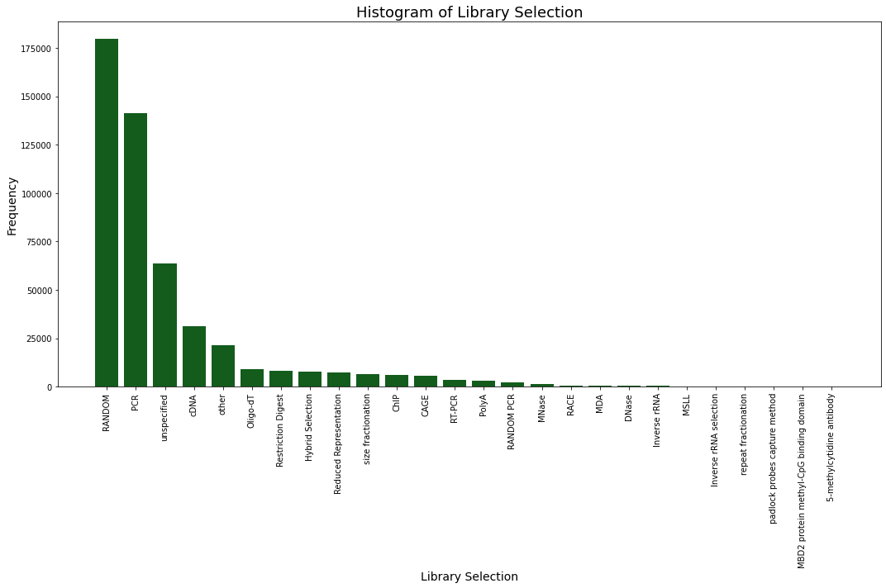

.. _pysradbsearch:

###############
Metadata Search
###############

As a python module, `pysradb search` organises each search query as an
instance of either the `SraSearch`, `EnaSearch` or the `GeoSearch` class.
These classes take in the following parameters in their constructor:

**SraSearch (verbosity=2, return_max=20, query=None, accession=None, organism=None, layout=None, mbases=None, publication_date=None, platform=None, selection=None, source=None, strategy=None, title=None, suppress_validation=False,)**

|

**EnaSearch (verbosity=2, return_max=20, query=None, accession=None, organism=None, layout=None, mbases=None, publication_date=None, platform=None, selection=None, source=None, strategy=None, title=None, suppress_validation=False,)**

|

**GeoSearch (verbosity=2, return_max=20, query=None, accession=None, organism=None, layout=None, mbases=None, publication_date=None, platform=None, selection=None, source=None, strategy=None, title=None, geo_query=None, geo_dataset_type=None, geo_entry_type=None, suppress_validation=False,)**

|

|

Parameters
~~~~~~~~~~

**verbosity** : int
    This determines how much details are retrieved and shown in the search result:

    *0: run_accession only*

    *1: run_accession and experiment_description only*

    *2: **(default)** study_accession, experiment_accession, experiment_title, description, tax_id, scientific_name, library_strategy, library_source, library_selection, sample_accession, sample_title, instrument_model, run_accession, read_count, base_count, pmid

    *3: Everything in verbosity level 2, followed by all other retrievable information from the database*

**return_max** : int
    Maximum number of returned entries. Default number is 20.

.. note:: If the maximum number is set to be large, querying the SRA and GEO
    DataSets databases will take significantly longer due to API limits,
    retrieving the matadata at about 10000 entries every 5-6 minutes (Shallow tested on Colab).
    EnaSearch is able to retrieve 500000 entries in ~ 1 minute.

**query** : str
    The main query string. **Note: if this parameter is left empty, at least one of the following search parameters must be supplied**:

**accession** : str
    A relevant study / experiment / sample / run accession number

**organism** : str
    The scientific name of the sample organism

**layout** : str
    Library layout. Accepted inputs: single, paired

**mbases** : int
    Size of the sample rounded to the nearest megabase

**publication_date** : str
    The publication date of the run in the format dd-mm-yyyy. If a date range is desired,
    enter the start date, followed by end date, separated by a colon ':' in the format dd-mm-yyyy:dd-mm-yyyy

    Example: 01-01-2010:31-12-2010

**platform** : str
    Sequencing platform used for the run.

    Some possible inputs: illumina, ion torrent, oxford nanopore

**selection** : str
    Library selection. Some possible inputs: cdna, chip, dnase, pcr, polya

**source** : str
    Library source. Some possible inputs: genomic, metagenomic, transcriptomic

**strategy** : str
    Library Preparation strategy. Possible inputs: wgs, amplicon, rna seq

**title** : str
    The title (in part or in whole) of the experiment of interest

|
|

**GeoSearch specific parameters:**
**********************************

**geo_query** : str
    The main query string to be sent to Geo DataSets.

**geo_dataset_type** : str
    Dataset type. Possible inputs: expression profiling by array, expression profiling by high throughput sequencing, non coding rna profiling by high throughput sequencing

**geo_entry_type** : str
    Entry type. Accepted inputs: gds, gpl, gse, gsm

`GeoSearch` works somewhat differently compared to `SraSearch` and `EnaSearch`:
A query comprising `geo_query`, `geo_dataset_type` and `geo_entry_type` is first sent to GEO Databases. The list of
uids in the response are converted to SRA uids via NCBI's ELink web service.
Another set of uids is retrieved from SRA using the SRA search parameters, which has an added search parameter of
filter["sra gds"], which restricts the output to those with GEO Dataset accession numbers.
The two lists of uids are then unioned together and used to retrieve metadata from SRA.

--------------------------------------------------------------------------

|

Command-line Documentation
==========================

.. code-block:: bash

    $ pysradb search -h
    usage: pysradb search [-h] [-o SAVETO] [-s] [-g [GRAPHS]] [-d {ena,geo,sra}]
                          [-v {0,1,2,3}] [--run-description] [--detailed] [-m MAX]
                          [-q QUERY [QUERY ...]] [-A ACCESSION]
                          [-O ORGANISM [ORGANISM ...]] [-L {SINGLE,PAIRED}]
                          [-M MBASES] [-D PUBLICATION_DATE]
                          [-P PLATFORM [PLATFORM ...]]
                          [-E SELECTION [SELECTION ...]] [-C SOURCE [SOURCE ...]]
                          [-S STRATEGY [STRATEGY ...]] [-T TITLE [TITLE ...]]
                          [-G GEO_QUERY [GEO_QUERY ...]]
                          [-Y GEO_DATASET_TYPE [GEO_DATASET_TYPE ...]]
                          [-Z GEO_ENTRY_TYPE [GEO_ENTRY_TYPE ...]]

    optional arguments:
      -h, --help            show this help message and exit
      -o SAVETO, --saveto SAVETO
                            Save search result dataframe to file
      -s, --stats           Displays some useful statistics for the search
                            results.
      -g [GRAPHS], --graphs [GRAPHS]
                            Generates graphs to illustrate the search result. By
                            default all graphs are generated. Alternatively,
                            select a subset from the options below in a space-
                            separated string: daterange, organism, source,
                            selection, platform, basecount
      -d {ena,geo,sra}, --db {ena,geo,sra}
                            Select the db API (sra, ena, or geo) to query, default
                            = sra
      -v {0,1,2,3}, --verbosity {0,1,2,3}
                            Level of search result details (0, 1, 2 or 3), default
                            = 2
      --run-description     Displays run accessions and descriptions only.
                            Equivalent to --verbosity 1
      --detailed            Displays detailed search results. Equivalent to
                            --verbosity 3.
      -m MAX, --max MAX     Maximum number of entries to return, default = 20
      -q QUERY [QUERY ...], --query QUERY [QUERY ...]
                            Main query string. Note that if no query is supplied,
                            at least one of the following flags must be present:
      -A ACCESSION, --accession ACCESSION
                            Accession number
      -O ORGANISM [ORGANISM ...], --organism ORGANISM [ORGANISM ...]
                            Scientific name of the sample organism
      -L {SINGLE,PAIRED}, --layout {SINGLE,PAIRED}
                            Library layout
      -M MBASES, --mbases MBASES
                            Size of the sample rounded to the nearest megabase
      -D PUBLICATION_DATE, --publication-date PUBLICATION_DATE
                            Publication date of the run in the format dd-mm-yyyy.
                            If a date range is desired, enter the start date,
                            followed by end date, separated by a colon ':'.
                            Example: 01-01-2010:31-12-2010
      -P PLATFORM [PLATFORM ...], --platform PLATFORM [PLATFORM ...]
                            Sequencing platform
      -E SELECTION [SELECTION ...], --selection SELECTION [SELECTION ...]
                            Library selection
      -C SOURCE [SOURCE ...], --source SOURCE [SOURCE ...]
                            Library source
      -S STRATEGY [STRATEGY ...], --strategy STRATEGY [STRATEGY ...]
                            Library preparation strategy
      -T TITLE [TITLE ...], --title TITLE [TITLE ...]
                            Experiment title
      -G GEO_QUERY [GEO_QUERY ...], --geo-query GEO_QUERY [GEO_QUERY ...]
                            Main query string for GEO DataSet. This flag is only
                            used when db is set to be geo.
      -Y GEO_DATASET_TYPE [GEO_DATASET_TYPE ...], --geo-dataset-type GEO_DATASET_TYPE [GEO_DATASET_TYPE ...]
                            GEO DataSet Type. This flag is only used when --db is
                            set to be geo.
      -Z GEO_ENTRY_TYPE [GEO_ENTRY_TYPE ...], --geo-entry-type GEO_ENTRY_TYPE [GEO_ENTRY_TYPE ...]
                            GEO Entry Type. This flag is only used when --db is
                            set to be geo.

---------------------------------------------------------------------------

|

Usage Examples
==============

The features shown below for `pysradb search` are accessible from both the
command-line interface and within python. Metadata retrieved are printed
out on the command line or returned as a `pandas DataFrame` object respectively.

pysradb usage on the two platforms will be displayed by selecting the
corresponding tab below.

Searching SRA database and retrieving metadata
~~~~~~~~~~~~~~~~~~~~~~~~~~~~~~~~~~~~~~~~~~~~~~~

Let's take for example we are interested in coronavirus sequences published
on Short Reads Archive (SRA) in the first week of August 2020.

.. tabbed:: Console

   .. code-block:: bash

        $ pysradb search -q coronavirus --publication-date 01-08-2020:07-08-2020

.. tabbed:: Python

   .. code-block:: python

      from pysradb.search import SraSearch

      instance = SraSearch(query="coronavirus", publication_date="01-08-2020:07-08-2020")
      instance.search()
      instance.get_df()

Output:
::

    study_accession  experiment_accession    experiment_title        sample_taxon_id sample_scientific_name  experiment_library_strategy     experiment_library_source       experiment_library_selection    sample_accession        sample_alias    experiment_instrument_model     pool_member_spots       run_1_size     run_1_accession  run_1_total_spots       run_1_total_bases       pmid
    SRP270658       SRX8679965      GSM4658808: SARS-CoV-2-infected 24h 3; Chlorocebus sabaeus; Severe acute respiratory syndrome coronavirus 2; RNA-Seq    60711   Chlorocebus sabaeus     RNA-Seq TRANSCRIPTOMIC  cDNA    SRS6959042      GSM4658808      NextSeq 500     104223040       9743267247      SRR12164500     104223040       31475358080     11295714
    SRP270658       SRX8679964      GSM4658807: SARS-CoV-2-infected 24h 2; Chlorocebus sabaeus; Severe acute respiratory syndrome coronavirus 2; RNA-Seq    60711   Chlorocebus sabaeus     RNA-Seq TRANSCRIPTOMIC  cDNA    SRS6959041      GSM4658807      NextSeq 500     92813819        8703506222      SRR12164499     92813819        28029773338     11295713
    SRP253798       SRX8677889      Severe acute respiratory syndrome coronavirus 2 2697049 Severe acute respiratory syndrome coronavirus 2 AMPLICON        VIRAL RNA       PCR     SRS6956975      hCoV-19/Australia/VIC1898/2020  NextSeq 500    456828   51422072        SRR12162149     456828  130280958       11292876
    SRP253798       SRX8677888      Severe acute respiratory syndrome coronavirus 2 2697049 Severe acute respiratory syndrome coronavirus 2 AMPLICON        VIRAL RNA       PCR     SRS6956974      hCoV-19/Australia/VIC1886/2020  NextSeq 500    268832   29923966        SRR12162150     268832  75885223        11292875
    SRP253798       SRX8677887      Severe acute respiratory syndrome coronavirus 2 2697049 Severe acute respiratory syndrome coronavirus 2 AMPLICON        VIRAL RNA       PCR     SRS6956973      hCoV-19/Australia/VIC1890/2020  NextSeq 500    483526   54629557        SRR12162151     483526  139019404       11292874
    SRP253798       SRX8677886      Severe acute respiratory syndrome coronavirus 2 2697049 Severe acute respiratory syndrome coronavirus 2 AMPLICON        VIRAL RNA       PCR     SRS6956971      hCoV-19/Australia/VIC1888/2020  NextSeq 500    473895   53675126        SRR12162152     473895  136058655       11292873
    SRP253798       SRX8677885      Severe acute respiratory syndrome coronavirus 2 2697049 Severe acute respiratory syndrome coronavirus 2 AMPLICON        VIRAL RNA       PCR     SRS6956972      hCoV-19/Australia/VIC1891/2020  NextSeq 500    482373   53331905        SRR12162153     482373  135769259       11292872
    SRP253798       SRX8677884      Severe acute respiratory syndrome coronavirus 2 2697049 Severe acute respiratory syndrome coronavirus 2 AMPLICON        VIRAL RNA       PCR     SRS6956970      hCoV-19/Australia/VIC1816/2020  NextSeq 550    357052   41111134        SRR12162154     357052  103693201       11292871
    SRP253798       SRX8677883      Severe acute respiratory syndrome coronavirus 2 2697049 Severe acute respiratory syndrome coronavirus 2 AMPLICON        VIRAL RNA       PCR     SRS6956969      hCoV-19/Australia/VIC1815/2020  NextSeq 550    307106   35306959        SRR12162155     307106  89866234        11292870
    SRP253798       SRX8677882      Severe acute respiratory syndrome coronavirus 2 2697049 Severe acute respiratory syndrome coronavirus 2 AMPLICON        VIRAL RNA       PCR     SRS6956968      hCoV-19/Australia/VIC1814/2020  NextSeq 550    353704   40652239        SRR12162156     353704  103366580       11292869
    SRP253798       SRX8677881      Severe acute respiratory syndrome coronavirus 2 2697049 Severe acute respiratory syndrome coronavirus 2 AMPLICON        VIRAL RNA       PCR     SRS6956967      hCoV-19/Australia/VIC1813/2020  NextSeq 550    327705   38035344        SRR12162157     327705  95931939        11292868
    SRP253798       SRX8677880      Severe acute respiratory syndrome coronavirus 2 2697049 Severe acute respiratory syndrome coronavirus 2 AMPLICON        VIRAL RNA       PCR     SRS6956966      hCoV-19/Australia/VIC1812/2020  NextSeq 550    321428   36795893        SRR12162158     321428  92821030        11292867
    SRP253798       SRX8677879      Severe acute respiratory syndrome coronavirus 2 2697049 Severe acute respiratory syndrome coronavirus 2 AMPLICON        VIRAL RNA       PCR     SRS6956965      hCoV-19/Australia/VIC1865/2020  NextSeq 500    565592   61755215        SRR12162159     565592  156629119       11292866
    SRP253798       SRX8677878      Severe acute respiratory syndrome coronavirus 2 2697049 Severe acute respiratory syndrome coronavirus 2 AMPLICON        VIRAL RNA       PCR     SRS6956964      hCoV-19/Australia/VIC1811/2020  NextSeq 550    295014   33818926        SRR12162160     295014  85816216        11292865
    SRP253798       SRX8677877      Severe acute respiratory syndrome coronavirus 2 2697049 Severe acute respiratory syndrome coronavirus 2 AMPLICON        VIRAL RNA       PCR     SRS6956963      hCoV-19/Australia/VIC1809/2020  NextSeq 550    367784   43112211        SRR12162161     367784  107949010       11292864
    SRP253798       SRX8677876      Severe acute respiratory syndrome coronavirus 2 2697049 Severe acute respiratory syndrome coronavirus 2 AMPLICON        VIRAL RNA       PCR     SRS6956962      hCoV-19/Australia/VIC1807/2020  NextSeq 550    256832   29447818        SRR12162162     256832  74949831        11292863
    SRP253798       SRX8677875      Severe acute respiratory syndrome coronavirus 2 2697049 Severe acute respiratory syndrome coronavirus 2 AMPLICON        VIRAL RNA       PCR     SRS6956961      hCoV-19/Australia/VIC1806/2020  NextSeq 550    317415   36523725        SRR12162163     317415  92494821        11292862
    SRP253798       SRX8677874      Severe acute respiratory syndrome coronavirus 2 2697049 Severe acute respiratory syndrome coronavirus 2 AMPLICON        VIRAL RNA       PCR     SRS6956960      hCoV-19/Australia/VIC1805/2020  NextSeq 550    362866   41227860        SRR12162164     362866  105727450       11292861
    SRP253798       SRX8677873      Severe acute respiratory syndrome coronavirus 2 2697049 Severe acute respiratory syndrome coronavirus 2 AMPLICON        VIRAL RNA       PCR     SRS6956959      hCoV-19/Australia/VIC1804/2020  NextSeq 550    349048   39605824        SRR12162165     349048  101279219       11292860
    SRP253798       SRX8677872      Severe acute respiratory syndrome coronavirus 2 2697049 Severe acute respiratory syndrome coronavirus 2 AMPLICON        VIRAL RNA       PCR     SRS6956958      hCoV-19/Australia/VIC1803/2020  NextSeq 550    273575   31019982        SRR12162166     273575  78519046        11292859

|

Searching ENA database and retrieving metadata
~~~~~~~~~~~~~~~~~~~~~~~~~~~~~~~~~~~~~~~~~~~~~~~

To query European Nucleotide Archive (ENA) instead:

.. tabbed:: Console

   .. code-block:: bash

        $ pysradb search --db ena -q coronavirus --publication-date 01-08-2020:07-08-2020

.. tabbed:: Python

   .. code-block:: python

      from pysradb.search import EnaSearch

      instance = EnaSearch(query="coronavirus", publication_date="01-08-2020:07-08-2020")
      instance.search()
      instance.get_df()

Output:
::

    study_accession experiment_accession    experiment_title        description     tax_id  scientific_name library_strategylibrary_source  library_selection       sample_accession        sample_title    instrument_model        run_accession  read_count       base_count
    PRJEB12126      ERX1264364      Illumina HiSeq 2000 sequencing; Analysis of coronavirus and infected host-cell gene expression through RNA sequencing and ribosome profiling    Illumina HiSeq 2000 sequencing; Analysis of coronavirus and infected host-cell gene expression through RNA sequencing and ribosome profiling    10090   Mus musculus    OTHER   TRANSCRIPTOMIC  other   SAMEA3708907    Sample 1        Illumina HiSeq 2000     ERR1190989      38883498        1161289538
    PRJEB12126      ERX1264365      Illumina HiSeq 2000 sequencing; Analysis of coronavirus and infected host-cell gene expression through RNA sequencing and ribosome profiling    Illumina HiSeq 2000 sequencing; Analysis of coronavirus and infected host-cell gene expression through RNA sequencing and ribosome profiling    10090   Mus musculus    OTHER   TRANSCRIPTOMIC  other   SAMEA3708908    Sample 10       Illumina HiSeq 2000     ERR1190990      55544297        1779600908
    PRJEB12126      ERX1264366      Illumina HiSeq 2000 sequencing; Analysis of coronavirus and infected host-cell gene expression through RNA sequencing and ribosome profiling    Illumina HiSeq 2000 sequencing; Analysis of coronavirus and infected host-cell gene expression through RNA sequencing and ribosome profiling    10090   Mus musculus    OTHER   TRANSCRIPTOMIC  other   SAMEA3708909    Sample 11       Illumina HiSeq 2000     ERR1190991      54474851        1713994365
    PRJEB12126      ERX1264367      Illumina HiSeq 2000 sequencing; Analysis of coronavirus and infected host-cell gene expression through RNA sequencing and ribosome profiling    Illumina HiSeq 2000 sequencing; Analysis of coronavirus and infected host-cell gene expression through RNA sequencing and ribosome profiling    10090   Mus musculus    OTHER   TRANSCRIPTOMIC  other   SAMEA3708910    Sample 12       Illumina HiSeq 2000     ERR1190992      78497711        2489092061
    PRJEB12126      ERX1264368      Illumina HiSeq 2000 sequencing; Analysis of coronavirus and infected host-cell gene expression through RNA sequencing and ribosome profiling    Illumina HiSeq 2000 sequencing; Analysis of coronavirus and infected host-cell gene expression through RNA sequencing and ribosome profiling    10090   Mus musculus    RNA-Seq TRANSCRIPTOMIC  RANDOM  SAMEA3708911    Sample 13       Illumina HiSeq 2000     ERR1190993      84955423        2627276298
    PRJEB12126      ERX1264369      Illumina HiSeq 2000 sequencing; Analysis of coronavirus and infected host-cell gene expression through RNA sequencing and ribosome profiling    Illumina HiSeq 2000 sequencing; Analysis of coronavirus and infected host-cell gene expression through RNA sequencing and ribosome profiling    10090   Mus musculus    RNA-Seq TRANSCRIPTOMIC  RANDOM  SAMEA3708912    Sample 14       Illumina HiSeq 2000     ERR1190994      75097651        2293097872
    PRJEB12126      ERX1264370      Illumina HiSeq 2000 sequencing; Analysis of coronavirus and infected host-cell gene expression through RNA sequencing and ribosome profiling    Illumina HiSeq 2000 sequencing; Analysis of coronavirus and infected host-cell gene expression through RNA sequencing and ribosome profiling    10090   Mus musculus    RNA-Seq TRANSCRIPTOMIC  RANDOM  SAMEA3708913    Sample 15       Illumina HiSeq 2000     ERR1190995      67177553        2060926619
    PRJEB12126      ERX1264371      Illumina HiSeq 2000 sequencing; Analysis of coronavirus and infected host-cell gene expression through RNA sequencing and ribosome profiling    Illumina HiSeq 2000 sequencing; Analysis of coronavirus and infected host-cell gene expression through RNA sequencing and ribosome profiling    10090   Mus musculus    RNA-Seq TRANSCRIPTOMIC  RANDOM  SAMEA3708914    Sample 16       Illumina HiSeq 2000     ERR1190996      62940694        2061757111
    PRJEB12126      ERX1264372      Illumina HiSeq 2000 sequencing; Analysis of coronavirus and infected host-cell gene expression through RNA sequencing and ribosome profiling    Illumina HiSeq 2000 sequencing; Analysis of coronavirus and infected host-cell gene expression through RNA sequencing and ribosome profiling    10090   Mus musculus    RNA-Seq TRANSCRIPTOMIC  RANDOM  SAMEA3708915    Sample 17       Illumina HiSeq 2000     ERR1190997      80591061        2475034240
    PRJEB12126      ERX1264373      Illumina HiSeq 2000 sequencing; Analysis of coronavirus and infected host-cell gene expression through RNA sequencing and ribosome profiling    Illumina HiSeq 2000 sequencing; Analysis of coronavirus and infected host-cell gene expression through RNA sequencing and ribosome profiling    10090   Mus musculus    RNA-Seq TRANSCRIPTOMIC  RANDOM  SAMEA3708916    Sample 18       Illumina HiSeq 2000     ERR1190998      68575621        2149386138
    PRJEB12126      ERX1264374      Illumina HiSeq 2000 sequencing; Analysis of coronavirus and infected host-cell gene expression through RNA sequencing and ribosome profiling    Illumina HiSeq 2000 sequencing; Analysis of coronavirus and infected host-cell gene expression through RNA sequencing and ribosome profiling    10090   Mus musculus    OTHER   TRANSCRIPTOMIC  other   SAMEA3708917    Sample 19       Illumina HiSeq 2000     ERR1190999      59543450        1840946911
    PRJEB12126      ERX1264375      Illumina HiSeq 2000 sequencing; Analysis of coronavirus and infected host-cell gene expression through RNA sequencing and ribosome profiling    Illumina HiSeq 2000 sequencing; Analysis of coronavirus and infected host-cell gene expression through RNA sequencing and ribosome profiling    10090   Mus musculus    OTHER   TRANSCRIPTOMIC  other   SAMEA3708918    Sample 2        Illumina HiSeq 2000     ERR1191000      48420348        1429402558
    PRJEB12126      ERX1264376      Illumina HiSeq 2000 sequencing; Analysis of coronavirus and infected host-cell gene expression through RNA sequencing and ribosome profiling    Illumina HiSeq 2000 sequencing; Analysis of coronavirus and infected host-cell gene expression through RNA sequencing and ribosome profiling    10090   Mus musculus    OTHER   TRANSCRIPTOMIC  other   SAMEA3708919    Sample 20       Illumina HiSeq 2000     ERR1191001      39413642        1197490271
    PRJEB12126      ERX1264377      Illumina HiSeq 2000 sequencing; Analysis of coronavirus and infected host-cell gene expression through RNA sequencing and ribosome profiling    Illumina HiSeq 2000 sequencing; Analysis of coronavirus and infected host-cell gene expression through RNA sequencing and ribosome profiling    10090   Mus musculus    OTHER   TRANSCRIPTOMIC  other   SAMEA3708920    Sample 21       Illumina HiSeq 2000     ERR1191002      43109202        1310217152
    PRJEB12126      ERX1264378      Illumina HiSeq 2000 sequencing; Analysis of coronavirus and infected host-cell gene expression through RNA sequencing and ribosome profiling    Illumina HiSeq 2000 sequencing; Analysis of coronavirus and infected host-cell gene expression through RNA sequencing and ribosome profiling    10090   Mus musculus    OTHER   TRANSCRIPTOMIC  other   SAMEA3708921    Sample 22       Illumina HiSeq 2000     ERR1191003      48048678        1464094378
    PRJEB12126      ERX1264379      Illumina HiSeq 2000 sequencing; Analysis of coronavirus and infected host-cell gene expression through RNA sequencing and ribosome profiling    Illumina HiSeq 2000 sequencing; Analysis of coronavirus and infected host-cell gene expression through RNA sequencing and ribosome profiling    10090   Mus musculus    OTHER   TRANSCRIPTOMIC  other   SAMEA3708922    Sample 23       Illumina HiSeq 2000     ERR1191004      55458988        1762359654
    PRJEB12126      ERX1264380      Illumina HiSeq 2000 sequencing; Analysis of coronavirus and infected host-cell gene expression through RNA sequencing and ribosome profiling    Illumina HiSeq 2000 sequencing; Analysis of coronavirus and infected host-cell gene expression through RNA sequencing and ribosome profiling    10090   Mus musculus    OTHER   TRANSCRIPTOMIC  other   SAMEA3708923    Sample 24       Illumina HiSeq 2000     ERR1191005      47426381        1463185679
    PRJEB12126      ERX1264381      Illumina HiSeq 2000 sequencing; Analysis of coronavirus and infected host-cell gene expression through RNA sequencing and ribosome profiling    Illumina HiSeq 2000 sequencing; Analysis of coronavirus and infected host-cell gene expression through RNA sequencing and ribosome profiling    10090   Mus musculus    OTHER   TRANSCRIPTOMIC  other   SAMEA3708924    Sample 25       Illumina HiSeq 2000     ERR1191006      53368431        1671809961
    PRJEB12126      ERX1264382      Illumina HiSeq 2000 sequencing; Analysis of coronavirus and infected host-cell gene expression through RNA sequencing and ribosome profiling    Illumina HiSeq 2000 sequencing; Analysis of coronavirus and infected host-cell gene expression through RNA sequencing and ribosome profiling    10090   Mus musculus    OTHER   TRANSCRIPTOMIC  other   SAMEA3708925    Sample 26       Illumina HiSeq 2000     ERR1191007      63008359        1879252598
    PRJEB12126      ERX1264383      Illumina HiSeq 2000 sequencing; Analysis of coronavirus and infected host-cell gene expression through RNA sequencing and ribosome profiling    Illumina HiSeq 2000 sequencing; Analysis of coronavirus and infected host-cell gene expression through RNA sequencing and ribosome profiling    10090   Mus musculus    OTHER   TRANSCRIPTOMIC  other   SAMEA3708926    Sample 27       Illumina HiSeq 2000     ERR1191008      54398154        1665685103

|

Searching GEO Datasets database and retrieving metadata
~~~~~~~~~~~~~~~~~~~~~~~~~~~~~~~~~~~~~~~~~~~~~~~~~~~~~~~

To query GEO Datasets instead:

.. tabbed:: Console

   .. code-block:: bash

        $ pysradb search --db geo -q coronavirus --publication-date 01-08-2020:07-08-2020

.. tabbed:: Python

   .. code-block:: python

      from pysradb.search import GeoSearch

      instance = GeoSearch(query="coronavirus", publication_date="01-08-2020:07-08-2020")
      instance.search()
      instance.get_df()

Output:
::

    study_accession    experiment_accession    experiment_title        sample_taxon_id sample_scientific_name  experiment_library_strategy     experiment_library_source       experiment_library_selection    sample_accession        sample_alias    experiment_instrument_model     pool_member_spots       run_1_size     run_1_accession  run_1_total_spots       run_1_total_bases
    SRP270658       SRX8679965      GSM4658808: SARS-CoV-2-infected 24h 3; Chlorocebus sabaeus; Severe acute respiratory syndrome coronavirus 2; RNA-Seq    60711   Chlorocebus sabaeus     RNA-Seq TRANSCRIPTOMIC  cDNA    SRS6959042      GSM4658808      NextSeq 500     104223040       9743267247      SRR12164500     104223040       31475358080
    SRP270658       SRX8679964      GSM4658807: SARS-CoV-2-infected 24h 2; Chlorocebus sabaeus; Severe acute respiratory syndrome coronavirus 2; RNA-Seq    60711   Chlorocebus sabaeus     RNA-Seq TRANSCRIPTOMIC  cDNA    SRS6959041      GSM4658807      NextSeq 500     92813819        8703506222      SRR12164499     92813819        28029773338

|

Controlling the level of detail of the metadata retrieved
*********************************************************

We can control the maximum number of result entries to retrieve using the
`-m` / `--max` flag or the `return_max` parameter:

.. tabbed:: Console

   .. code-block:: bash

        $ pysradb search -q coronavirus --publication-date 01-08-2020:07-08-2020 -m 5

.. tabbed:: Python

   .. code-block:: python

      from pysradb.search import SraSearch

      instance = SraSearch(return_max=5, query="coronavirus", publication_date="01-08-2020:07-08-2020")
      instance.search()
      instance.get_df()

Output:
::

    study_accession    experiment_accession    experiment_title        sample_taxon_id sample_scientific_name  experiment_library_strategy     experiment_library_source       experiment_library_selection    sample_accession        sample_alias    experiment_instrument_model     pool_member_spots       run_1_size     run_1_accession  run_1_total_spots       run_1_total_bases       pmid
    SRP270658       SRX8679965      GSM4658808: SARS-CoV-2-infected 24h 3; Chlorocebus sabaeus; Severe acute respiratory syndrome coronavirus 2; RNA-Seq    60711   Chlorocebus sabaeus     RNA-Seq TRANSCRIPTOMIC  cDNA    SRS6959042      GSM4658808      NextSeq 500     104223040       9743267247      SRR12164500     104223040       31475358080     11295714
    SRP270658       SRX8679964      GSM4658807: SARS-CoV-2-infected 24h 2; Chlorocebus sabaeus; Severe acute respiratory syndrome coronavirus 2; RNA-Seq    60711   Chlorocebus sabaeus     RNA-Seq TRANSCRIPTOMIC  cDNA    SRS6959041      GSM4658807      NextSeq 500     92813819        8703506222      SRR12164499     92813819        28029773338     11295713
    SRP253798       SRX8677889      Severe acute respiratory syndrome coronavirus 2 2697049 Severe acute respiratory syndrome coronavirus 2 AMPLICON        VIRAL RNA       PCR     SRS6956975      hCoV-19/Australia/VIC1898/2020  NextSeq 500    456828   51422072        SRR12162149     456828  130280958       11292876
    SRP253798       SRX8677888      Severe acute respiratory syndrome coronavirus 2 2697049 Severe acute respiratory syndrome coronavirus 2 AMPLICON        VIRAL RNA       PCR     SRS6956974      hCoV-19/Australia/VIC1886/2020  NextSeq 500    268832   29923966        SRR12162150     268832  75885223        11292875
    SRP253798       SRX8677887      Severe acute respiratory syndrome coronavirus 2 2697049 Severe acute respiratory syndrome coronavirus 2 AMPLICON        VIRAL RNA       PCR     SRS6956973      hCoV-19/Australia/VIC1890/2020  NextSeq 500    483526   54629557        SRR12162151     483526  139019404       11292874

|

To control the number of columns of the metadata output, we can use the
``-v`` / ``--verbosity`` flags or the ``verbosity`` parameter. The default
verbosity, which is shown above, is 2.

We can set verbosity to be 1 to only see run_accession and experiment title.
On the command-line, we can use the more intuitive  ``--run-description`` flag
in place of the more obscure ``-v 1`` as shown below:

.. tabbed:: Console

   .. code-block:: bash

        $ pysradb search -v 1 -q coronavirus --publication-date 01-08-2020:07-08-2020

.. tabbed:: Python

   .. code-block:: python

      from pysradb.search import SraSearch

      instance = SraSearch(verbosity=1, query="coronavirus", publication_date="01-08-2020:07-08-2020")
      instance.search()
      instance.get_df()

Output:
::

    run_accession    experiment_title
    SRR12164500     GSM4658808: SARS-CoV-2-infected 24h 3; Chlorocebus sabaeus; Severe acute respiratory syndrome coronavirus 2; RNA-Seq
    SRR12164499     GSM4658807: SARS-CoV-2-infected 24h 2; Chlorocebus sabaeus; Severe acute respiratory syndrome coronavirus 2; RNA-Seq
    SRR12162149     Severe acute respiratory syndrome coronavirus 2
    SRR12162150     Severe acute respiratory syndrome coronavirus 2
    SRR12162151     Severe acute respiratory syndrome coronavirus 2
    SRR12162152     Severe acute respiratory syndrome coronavirus 2
    SRR12162153     Severe acute respiratory syndrome coronavirus 2
    SRR12162154     Severe acute respiratory syndrome coronavirus 2
    SRR12162155     Severe acute respiratory syndrome coronavirus 2
    SRR12162156     Severe acute respiratory syndrome coronavirus 2
    SRR12162157     Severe acute respiratory syndrome coronavirus 2
    SRR12162158     Severe acute respiratory syndrome coronavirus 2
    SRR12162159     Severe acute respiratory syndrome coronavirus 2
    SRR12162160     Severe acute respiratory syndrome coronavirus 2
    SRR12162161     Severe acute respiratory syndrome coronavirus 2
    SRR12162162     Severe acute respiratory syndrome coronavirus 2
    SRR12162163     Severe acute respiratory syndrome coronavirus 2
    SRR12162164     Severe acute respiratory syndrome coronavirus 2
    SRR12162165     Severe acute respiratory syndrome coronavirus 2
    SRR12162166     Severe acute respiratory syndrome coronavirus 2

|

To view a more detailed metadata, including download URLs and sample
attributes, we can set verbosity to be 3. Similar to the previous example,
we can use the more intuitive ``--detailed`` flag in place of the more
obscure ``-v 3`` as shown below:

.. tabbed:: Console

   .. code-block:: bash

        $ pysradb search -v 3 -q coronavirus --publication-date 01-08-2020:07-08-2020

.. tabbed:: Python

   .. code-block:: python

      from pysradb.search import SraSearch

      instance = SraSearch(verbosity=3, query="coronavirus", publication_date="01-08-2020:07-08-2020")
      instance.search()
      instance.get_df()

Output:
::

    study_accession  experiment_accession    experiment_title        sample_taxon_id sample_scientific_name  experiment_library_strategy     experiment_library_source       experiment_library_selection    sample_accession        sample_alias    experiment_instrument_model     pool_member_spots       run_1_size     run_1_accession  run_1_total_spots       run_1_total_bases       experiment_alias        experiment_attributes_1_tag    experiment_attributes_1_value    experiment_design_description   experiment_external_id  experiment_library_construction_protocol        experiment_library_name experiment_link_1_type  experiment_link_1_value_1       experiment_link_1_value_2       experiment_link_1_value_3       experiment_platform     experiment_sample_descriptor_accession  library_layout pool_external_id pool_member_accession   pool_member_bases       pool_member_member_name pool_member_organism    pool_member_sample_name pool_member_sample_title        pool_member_tax_id      run_1_alias     run_1_base_A_count      run_1_base_C_count      run_1_base_G_count      run_1_base_N_count      run_1_base_T_count      run_1_cloudfile_1_filetype     run_1_cloudfile_1_location       run_1_cloudfile_1_provider      run_1_cloudfile_2_filetype      run_1_cloudfile_2_location      run_1_cloudfile_2_provider      run_1_cloudfile_3_filetype      run_1_cloudfile_3_location      run_1_cloudfile_3_provider      run_1_cloudfile_4_filetype      run_1_cloudfile_4_location      run_1_cloudfile_4_provider      run_1_cluster_name      run_1_database_1        run_1_is_public run_1_load_done run_1_published run_1_srafile_1_alternative_1_access_type       run_1_srafile_1_alternative_1_free_egress       run_1_srafile_1_alternative_1_org       run_1_srafile_1_alternative_1_url       run_1_srafile_1_alternative_2_access_type       run_1_srafile_1_alternative_2_free_egress      run_1_srafile_1_alternative_2_org        run_1_srafile_1_alternative_2_url       run_1_srafile_1_alternative_3_access_type       run_1_srafile_1_alternative_3_free_egress       run_1_srafile_1_alternative_3_org       run_1_srafile_1_alternative_3_url       run_1_srafile_1_cluster run_1_srafile_1_date    run_1_srafile_1_filename        run_1_srafile_1_md5    run_1_srafile_1_semantic_name    run_1_srafile_1_size    run_1_srafile_1_sratoolkit      run_1_srafile_1_supertype      run_1_srafile_1_url      run_1_srafile_2_alternative_1_access_type       run_1_srafile_2_alternative_1_free_egress      run_1_srafile_2_alternative_1_org        run_1_srafile_2_alternative_1_url       run_1_srafile_2_alternative_2_access_type       run_1_srafile_2_alternative_2_free_egress       run_1_srafile_2_alternative_2_org       run_1_srafile_2_alternative_2_url       run_1_srafile_2_alternative_3_access_type       run_1_srafile_2_alternative_3_free_egress       run_1_srafile_2_alternative_3_org       run_1_srafile_2_alternative_3_url       run_1_srafile_2_cluster run_1_srafile_2_date   run_1_srafile_2_filename run_1_srafile_2_md5     run_1_srafile_2_semantic_name   run_1_srafile_2_size    run_1_srafile_2_sratoolkit      run_1_srafile_2_supertype       run_1_srafile_2_url     run_1_srafile_3_alternative_1_access_type      run_1_srafile_3_alternative_1_free_egress        run_1_srafile_3_alternative_1_org       run_1_srafile_3_alternative_1_url       run_1_srafile_3_alternative_2_access_type       run_1_srafile_3_alternative_2_free_egress       run_1_srafile_3_alternative_2_org       run_1_srafile_3_alternative_2_url       run_1_srafile_3_alternative_3_access_type       run_1_srafile_3_alternative_3_free_egress       run_1_srafile_3_alternative_3_org       run_1_srafile_3_alternative_3_url      run_1_srafile_3_alternative_4_access_type        run_1_srafile_3_alternative_4_free_egress       run_1_srafile_3_alternative_4_org       run_1_srafile_3_alternative_4_url       run_1_srafile_3_cluster run_1_srafile_3_date    run_1_srafile_3_filename        run_1_srafile_3_md5     run_1_srafile_3_semantic_name   run_1_srafile_3_size    run_1_srafile_3_sratoolkit      run_1_srafile_3_supertype       run_1_srafile_3_url     run_1_static_data_available     run_1_total_base_count run_1_total_base_cs_native       sample_attributes_10_tag        sample_attributes_10_value      sample_attributes_11_tagsample_attributes_11_value      sample_attributes_12_tag        sample_attributes_12_value      sample_attributes_1_tagsample_attributes_1_value        sample_attributes_2_tag sample_attributes_2_value       sample_attributes_3_tag sample_attributes_3_value       sample_attributes_4_tag sample_attributes_4_value       sample_attributes_5_tag sample_attributes_5_value       sample_attributes_6_tag sample_attributes_6_value       sample_attributes_7_tag sample_attributes_7_value       sample_attributes_8_tag sample_attributes_8_value       sample_attributes_9_tag sample_attributes_9_value      sample_description       sample_external_id_1    sample_external_id_1_namespace  sample_link_1_type      sample_link_1_value_1   sample_link_1_value_2   sample_link_1_value_3   sample_taxon_id sample_title    study_alias     study_center_name       study_center_project_name       study_external_id_1     study_external_id_1_namespace   study_study_abstract   study_study_title        study_study_type_existing_study_type    submission_accession    submission_alias        submission_broker_name  submission_center_name  submission_lab_name     submission_submission_comment   pmid
    SRP270658       SRX8679965      GSM4658808: SARS-CoV-2-infected 24h 3; Chlorocebus sabaeus; Severe acute respiratory syndrome coronavirus 2; RNA-Seq    60711   Chlorocebus sabaeus     RNA-Seq TRANSCRIPTOMIC  cDNA    SRS6959042      GSM4658808      NextSeq 500     104223040       9743267247      SRR12164500     104223040       31475358080     GSM4658808     GEO Accession    GSM4658808      N/A     GSM4658808      Cells were harvested, and total RNA was extracted using the Qiagen RNeasy Plus Mini Kit. The quality of the extracted RNA was assessed with the Agilent 2100 Bioanalyzer. RNA libraries were prepared for sequencing using standard Illumina protocols. N/A     XREF_LINK       DB: gds ID: 304658808   LABEL: GSM4658808       ILLUMINA        SRS6959042      PAIRED  SAMN15464189    SRS6959042      31475358080     N/A     Chlorocebus sabaeus     GSM4658808      SARS-CoV-2-infected 24h 3       60711   GSM4658808_r1   7955582672      7851434515     7958217565       273003  7709850325      fastq   gs.US   gs      fastq   s3.us-east-1    s3      run     gs.US   gs     run      s3.us-east-1    s3      public  <Database><Table name="SEQUENCE"><Statistics source="meta"><Rows count="104223040" /><Elements count="31475358080" /></Statistics></Table></Database>   true    true    2020-07-08 18:19:30     Use Cloud Data Delivery -       GCP     gs://sra-pub-src-12/SRR12164500/6_CoV2_24h_3_S5_R1_001.fastq.gz.1       Use Cloud Data Delivery -       AWS     s3://sra-pub-src-12/SRR12164500/6_CoV2_24h_3_S5_R1_001.fastq.gz.1       N/A     N/A     N/A    N/A      public  2020-07-07 13:36:52     N/A     9ca5526761cf0716bfb6802c0fb31297        fastq   7139762726      0      Original N/A     Use Cloud Data Delivery -       GCP     gs://sra-pub-src-12/SRR12164500/6_CoV2_24h_3_S5_R2_001.fastq.gz.1       Use Cloud Data Delivery -       AWS     s3://sra-pub-src-12/SRR12164500/6_CoV2_24h_3_S5_R2_001.fastq.gz.1      N/A      N/A     N/A     N/A     public  2020-07-07 13:36:20     N/A     d2c92af7effd76563a8133011ec2275e        fastq  7448441689       0       Original        N/A     anonymous       worldwide       NCBI    https://sra-download.ncbi.nlm.nih.gov/traces/sra76/SRR/011879/SRR12164500       aws identity    s3.us-east-1    AWS     s3://sra-pub-run-8/SRR12164500/SRR12164500.1    gcp identity    gs.US   GCP     gs://sra-pub-run-9/SRR12164500/SRR12164500.1    N/A     N/A     N/A    N/A      public  2020-07-07 13:38:09     SRR12164500     2e349fddeeed6377a84638e8a6f3b055        run     9743268772     1Primary ETL     https://sra-download.ncbi.nlm.nih.gov/traces/sra76/SRR/011879/SRR12164500       1       31475358080    false    N/A     N/A     N/A     N/A     N/A     N/A     source_name     SARS-CoV-2-infected Vero E6 cells       cell   Vero E6 cells    treatment       SARS-CoV-2 infection    time    24h     N/A     N/A     N/A     N/A     N/A     N/A    N/A      N/A     N/A     N/A     N/A     SAMN15464189    BioSample       XREF_LINK       DB: bioproject  ID: 644588     LABEL: PRJNA644588       60711   SARS-CoV-2-infected 24h 3       GSE153940       GEO     GSE153940       PRJNA644588    BioProject       We conducted a high-throughput drug repositioning screen using the LOPAC?1280 and the ReFRAME drug libraries to identify existing drugs that harbor antiviral activity against SARS-CoV-2, in a Vero E6 cell-based assay. We additionally performed RNA sequencing on control and SARS-CoV-2 infected Vero E6 cells to study the biological changes after SARS-CoV-2 infection and to elucidate the potential mechanisms underlying the positive hits identified from our high-throughput screen. Vero E6 cells were either mock-infected or infected with SARS-CoV-2 USA-WA1/2020 (MOI = 0.3) with three replicates. Cells were harvested 24 hours after infection, and total RNA was extracted using the Qiagen? RNeasy? Plus Mini Kit. The quality of the extracted RNA was assessed with the Agilent? 2100 Bioanalyzer. Libraries were prepared from total RNA following ribosome RNA depletion using standard protocol according to Illumina?. Total RNA sequencing was then performed on the Illumina? NextSeq system; 150bp paired-end runs were performed and 100 million raw reads per sample were generated. Overall design: mRNA profiles of control (mock-infected) and 24h post-SARS-CoV-2-infection Vero E6 cells with three replicates.  Gene expression of SARS-CoV-2-infected Vero E6 cells    Other   SRA1095806      GEO: GSE153940 GEO      GEO     N/A     submission brokered by GEO      11295714
    SRP270658       SRX8679964      GSM4658807: SARS-CoV-2-infected 24h 2; Chlorocebus sabaeus; Severe acute respiratory syndrome coronavirus 2; RNA-Seq    60711   Chlorocebus sabaeus     RNA-Seq TRANSCRIPTOMIC  cDNA    SRS6959041      GSM4658807      NextSeq 500     92813819        8703506222      SRR12164499     92813819        28029773338     GSM4658807     GEO Accession    GSM4658807      N/A     GSM4658807      Cells were harvested, and total RNA was extracted using the Qiagen RNeasy Plus Mini Kit. The quality of the extracted RNA was assessed with the Agilent 2100 Bioanalyzer. RNA libraries were prepared for sequencing using standard Illumina protocols. N/A     XREF_LINK       DB: gds ID: 304658807   LABEL: GSM4658807       ILLUMINA        SRS6959041      PAIRED  SAMN15464190    SRS6959041      28029773338     N/A     Chlorocebus sabaeus     GSM4658807      SARS-CoV-2-infected 24h 2       60711   GSM4658807_r1   7064191719      7025296945     7068860505       241911  6871182258      fastq   gs.US   gs      fastq   s3.us-east-1    s3      run     gs.US   gs     run      s3.us-east-1    s3      public  <Database><Table name="SEQUENCE"><Statistics source="meta"><Rows count="92813819" /><Elements count="28029773338" /></Statistics></Table></Database>    true    true    2020-07-08 18:19:30     Use Cloud Data Delivery -       GCP     gs://sra-pub-src-9/SRR12164499/5_CoV2_24h_2_S4_R1_001.fastq.gz.1        Use Cloud Data Delivery -       AWS     s3://sra-pub-src-9/SRR12164499/5_CoV2_24h_2_S4_R1_001.fastq.gz.1        N/A     N/A     N/A    N/A      public  2020-07-07 13:34:31     N/A     4666a6d924bb05c5ee967762a6d2fbe5        fastq   6383247475      0      Original N/A     Use Cloud Data Delivery -       GCP     gs://sra-pub-src-9/SRR12164499/5_CoV2_24h_2_S4_R2_001.fastq.gz.1Use Cloud Data Delivery -       AWS     s3://sra-pub-src-9/SRR12164499/5_CoV2_24h_2_S4_R2_001.fastq.gz.1        N/A    N/A      N/A     N/A     public  2020-07-07 13:37:05     N/A     9f4cb927c184d1dc8c89d47e83c79a4e        fastq   6689694994      0       Original        N/A     anonymous       worldwide       NCBI    https://sra-download.ncbi.nlm.nih.gov/traces/sra60/SRR/011879/SRR12164499       aws identity    s3.us-east-1    AWS     s3://sra-pub-run-9/SRR12164499/SRR12164499.1    gcp identity    gs.US   GCP     gs://sra-pub-run-8/SRR12164499/SRR12164499.1    N/A     N/A     N/A     N/A    public   2020-07-07 13:40:47     SRR12164499     35767b7633482d339f0c96bbb21e58c9        run     8703507747      1      Primary ETL      https://sra-download.ncbi.nlm.nih.gov/traces/sra60/SRR/011879/SRR12164499       1       28029773338    false    N/A     N/A     N/A     N/A     N/A     N/A     source_name     SARS-CoV-2-infected Vero E6 cells       cell   Vero E6 cells    treatment       SARS-CoV-2 infection    time    24h     N/A     N/A     N/A     N/A     N/A     N/A    N/A      N/A     N/A     N/A     N/A     SAMN15464190    BioSample       XREF_LINK       DB: bioproject  ID: 644588     LABEL: PRJNA644588       60711   SARS-CoV-2-infected 24h 2       GSE153940       GEO     GSE153940       PRJNA644588    BioProject       We conducted a high-throughput drug repositioning screen using the LOPAC?1280 and the ReFRAME drug libraries to identify existing drugs that harbor antiviral activity against SARS-CoV-2, in a Vero E6 cell-based assay. We additionally performed RNA sequencing on control and SARS-CoV-2 infected Vero E6 cells to study the biological changes after SARS-CoV-2 infection and to elucidate the potential mechanisms underlying the positive hits identified from our high-throughput screen. Vero E6 cells were either mock-infected or infected with SARS-CoV-2 USA-WA1/2020 (MOI = 0.3) with three replicates. Cells were harvested 24 hours after infection, and total RNA was extracted using the Qiagen? RNeasy? Plus Mini Kit. The quality of the extracted RNA was assessed with the Agilent? 2100 Bioanalyzer. Libraries were prepared from total RNA following ribosome RNA depletion using standard protocol according to Illumina?. Total RNA sequencing was then performed on the Illumina? NextSeq system; 150bp paired-end runs were performed and 100 million raw reads per sample were generated. Overall design: mRNA profiles of control (mock-infected) and 24h post-SARS-CoV-2-infection Vero E6 cells with three replicates.  Gene expression of SARS-CoV-2-infected Vero E6 cells    Other   SRA1095806      GEO: GSE153940 GEO      GEO     N/A     submission brokered by GEO      11295713
    SRP253798       SRX8677889      Severe acute respiratory syndrome coronavirus 2 2697049 Severe acute respiratory syndrome coronavirus 2 AMPLICON        VIRAL RNA       PCR     SRS6956975      hCoV-19/Australia/VIC1898/2020  NextSeq 500    456828   51422072        SRR12162149     456828  130280958       VIC1898_illumina        N/A     N/A     ARTIC v3, minimap2 v2.17, ivar v1.2.2, samtools v1.10. Using minimap2, short reads mapped to SARS-CoV-2 NCBI accession MN908947.3. Using samtools, proper_pairs (samflag 2) mapping to MN908947.3 retained, unmapped reads (samflag 4) discarded (to filter out non-SARS-CoV-2 cDNA). Filtered reads submitted to NCBI  SAMN15459145    N/A     VIC1898_illumina        N/A     N/A    N/A      N/A     ILLUMINA        SRS6956975      PAIRED  SAMN15459145    SRS6956975      130280958       N/A     Severe acute respiratory syndrome coronavirus 2 hCoV-19/Australia/VIC1898/2020  SARS-Cov-2 VIC1898 (GISAID EPI_ISL_480645)     2697049  VIC1898_R1.fq.gz        40296742        24826904        24644946        2414    40509952        fastq   gs.US  gs       fastq   s3.us-east-1    s3      run     gs.US   gs      run     s3.us-east-1    s3      public  <Database><Table name="SEQUENCE"><Statistics source="meta"><Rows count="456828" /><Elements count="130280958" /></Statistics></Table></Database>        true    true    2020-07-07 09:35:31     Use Cloud Data Delivery -       GCP     gs://sra-pub-src-12/SRR12162149/VIC1898_R1.fq.gz.1      Use Cloud Data Delivery -       AWS     s3://sra-pub-src-12/SRR12162149/VIC1898_R1.fq.gz.1      anonymous       worldwide       AWS     https://sra-pub-sars-cov2.s3.amazonaws.com/sra-src/SRR12162149/VIC1898_R1.fq.gz.1       public  2020-07-07 09:29:51     VIC1898_R1.fq.gz        01a47ca96701c890901dff4568f5dcfd        fastq  36157796 0       Original        https://sra-pub-sars-cov2.s3.amazonaws.com/sra-src/SRR12162149/VIC1898_R1.fq.gz.1      Use Cloud Data Delivery  -       GCP     gs://sra-pub-src-12/SRR12162149/VIC1898_R2.fq.gz.1      Use Cloud Data Delivery-AWS     s3://sra-pub-src-12/SRR12162149/VIC1898_R2.fq.gz.1      anonymous       worldwide       AWS     https://sra-pub-sars-cov2.s3.amazonaws.com/sra-src/SRR12162149/VIC1898_R2.fq.gz.1       public  2020-07-07 09:29:53     VIC1898_R2.fq.gz1fe742c26d5097d22a5760940f8aa113        fastq   35886034        0       Original        https://sra-pub-sars-cov2.s3.amazonaws.com/sra-src/SRR12162149/VIC1898_R2.fq.gz.1       anonymous       worldwide       NCBI    https://sra-download.ncbi.nlm.nih.gov/traces/sra39/SRR/011877/SRR12162149       anonymous       worldwide       AWS     https://sra-pub-sars-cov2.s3.amazonaws.com/run/SRR12162149/SRR12162149  aws identity    s3.us-east-1    AWS     s3://sra-pub-run-8/SRR12162149/SRR12162149.1    gcp identity    gs.US   GCP     gs://sra-pub-run-9/SRR12162149/SRR12162149.1    public  2020-07-07 09:30:03     SRR12162149     a812f270939cf1941b3015f47736d050        run     51423889        1       Primary ETL     https://sra-download.ncbi.nlm.nih.gov/traces/sra39/SRR/011877/SRR12162149       1       130280958       false   host_sex       female   passage_history Original        BioSampleModel  Pathogen.cl     isolate VIC1898 collected_by    Victorian Infectious Diseases Reference Laboratory (VIDRL)      collection_date 2020-06-01      geo_loc_name    Australia: Victoria    host     Homo sapiens    host_disease    COVID-19        isolation_source        missing lat_lon missing host_age       22       EPI_ISL_480645  SAMN15459145    BioSample       XREF_LINK       DB: bioproject  ID: 613958      LABEL: PRJNA613958      2697049 SARS-Cov-2 VIC1898 (GISAID EPI_ISL_480645)      PRJNA613958     BioProject      Severe acute respiratory syndrome coronavirus 2 PRJNA613958     BioProject      Genomic sequence data of clinical SARS-CoV-2 samples.   Severe acute respiratory syndrome coronavirus 2 (SARS-CoV-2) genome sequencing  Other   SRA1095659      SUB7730753      N/A    The Peter Doherty Institute for Infection and Immunity   Microbiology and Immunology     N/A     11292876
    SRP253798       SRX8677888      Severe acute respiratory syndrome coronavirus 2 2697049 Severe acute respiratory syndrome coronavirus 2 AMPLICON        VIRAL RNA       PCR     SRS6956974      hCoV-19/Australia/VIC1886/2020  NextSeq 500    268832   29923966        SRR12162150     268832  75885223        VIC1886_illumina        N/A     N/A     ARTIC v3, minimap2 v2.17, ivar v1.2.2, samtools v1.10. Using minimap2, short reads mapped to SARS-CoV-2 NCBI accession MN908947.3. Using samtools, proper_pairs (samflag 2) mapping to MN908947.3 retained, unmapped reads (samflag 4) discarded (to filter out non-SARS-CoV-2 cDNA). Filtered reads submitted to NCBI  SAMN15459144    N/A     VIC1886_illumina        N/A     N/A    N/A      N/A     ILLUMINA        SRS6956974      PAIRED  SAMN15459144    SRS6956974      75885223        N/A     Severe acute respiratory syndrome coronavirus 2 hCoV-19/Australia/VIC1886/2020  SARS-Cov-2 VIC1886 (GISAID EPI_ISL_480644)     2697049  VIC1886_R1.fq.gz        23251534        14479976        14377143        1605    23774965        fastq   gs.US  gs       fastq   s3.us-east-1    s3      run     gs.US   gs      run     s3.us-east-1    s3      public  <Database><Table name="SEQUENCE"><Statistics source="meta"><Rows count="268832" /><Elements count="75885223" /></Statistics></Table></Database> true    true    2020-07-07 09:35:31     Use Cloud Data Delivery -       GCP     gs://sra-pub-src-11/SRR12162150/VIC1886_R1.fq.gz.1      Use Cloud Data Delivery -       AWS     s3://sra-pub-src-11/SRR12162150/VIC1886_R1.fq.gz.1     anonymous        worldwide       AWS     https://sra-pub-sars-cov2.s3.amazonaws.com/sra-src/SRR12162150/VIC1886_R1.fq.gz.1       public  2020-07-07 09:29:41     VIC1886_R1.fq.gz        0e7cb97ad7b038954a1a280d2082a1a9        fastq   201569690       Original        https://sra-pub-sars-cov2.s3.amazonaws.com/sra-src/SRR12162150/VIC1886_R1.fq.gz.1       Use Cloud Data Delivery -       AWS     s3://sra-pub-src-11/SRR12162150/VIC1886_R2.fq.gz.1      anonymous       worldwide      AWS      https://sra-pub-sars-cov2.s3.amazonaws.com/sra-src/SRR12162150/VIC1886_R2.fq.gz.1       anonymous       worldwide       NCBI    https://sra-download.ncbi.nlm.nih.gov/traces/sra52/SRZ/012162/SRR12162150/VIC1886_R2.fq.gz      public 2020-07-07 09:29:40      VIC1886_R2.fq.gz        d361d616985ebf2966716ec2d0af38a7        fastq   20299385        0      Original https://sra-download.ncbi.nlm.nih.gov/traces/sra52/SRZ/012162/SRR12162150/VIC1886_R2.fq.gz      anonymous      worldwide        NCBI    https://sra-download.ncbi.nlm.nih.gov/traces/sra69/SRR/011877/SRR12162150       anonymous      worldwide        AWS     https://sra-pub-sars-cov2.s3.amazonaws.com/run/SRR12162150/SRR12162150  aws identity    s3.us-east-1    AWS     s3://sra-pub-run-8/SRR12162150/SRR12162150.1    gcp identity    gs.US   GCP     gs://sra-pub-run-9/SRR12162150/SRR12162150.1    public  2020-07-07 09:29:50     SRR12162150     f911722720480ebd389aaab0761bb8b6        run    29925787 1       Primary ETL     https://sra-download.ncbi.nlm.nih.gov/traces/sra69/SRR/011877/SRR12162150       1      75885223 false   host_sex        female  passage_history Original        BioSampleModel  Pathogen.cl     isolate VIC1886collected_by     Victorian Infectious Diseases Reference Laboratory (VIDRL)      collection_date 2020-05-29      geo_loc_name    Australia: Victoria     host    Homo sapiens    host_disease    COVID-19        isolation_source        missinglat_lon  missing host_age        35      EPI_ISL_480644  SAMN15459144    BioSample       XREF_LINK       DB: bioproject ID: 613958       LABEL: PRJNA613958      2697049 SARS-Cov-2 VIC1886 (GISAID EPI_ISL_480644)      PRJNA613958     BioProject      Severe acute respiratory syndrome coronavirus 2 PRJNA613958     BioProject      Genomic sequence data of clinical SARS-CoV-2 samples.   Severe acute respiratory syndrome coronavirus 2 (SARS-CoV-2) genome sequencing  Other   SRA1095659      SUB7730753      N/A     The Peter Doherty Institute for Infection and Immunity  Microbiology and Immunology    N/A      11292875
    SRP253798       SRX8677887      Severe acute respiratory syndrome coronavirus 2 2697049 Severe acute respiratory syndrome coronavirus 2 AMPLICON        VIRAL RNA       PCR     SRS6956973      hCoV-19/Australia/VIC1890/2020  NextSeq 500    483526   54629557        SRR12162151     483526  139019404       VIC1890_illumina        N/A     N/A     ARTIC v3, minimap2 v2.17, ivar v1.2.2, samtools v1.10. Using minimap2, short reads mapped to SARS-CoV-2 NCBI accession MN908947.3. Using samtools, proper_pairs (samflag 2) mapping to MN908947.3 retained, unmapped reads (samflag 4) discarded (to filter out non-SARS-CoV-2 cDNA). Filtered reads submitted to NCBI  SAMN15459143    N/A     VIC1890_illumina        N/A     N/A    N/A      N/A     ILLUMINA        SRS6956973      PAIRED  SAMN15459143    SRS6956973      139019404       N/A     Severe acute respiratory syndrome coronavirus 2 hCoV-19/Australia/VIC1890/2020  SARS-Cov-2 VIC1890 (GISAID EPI_ISL_480643)     2697049  VIC1890_R1.fq.gz        43067455        26436884        26213342        2531    43299192        fastq   gs.US  gs       fastq   s3.us-east-1    s3      run     gs.US   gs      run     s3.us-east-1    s3      public  <Database><Table name="SEQUENCE"><Statistics source="meta"><Rows count="483526" /><Elements count="139019404" /></Statistics></Table></Database>        true    true    2020-07-07 09:35:31     Use Cloud Data Delivery -       GCP     gs://sra-pub-src-10/SRR12162151/VIC1890_R1.fq.gz.1      Use Cloud Data Delivery -       AWS     s3://sra-pub-src-10/SRR12162151/VIC1890_R1.fq.gz.1      anonymous       worldwide       AWS     https://sra-pub-sars-cov2.s3.amazonaws.com/sra-src/SRR12162151/VIC1890_R1.fq.gz.1       public  2020-07-07 09:29:51     VIC1890_R1.fq.gz        ea01f8e763119c7ba2a6d1fc2efd7c48        fastq  38106091 0       Original        https://sra-pub-sars-cov2.s3.amazonaws.com/sra-src/SRR12162151/VIC1890_R1.fq.gz.1      Use Cloud Data Delivery  -       GCP     gs://sra-pub-src-10/SRR12162151/VIC1890_R2.fq.gz.1      Use Cloud Data Delivery-AWS     s3://sra-pub-src-10/SRR12162151/VIC1890_R2.fq.gz.1      anonymous       worldwide       AWS     https://sra-pub-sars-cov2.s3.amazonaws.com/sra-src/SRR12162151/VIC1890_R2.fq.gz.1       public  2020-07-07 09:29:50     VIC1890_R2.fq.gz77a4c917d81b118439c140a65171b100        fastq   38420606        0       Original        https://sra-pub-sars-cov2.s3.amazonaws.com/sra-src/SRR12162151/VIC1890_R2.fq.gz.1       anonymous       worldwide       NCBI    https://sra-download.ncbi.nlm.nih.gov/traces/sra24/SRR/011877/SRR12162151       anonymous       worldwide       AWS     https://sra-pub-sars-cov2.s3.amazonaws.com/run/SRR12162151/SRR12162151  aws identity    s3.us-east-1    AWS     s3://sra-pub-run-9/SRR12162151/SRR12162151.1    gcp identity    gs.US   GCP     gs://sra-pub-run-8/SRR12162151/SRR12162151.1    public  2020-07-07 09:30:02     SRR12162151     2a2c0b808b724dbbe2ac866daef597d7        run     54631373        1       Primary ETL     https://sra-download.ncbi.nlm.nih.gov/traces/sra24/SRR/011877/SRR12162151       1       139019404       false   host_sex       male     passage_history Original        BioSampleModel  Pathogen.cl     isolate VIC1890 collected_by    Victorian Infectious Diseases Reference Laboratory (VIDRL)      collection_date 2020-05-30      geo_loc_name    Australia: Victoria    host     Homo sapiens    host_disease    COVID-19        isolation_source        missing lat_lon missing host_age       19       EPI_ISL_480643  SAMN15459143    BioSample       XREF_LINK       DB: bioproject  ID: 613958      LABEL: PRJNA613958      2697049 SARS-Cov-2 VIC1890 (GISAID EPI_ISL_480643)      PRJNA613958     BioProject      Severe acute respiratory syndrome coronavirus 2 PRJNA613958     BioProject      Genomic sequence data of clinical SARS-CoV-2 samples.   Severe acute respiratory syndrome coronavirus 2 (SARS-CoV-2) genome sequencing  Other   SRA1095659      SUB7730753      N/A    The Peter Doherty Institute for Infection and Immunity   Microbiology and Immunology     N/A     11292874
    SRP253798       SRX8677886      Severe acute respiratory syndrome coronavirus 2 2697049 Severe acute respiratory syndrome coronavirus 2 AMPLICON        VIRAL RNA       PCR     SRS6956971      hCoV-19/Australia/VIC1888/2020  NextSeq 500    473895   53675126        SRR12162152     473895  136058655       VIC1888_illumina        N/A     N/A     ARTIC v3, minimap2 v2.17, ivar v1.2.2, samtools v1.10. Using minimap2, short reads mapped to SARS-CoV-2 NCBI accession MN908947.3. Using samtools, proper_pairs (samflag 2) mapping to MN908947.3 retained, unmapped reads (samflag 4) discarded (to filter out non-SARS-CoV-2 cDNA). Filtered reads submitted to NCBI  SAMN15459142    N/A     VIC1888_illumina        N/A     N/A    N/A      N/A     ILLUMINA        SRS6956971      PAIRED  SAMN15459142    SRS6956971      136058655       N/A     Severe acute respiratory syndrome coronavirus 2 hCoV-19/Australia/VIC1888/2020  SARS-Cov-2 VIC1888 (GISAID EPI_ISL_480642)     2697049  VIC1888_R1.fq.gz        42091928        25945569        25704913        2584    42313661        fastq   gs.US  gs       fastq   s3.us-east-1    s3      run     gs.US   gs      run     s3.us-east-1    s3      public  <Database><Table name="SEQUENCE"><Statistics source="meta"><Rows count="473895" /><Elements count="136058655" /></Statistics></Table></Database>        true    true    2020-07-07 09:35:31     Use Cloud Data Delivery -       GCP     gs://sra-pub-src-10/SRR12162152/VIC1888_R1.fq.gz.1      Use Cloud Data Delivery -       AWS     s3://sra-pub-src-10/SRR12162152/VIC1888_R1.fq.gz.1      anonymous       worldwide       AWS     https://sra-pub-sars-cov2.s3.amazonaws.com/sra-src/SRR12162152/VIC1888_R1.fq.gz.1       public  2020-07-07 09:29:52     VIC1888_R1.fq.gz        b9f7f507feb86c2630ccf8daf5d20b58        fastq  37409094 0       Original        https://sra-pub-sars-cov2.s3.amazonaws.com/sra-src/SRR12162152/VIC1888_R1.fq.gz.1      Use Cloud Data Delivery  -       GCP     gs://sra-pub-src-10/SRR12162152/VIC1888_R2.fq.gz.1      Use Cloud Data Delivery-AWS     s3://sra-pub-src-10/SRR12162152/VIC1888_R2.fq.gz.1      anonymous       worldwide       AWS     https://sra-pub-sars-cov2.s3.amazonaws.com/sra-src/SRR12162152/VIC1888_R2.fq.gz.1       public  2020-07-07 09:29:51     VIC1888_R2.fq.gz4aad09e8a93d75cf468559505fc72662        fastq   37729286        0       Original        https://sra-pub-sars-cov2.s3.amazonaws.com/sra-src/SRR12162152/VIC1888_R2.fq.gz.1       anonymous       worldwide       NCBI    https://sra-download.ncbi.nlm.nih.gov/traces/sra46/SRR/011877/SRR12162152       anonymous       worldwide       AWS     https://sra-pub-sars-cov2.s3.amazonaws.com/run/SRR12162152/SRR12162152  aws identity    s3.us-east-1    AWS     s3://sra-pub-run-9/SRR12162152/SRR12162152.1    gcp identity    gs.US   GCP     gs://sra-pub-run-8/SRR12162152/SRR12162152.1    public  2020-07-07 09:30:01     SRR12162152     793750aea426e65c0e8fc1d9a5ba26d4        run     53676944        1       Primary ETL     https://sra-download.ncbi.nlm.nih.gov/traces/sra46/SRR/011877/SRR12162152       1       136058655       false   host_sex       male     passage_history Original        BioSampleModel  Pathogen.cl     isolate VIC1888 collected_by    Victorian Infectious Diseases Reference Laboratory (VIDRL)      collection_date 2020-05-30      geo_loc_name    Australia: Victoria    host     Homo sapiens    host_disease    COVID-19        isolation_source        missing lat_lon missing host_age       25       EPI_ISL_480642  SAMN15459142    BioSample       XREF_LINK       DB: bioproject  ID: 613958      LABEL: PRJNA613958      2697049 SARS-Cov-2 VIC1888 (GISAID EPI_ISL_480642)      PRJNA613958     BioProject      Severe acute respiratory syndrome coronavirus 2 PRJNA613958     BioProject      Genomic sequence data of clinical SARS-CoV-2 samples.   Severe acute respiratory syndrome coronavirus 2 (SARS-CoV-2) genome sequencing  Other   SRA1095659      SUB7730753      N/A    The Peter Doherty Institute for Infection and Immunity   Microbiology and Immunology     N/A     11292873
    SRP253798       SRX8677885      Severe acute respiratory syndrome coronavirus 2 2697049 Severe acute respiratory syndrome coronavirus 2 AMPLICON        VIRAL RNA       PCR     SRS6956972      hCoV-19/Australia/VIC1891/2020  NextSeq 500    482373   53331905        SRR12162153     482373  135769259       VIC1891_illumina        N/A     N/A     ARTIC v3, minimap2 v2.17, ivar v1.2.2, samtools v1.10. Using minimap2, short reads mapped to SARS-CoV-2 NCBI accession MN908947.3. Using samtools, proper_pairs (samflag 2) mapping to MN908947.3 retained, unmapped reads (samflag 4) discarded (to filter out non-SARS-CoV-2 cDNA). Filtered reads submitted to NCBI  SAMN15459141    N/A     VIC1891_illumina        N/A     N/A    N/A      N/A     ILLUMINA        SRS6956972      PAIRED  SAMN15459141    SRS6956972      135769259       N/A     Severe acute respiratory syndrome coronavirus 2 hCoV-19/Australia/VIC1891/2020  SARS-Cov-2 VIC1891 (GISAID EPI_ISL_480641)     2697049  VIC1891_R1.fq.gz        42029260        25869628        25687184        2666    42180521        fastq   gs.US  gs       fastq   s3.us-east-1    s3      run     gs.US   gs      run     s3.us-east-1    s3      public  <Database><Table name="SEQUENCE"><Statistics source="meta"><Rows count="482373" /><Elements count="135769259" /></Statistics></Table></Database>        true    true    2020-07-07 09:35:31     Use Cloud Data Delivery -       GCP     gs://sra-pub-src-9/SRR12162153/VIC1891_R1.fq.gz.1       Use Cloud Data Delivery -       AWS     s3://sra-pub-src-9/SRR12162153/VIC1891_R1.fq.gz.1       anonymous       worldwide       AWS     https://sra-pub-sars-cov2.s3.amazonaws.com/sra-src/SRR12162153/VIC1891_R1.fq.gz.1       public  2020-07-07 09:29:52     VIC1891_R1.fq.gz        df4160fb2bcab5dfb6d9f980063f68df        fastq  37386203 0       Original        https://sra-pub-sars-cov2.s3.amazonaws.com/sra-src/SRR12162153/VIC1891_R1.fq.gz.1      Use Cloud Data Delivery  -       GCP     gs://sra-pub-src-9/SRR12162153/VIC1891_R2.fq.gz.1       Use Cloud Data Delivery-AWS     s3://sra-pub-src-9/SRR12162153/VIC1891_R2.fq.gz.1       anonymous       worldwide       AWS     https://sra-pub-sars-cov2.s3.amazonaws.com/sra-src/SRR12162153/VIC1891_R2.fq.gz.1       public  2020-07-07 09:29:50     VIC1891_R2.fq.gzdc5cfad9aa3a9b9f9550e628af1504dd        fastq   37508923        0       Original        https://sra-pub-sars-cov2.s3.amazonaws.com/sra-src/SRR12162153/VIC1891_R2.fq.gz.1       anonymous       worldwide       NCBI    https://sra-download.ncbi.nlm.nih.gov/traces/sra77/SRR/011877/SRR12162153       anonymous       worldwide       AWS     https://sra-pub-sars-cov2.s3.amazonaws.com/run/SRR12162153/SRR12162153  aws identity    s3.us-east-1    AWS     s3://sra-pub-run-9/SRR12162153/SRR12162153.1    gcp identity    gs.US   GCP     gs://sra-pub-run-8/SRR12162153/SRR12162153.1    public  2020-07-07 09:30:00     SRR12162153     81444b98bc09c01f8ddc4c2fdb502ebd        run     53333724        1       Primary ETL     https://sra-download.ncbi.nlm.nih.gov/traces/sra77/SRR/011877/SRR12162153       1       135769259       false   host_sex       male     passage_history Original        BioSampleModel  Pathogen.cl     isolate VIC1891 collected_by    Victorian Infectious Diseases Reference Laboratory (VIDRL)      collection_date 2020-05-30      geo_loc_name    Australia: Victoria    host     Homo sapiens    host_disease    COVID-19        isolation_source        missing lat_lon missing host_age       23       EPI_ISL_480641  SAMN15459141    BioSample       XREF_LINK       DB: bioproject  ID: 613958      LABEL: PRJNA613958      2697049 SARS-Cov-2 VIC1891 (GISAID EPI_ISL_480641)      PRJNA613958     BioProject      Severe acute respiratory syndrome coronavirus 2 PRJNA613958     BioProject      Genomic sequence data of clinical SARS-CoV-2 samples.   Severe acute respiratory syndrome coronavirus 2 (SARS-CoV-2) genome sequencing  Other   SRA1095659      SUB7730753      N/A    The Peter Doherty Institute for Infection and Immunity   Microbiology and Immunology     N/A     11292872
    SRP253798       SRX8677884      Severe acute respiratory syndrome coronavirus 2 2697049 Severe acute respiratory syndrome coronavirus 2 AMPLICON        VIRAL RNA       PCR     SRS6956970      hCoV-19/Australia/VIC1816/2020  NextSeq 550    357052   41111134        SRR12162154     357052  103693201       VIC1816_illumina        N/A     N/A     ARTIC v3, minimap2 v2.17, ivar v1.2.2, samtools v1.10. Using minimap2, short reads mapped to SARS-CoV-2 NCBI accession MN908947.3. Using samtools, proper_pairs (samflag 2) mapping to MN908947.3 retained, unmapped reads (samflag 4) discarded (to filter out non-SARS-CoV-2 cDNA). Filtered reads submitted to NCBI  SAMN15459140    N/A     VIC1816_illumina        N/A     N/A    N/A      N/A     ILLUMINA        SRS6956970      PAIRED  SAMN15459140    SRS6956970      103693201       N/A     Severe acute respiratory syndrome coronavirus 2 hCoV-19/Australia/VIC1816/2020  SARS-Cov-2 VIC1816 (GISAID EPI_ISL_480640)     2697049  VIC1816_R1.fq.gz        31884733        19921529        19810575        658     32075706        fastq   gs.US  gs       fastq   s3.us-east-1    s3      run     gs.US   gs      run     s3.us-east-1    s3      public  <Database><Table name="SEQUENCE"><Statistics source="meta"><Rows count="357052" /><Elements count="103693201" /></Statistics></Table></Database>        true    true    2020-07-07 09:35:31     Use Cloud Data Delivery -       GCP     gs://sra-pub-src-13/SRR12162154/VIC1816_R1.fq.gz.1      Use Cloud Data Delivery -       AWS     s3://sra-pub-src-14/SRR12162154/VIC1816_R1.fq.gz.1      anonymous       worldwide       AWS     https://sra-pub-sars-cov2.s3.amazonaws.com/sra-src/SRR12162154/VIC1816_R1.fq.gz.1       public  2020-07-07 09:29:47     VIC1816_R1.fq.gz        e55f6baa6b6e51c6594742671c527064        fastq  28430968 0       Original        https://sra-pub-sars-cov2.s3.amazonaws.com/sra-src/SRR12162154/VIC1816_R1.fq.gz.1      Use Cloud Data Delivery  -       GCP     gs://sra-pub-src-13/SRR12162154/VIC1816_R2.fq.gz.1      Use Cloud Data Delivery-AWS     s3://sra-pub-src-14/SRR12162154/VIC1816_R2.fq.gz.1      anonymous       worldwide       AWS     https://sra-pub-sars-cov2.s3.amazonaws.com/sra-src/SRR12162154/VIC1816_R2.fq.gz.1       public  2020-07-07 09:29:48     VIC1816_R2.fq.gz16b592babfeabc99ecdc3c88d455f517        fastq   28901378        0       Original        https://sra-pub-sars-cov2.s3.amazonaws.com/sra-src/SRR12162154/VIC1816_R2.fq.gz.1       anonymous       worldwide       NCBI    https://sra-download.ncbi.nlm.nih.gov/traces/sra33/SRR/011877/SRR12162154       anonymous       worldwide       AWS     https://sra-pub-sars-cov2.s3.amazonaws.com/run/SRR12162154/SRR12162154  aws identity    s3.us-east-1    AWS     s3://sra-pub-run-3/SRR12162154/SRR12162154.1    gcp identity    gs.US   GCP     gs://sra-pub-run-5/SRR12162154/SRR12162154.1    public  2020-07-07 09:29:57     SRR12162154     d72cfe9b26d99004ea5ec23b478b919b        run     41112954        1       Primary ETL     https://sra-download.ncbi.nlm.nih.gov/traces/sra33/SRR/011877/SRR12162154       1       103693201       false   host_sex       female   passage_history Original        BioSampleModel  Pathogen.cl     isolate VIC1816 collected_by    Victorian Infectious Diseases Reference Laboratory (VIDRL)      collection_date 2020-05-30      geo_loc_name    Australia: Victoria    host     Homo sapiens    host_disease    COVID-19        isolation_source        missing lat_lon missing host_age       missing  EPI_ISL_480640  SAMN15459140    BioSample       XREF_LINK       DB: bioproject  ID: 613958      LABEL: PRJNA613958      2697049 SARS-Cov-2 VIC1816 (GISAID EPI_ISL_480640)      PRJNA613958     BioProject      Severe acute respiratory syndrome coronavirus 2 PRJNA613958     BioProject      Genomic sequence data of clinical SARS-CoV-2 samples.   Severe acute respiratory syndrome coronavirus 2 (SARS-CoV-2) genome sequencing  Other   SRA1095659      SUB7730753      N/A    The Peter Doherty Institute for Infection and Immunity   Microbiology and Immunology     N/A     11292871
    SRP253798       SRX8677883      Severe acute respiratory syndrome coronavirus 2 2697049 Severe acute respiratory syndrome coronavirus 2 AMPLICON        VIRAL RNA       PCR     SRS6956969      hCoV-19/Australia/VIC1815/2020  NextSeq 550    307106   35306959        SRR12162155     307106  89866234        VIC1815_illumina        N/A     N/A     ARTIC v3, minimap2 v2.17, ivar v1.2.2, samtools v1.10. Using minimap2, short reads mapped to SARS-CoV-2 NCBI accession MN908947.3. Using samtools, proper_pairs (samflag 2) mapping to MN908947.3 retained, unmapped reads (samflag 4) discarded (to filter out non-SARS-CoV-2 cDNA). Filtered reads submitted to NCBI  SAMN15459139    N/A     VIC1815_illumina        N/A     N/A    N/A      N/A     ILLUMINA        SRS6956969      PAIRED  SAMN15459139    SRS6956969      89866234        N/A     Severe acute respiratory syndrome coronavirus 2 hCoV-19/Australia/VIC1815/2020  SARS-Cov-2 VIC1815 (GISAID EPI_ISL_480639)     2697049  VIC1815_R1.fq.gz        27650006        17041648        16984987        685     28188908        fastq   gs.US  gs       fastq   s3.us-east-1    s3      run     gs.US   gs      run     s3.us-east-1    s3      public  <Database><Table name="SEQUENCE"><Statistics source="meta"><Rows count="307106" /><Elements count="89866234" /></Statistics></Table></Database> true    true    2020-07-07 09:35:31     Use Cloud Data Delivery -       GCP     gs://sra-pub-src-13/SRR12162155/VIC1815_R1.fq.gz.1      Use Cloud Data Delivery -       AWS     s3://sra-pub-src-14/SRR12162155/VIC1815_R1.fq.gz.1     anonymous        worldwide       AWS     https://sra-pub-sars-cov2.s3.amazonaws.com/sra-src/SRR12162155/VIC1815_R1.fq.gz.1       public  2020-07-07 09:29:47     VIC1815_R1.fq.gz        c3eb2d61396671209d729528a38fe991        fastq   237993890       Original        https://sra-pub-sars-cov2.s3.amazonaws.com/sra-src/SRR12162155/VIC1815_R1.fq.gz.1       Use Cloud Data Delivery -       GCP     gs://sra-pub-src-13/SRR12162155/VIC1815_R2.fq.gz.1      Use Cloud Data Delivery -      AWS      s3://sra-pub-src-14/SRR12162155/VIC1815_R2.fq.gz.1      anonymous       worldwide       AWS     https://sra-pub-sars-cov2.s3.amazonaws.com/sra-src/SRR12162155/VIC1815_R2.fq.gz.1       public  2020-07-07 09:29:46     VIC1815_R2.fq.gz7e525466b72d7a4ffc76e8263b8b21eb        fastq   24296605        0       Original        https://sra-pub-sars-cov2.s3.amazonaws.com/sra-src/SRR12162155/VIC1815_R2.fq.gz.1       anonymous       worldwide       NCBI    https://sra-download.ncbi.nlm.nih.gov/traces/sra14/SRR/011877/SRR12162155       anonymous       worldwide       AWS     https://sra-pub-sars-cov2.s3.amazonaws.com/run/SRR12162155/SRR12162155  aws identity    s3.us-east-1    AWS     s3://sra-pub-run-6/SRR12162155/SRR12162155.1    gcp identity    gs.US   GCP     gs://sra-pub-run-7/SRR12162155/SRR12162155.1    public  2020-07-07 09:29:56     SRR12162155     6bf8eb2ff09f4df672a5d158fc008342        run     35308778        1       Primary ETL     https://sra-download.ncbi.nlm.nih.gov/traces/sra14/SRR/011877/SRR12162155       1       89866234        false   host_sex       female   passage_history Original        BioSampleModel  Pathogen.cl     isolate VIC1815 collected_by    Victorian Infectious Diseases Reference Laboratory (VIDRL)      collection_date 2020-05-28      geo_loc_name    Australia: Victoria    host     Homo sapiens    host_disease    COVID-19        isolation_source        missing lat_lon missing host_age       56       EPI_ISL_480639  SAMN15459139    BioSample       XREF_LINK       DB: bioproject  ID: 613958      LABEL: PRJNA613958      2697049 SARS-Cov-2 VIC1815 (GISAID EPI_ISL_480639)      PRJNA613958     BioProject      Severe acute respiratory syndrome coronavirus 2 PRJNA613958     BioProject      Genomic sequence data of clinical SARS-CoV-2 samples.   Severe acute respiratory syndrome coronavirus 2 (SARS-CoV-2) genome sequencing  Other   SRA1095659      SUB7730753      N/A    The Peter Doherty Institute for Infection and Immunity   Microbiology and Immunology     N/A     11292870
    SRP253798       SRX8677882      Severe acute respiratory syndrome coronavirus 2 2697049 Severe acute respiratory syndrome coronavirus 2 AMPLICON        VIRAL RNA       PCR     SRS6956968      hCoV-19/Australia/VIC1814/2020  NextSeq 550    353704   40652239        SRR12162156     353704  103366580       VIC1814_illumina        N/A     N/A     ARTIC v3, minimap2 v2.17, ivar v1.2.2, samtools v1.10. Using minimap2, short reads mapped to SARS-CoV-2 NCBI accession MN908947.3. Using samtools, proper_pairs (samflag 2) mapping to MN908947.3 retained, unmapped reads (samflag 4) discarded (to filter out non-SARS-CoV-2 cDNA). Filtered reads submitted to NCBI  SAMN15459138    N/A     VIC1814_illumina        N/A     N/A    N/A      N/A     ILLUMINA        SRS6956968      PAIRED  SAMN15459138    SRS6956968      103366580       N/A     Severe acute respiratory syndrome coronavirus 2 hCoV-19/Australia/VIC1814/2020  SARS-Cov-2 VIC1814 (GISAID EPI_ISL_480638)     2697049  VIC1814_R1.fq.gz        31849258        19579180        19504589        756     32432797        fastq   gs.US  gs       fastq   s3.us-east-1    s3      run     gs.US   gs      run     s3.us-east-1    s3      public  <Database><Table name="SEQUENCE"><Statistics source="meta"><Rows count="353704" /><Elements count="103366580" /></Statistics></Table></Database>        true    true    2020-07-07 09:36:21     Use Cloud Data Delivery -       AWS     s3://sra-pub-src-13/SRR12162156/VIC1814_R1.fq.gz.1      Use Cloud Data Delivery -       GCP     gs://sra-pub-src-14/SRR12162156/VIC1814_R1.fq.gz.1      anonymous       worldwide       AWS     https://sra-pub-sars-cov2.s3.amazonaws.com/sra-src/SRR12162156/VIC1814_R1.fq.gz.1       public  2020-07-07 09:29:47     VIC1814_R1.fq.gz        f304a2b1c0f4da708cb7f63f24d6a7b5        fastq  27549676 0       Original        https://sra-pub-sars-cov2.s3.amazonaws.com/sra-src/SRR12162156/VIC1814_R1.fq.gz.1      Use Cloud Data Delivery  -       AWS     s3://sra-pub-src-13/SRR12162156/VIC1814_R2.fq.gz.1      Use Cloud Data Delivery-GCP     gs://sra-pub-src-14/SRR12162156/VIC1814_R2.fq.gz.1      anonymous       worldwide       AWS     https://sra-pub-sars-cov2.s3.amazonaws.com/sra-src/SRR12162156/VIC1814_R2.fq.gz.1       public  2020-07-07 09:29:46     VIC1814_R2.fq.gz210ef61aee2ce8b82bfc0e757716e398        fastq   28072542        0       Original        https://sra-pub-sars-cov2.s3.amazonaws.com/sra-src/SRR12162156/VIC1814_R2.fq.gz.1       anonymous       worldwide       NCBI    https://sra-download.ncbi.nlm.nih.gov/traces/sra1/SRR/011877/SRR12162156        anonymous       worldwide       AWS     https://sra-pub-sars-cov2.s3.amazonaws.com/run/SRR12162156/SRR12162156  aws identity    s3.us-east-1    AWS     s3://sra-pub-run-1/SRR12162156/SRR12162156.1    gcp identity    gs.US   GCP     gs://sra-pub-run-1/SRR12162156/SRR12162156.1    public  2020-07-07 09:29:55     SRR12162156     3fd5aed61d6d4459b809ae7965b08e27        run     40654059        1       Primary ETL     https://sra-download.ncbi.nlm.nih.gov/traces/sra1/SRR/011877/SRR12162156        1       103366580       false   host_sex       missing  passage_history Original        BioSampleModel  Pathogen.cl     isolate VIC1814 collected_by    Victorian Infectious Diseases Reference Laboratory (VIDRL)      collection_date 2020-05-28      geo_loc_name    Australia: Victoria    host     Homo sapiens    host_disease    COVID-19        isolation_source        missing lat_lon missing host_age       missing  EPI_ISL_480638  SAMN15459138    BioSample       XREF_LINK       DB: bioproject  ID: 613958      LABEL: PRJNA613958      2697049 SARS-Cov-2 VIC1814 (GISAID EPI_ISL_480638)      PRJNA613958     BioProject      Severe acute respiratory syndrome coronavirus 2 PRJNA613958     BioProject      Genomic sequence data of clinical SARS-CoV-2 samples.   Severe acute respiratory syndrome coronavirus 2 (SARS-CoV-2) genome sequencing  Other   SRA1095659      SUB7730753      N/A    The Peter Doherty Institute for Infection and Immunity   Microbiology and Immunology     N/A     11292869
    SRP253798       SRX8677881      Severe acute respiratory syndrome coronavirus 2 2697049 Severe acute respiratory syndrome coronavirus 2 AMPLICON        VIRAL RNA       PCR     SRS6956967      hCoV-19/Australia/VIC1813/2020  NextSeq 550    327705   38035344        SRR12162157     327705  95931939        VIC1813_illumina        N/A     N/A     ARTIC v3, minimap2 v2.17, ivar v1.2.2, samtools v1.10. Using minimap2, short reads mapped to SARS-CoV-2 NCBI accession MN908947.3. Using samtools, proper_pairs (samflag 2) mapping to MN908947.3 retained, unmapped reads (samflag 4) discarded (to filter out non-SARS-CoV-2 cDNA). Filtered reads submitted to NCBI  SAMN15459137    N/A     VIC1813_illumina        N/A     N/A    N/A      N/A     ILLUMINA        SRS6956967      PAIRED  SAMN15459137    SRS6956967      95931939        N/A     Severe acute respiratory syndrome coronavirus 2 hCoV-19/Australia/VIC1813/2020  SARS-Cov-2 VIC1813 (GISAID EPI_ISL_480637)     2697049  VIC1813_R1.fq.gz        29590938        18205433        18122632        872     30012064        fastq   gs.US  gs       fastq   s3.us-east-1    s3      run     gs.US   gs      run     s3.us-east-1    s3      public  <Database><Table name="SEQUENCE"><Statistics source="meta"><Rows count="327705" /><Elements count="95931939" /></Statistics></Table></Database> true    true    2020-07-07 09:35:31     Use Cloud Data Delivery -       AWS     s3://sra-pub-src-13/SRR12162157/VIC1813_R1.fq.gz.1      Use Cloud Data Delivery -       GCP     gs://sra-pub-src-14/SRR12162157/VIC1813_R1.fq.gz.1     anonymous        worldwide       AWS     https://sra-pub-sars-cov2.s3.amazonaws.com/sra-src/SRR12162157/VIC1813_R1.fq.gz.1       public  2020-07-07 09:29:47     VIC1813_R1.fq.gz        5c7889fd13fb36f3ddec1437027575ce        fastq   259842050       Original        https://sra-pub-sars-cov2.s3.amazonaws.com/sra-src/SRR12162157/VIC1813_R1.fq.gz.1       Use Cloud Data Delivery -       AWS     s3://sra-pub-src-13/SRR12162157/VIC1813_R2.fq.gz.1      Use Cloud Data Delivery -      GCP      gs://sra-pub-src-14/SRR12162157/VIC1813_R2.fq.gz.1      anonymous       worldwide       AWS     https://sra-pub-sars-cov2.s3.amazonaws.com/sra-src/SRR12162157/VIC1813_R2.fq.gz.1       public  2020-07-07 09:29:46     VIC1813_R2.fq.gzd95cebe7a4e0e3e3905fc2c840a9fa72        fastq   26381378        0       Original        https://sra-pub-sars-cov2.s3.amazonaws.com/sra-src/SRR12162157/VIC1813_R2.fq.gz.1       anonymous       worldwide       NCBI    https://sra-download.ncbi.nlm.nih.gov/traces/sra0/SRR/011877/SRR12162157        anonymous       worldwide       AWS     https://sra-pub-sars-cov2.s3.amazonaws.com/run/SRR12162157/SRR12162157  aws identity    s3.us-east-1    AWS     s3://sra-pub-run-1/SRR12162157/SRR12162157.1    gcp identity    gs.US   GCP     gs://sra-pub-run-1/SRR12162157/SRR12162157.1    public  2020-07-07 09:29:55     SRR12162157     a5439295b52c66bdfe6b176f1a2922e9        run     38037163        1       Primary ETL     https://sra-download.ncbi.nlm.nih.gov/traces/sra0/SRR/011877/SRR12162157        1       95931939        false   host_sex       female   passage_history Original        BioSampleModel  Pathogen.cl     isolate VIC1813 collected_by    Victorian Infectious Diseases Reference Laboratory (VIDRL)      collection_date 2020-05-28      geo_loc_name    Australia: Victoria    host     Homo sapiens    host_disease    COVID-19        isolation_source        missing lat_lon missing host_age       28       EPI_ISL_480637  SAMN15459137    BioSample       XREF_LINK       DB: bioproject  ID: 613958      LABEL: PRJNA613958      2697049 SARS-Cov-2 VIC1813 (GISAID EPI_ISL_480637)      PRJNA613958     BioProject      Severe acute respiratory syndrome coronavirus 2 PRJNA613958     BioProject      Genomic sequence data of clinical SARS-CoV-2 samples.   Severe acute respiratory syndrome coronavirus 2 (SARS-CoV-2) genome sequencing  Other   SRA1095659      SUB7730753      N/A    The Peter Doherty Institute for Infection and Immunity   Microbiology and Immunology     N/A     11292868
    SRP253798       SRX8677880      Severe acute respiratory syndrome coronavirus 2 2697049 Severe acute respiratory syndrome coronavirus 2 AMPLICON        VIRAL RNA       PCR     SRS6956966      hCoV-19/Australia/VIC1812/2020  NextSeq 550    321428   36795893        SRR12162158     321428  92821030        VIC1812_illumina        N/A     N/A     ARTIC v3, minimap2 v2.17, ivar v1.2.2, samtools v1.10. Using minimap2, short reads mapped to SARS-CoV-2 NCBI accession MN908947.3. Using samtools, proper_pairs (samflag 2) mapping to MN908947.3 retained, unmapped reads (samflag 4) discarded (to filter out non-SARS-CoV-2 cDNA). Filtered reads submitted to NCBI  SAMN15459136    N/A     VIC1812_illumina        N/A     N/A    N/A      N/A     ILLUMINA        SRS6956966      PAIRED  SAMN15459136    SRS6956966      92821030        N/A     Severe acute respiratory syndrome coronavirus 2 hCoV-19/Australia/VIC1812/2020  SARS-Cov-2 VIC1812 (GISAID EPI_ISL_480636)     2697049  VIC1812_R1.fq.gz        28461946        17915982        17843283        811     28599008        fastq   gs.US  gs       fastq   s3.us-east-1    s3      run     gs.US   gs      run     s3.us-east-1    s3      public  <Database><Table name="SEQUENCE"><Statistics source="meta"><Rows count="321428" /><Elements count="92821030" /></Statistics></Table></Database> true    true    2020-07-07 09:38:41     Use Cloud Data Delivery -       AWS     s3://sra-pub-src-4/SRR12162158/VIC1812_R1.fq.gz.1       Use Cloud Data Delivery -       GCP     gs://sra-pub-src-7/SRR12162158/VIC1812_R1.fq.gz.1      anonymous        worldwide       AWS     https://sra-pub-sars-cov2.s3.amazonaws.com/sra-src/SRR12162158/VIC1812_R1.fq.gz.1       public  2020-07-07 09:29:45     VIC1812_R1.fq.gz        c6888d7dcaf52a73689fe4ffd1705ae0        fastq   253736400       Original        https://sra-pub-sars-cov2.s3.amazonaws.com/sra-src/SRR12162158/VIC1812_R1.fq.gz.1       Use Cloud Data Delivery -       GCP     gs://sra-pub-src-8/SRR12162158/VIC1812_R2.fq.gz.1       Use Cloud Data Delivery -      AWS      s3://sra-pub-src-8/SRR12162158/VIC1812_R2.fq.gz.1       anonymous       worldwide       AWS     https://sra-pub-sars-cov2.s3.amazonaws.com/sra-src/SRR12162158/VIC1812_R2.fq.gz.1       public  2020-07-07 09:29:44     VIC1812_R2.fq.gz436b22634415958cf7511599cb282476        fastq   25831519        0       Original        https://sra-pub-sars-cov2.s3.amazonaws.com/sra-src/SRR12162158/VIC1812_R2.fq.gz.1       anonymous       worldwide       NCBI    https://sra-download.ncbi.nlm.nih.gov/traces/sra1/SRR/011877/SRR12162158        anonymous       worldwide       AWS     https://sra-pub-sars-cov2.s3.amazonaws.com/run/SRR12162158/SRR12162158  aws identity    s3.us-east-1    AWS     s3://sra-pub-run-4/SRR12162158/SRR12162158.1    gcp identity    gs.US   GCP     gs://sra-pub-run-2/SRR12162158/SRR12162158.1    public  2020-07-07 09:29:58     SRR12162158     24497d78bc8566ba5e1bf2732bd7b43a        run     36797712        1       Primary ETL     https://sra-download.ncbi.nlm.nih.gov/traces/sra1/SRR/011877/SRR12162158        1       92821030        false   host_sex       male     passage_history Original        BioSampleModel  Pathogen.cl     isolate VIC1812 collected_by    Victorian Infectious Diseases Reference Laboratory (VIDRL)      collection_date 2020-05-27      geo_loc_name    Australia: Victoria    host     Homo sapiens    host_disease    COVID-19        isolation_source        missing lat_lon missing host_age       27       EPI_ISL_480636  SAMN15459136    BioSample       XREF_LINK       DB: bioproject  ID: 613958      LABEL: PRJNA613958      2697049 SARS-Cov-2 VIC1812 (GISAID EPI_ISL_480636)      PRJNA613958     BioProject      Severe acute respiratory syndrome coronavirus 2 PRJNA613958     BioProject      Genomic sequence data of clinical SARS-CoV-2 samples.   Severe acute respiratory syndrome coronavirus 2 (SARS-CoV-2) genome sequencing  Other   SRA1095659      SUB7730753      N/A    The Peter Doherty Institute for Infection and Immunity   Microbiology and Immunology     N/A     11292867
    SRP253798       SRX8677879      Severe acute respiratory syndrome coronavirus 2 2697049 Severe acute respiratory syndrome coronavirus 2 AMPLICON        VIRAL RNA       PCR     SRS6956965      hCoV-19/Australia/VIC1865/2020  NextSeq 500    565592   61755215        SRR12162159     565592  156629119       VIC1865_illumina        N/A     N/A     ARTIC v3, minimap2 v2.17, ivar v1.2.2, samtools v1.10. Using minimap2, short reads mapped to SARS-CoV-2 NCBI accession MN908947.3. Using samtools, proper_pairs (samflag 2) mapping to MN908947.3 retained, unmapped reads (samflag 4) discarded (to filter out non-SARS-CoV-2 cDNA). Filtered reads submitted to NCBI  SAMN15459055    N/A     VIC1865_illumina        N/A     N/A    N/A      N/A     ILLUMINA        SRS6956965      PAIRED  SAMN15459055    SRS6956965      156629119       N/A     Severe acute respiratory syndrome coronavirus 2 hCoV-19/Australia/VIC1865/2020  SARS-Cov-2 VIC1865 (GISAID EPI_ISL_480566)     2697049  VIC1865_R1.fq.gz        48227950        29876506        29617873        2751    48904039        fastq   gs.US  gs       fastq   s3.us-east-1    s3      run     gs.US   gs      run     s3.us-east-1    s3      public  <Database><Table name="SEQUENCE"><Statistics source="meta"><Rows count="565592" /><Elements count="156629119" /></Statistics></Table></Database>        true    true    2020-07-07 09:36:21     Use Cloud Data Delivery -       GCP     gs://sra-pub-src-12/SRR12162159/VIC1865_R1.fq.gz.1      Use Cloud Data Delivery -       AWS     s3://sra-pub-src-12/SRR12162159/VIC1865_R1.fq.gz.1      anonymous       worldwide       AWS     https://sra-pub-sars-cov2.s3.amazonaws.com/sra-src/SRR12162159/VIC1865_R1.fq.gz.1       public  2020-07-07 09:29:53     VIC1865_R1.fq.gz        255b9fa29db2a9facaa9bda1a252e900        fastq  43027710 0       Original        https://sra-pub-sars-cov2.s3.amazonaws.com/sra-src/SRR12162159/VIC1865_R1.fq.gz.1      Use Cloud Data Delivery  -       GCP     gs://sra-pub-src-12/SRR12162159/VIC1865_R2.fq.gz.1      Use Cloud Data Delivery-AWS     s3://sra-pub-src-12/SRR12162159/VIC1865_R2.fq.gz.1      anonymous       worldwide       AWS     https://sra-pub-sars-cov2.s3.amazonaws.com/sra-src/SRR12162159/VIC1865_R2.fq.gz.1       public  2020-07-07 09:29:52     VIC1865_R2.fq.gz469125ebcd05e7ee9f7dbafded17c579        fastq   43069774        0       Original        https://sra-pub-sars-cov2.s3.amazonaws.com/sra-src/SRR12162159/VIC1865_R2.fq.gz.1       anonymous       worldwide       NCBI    https://sra-download.ncbi.nlm.nih.gov/traces/sra38/SRR/011877/SRR12162159       anonymous       worldwide       AWS     https://sra-pub-sars-cov2.s3.amazonaws.com/run/SRR12162159/SRR12162159  aws identity    s3.us-east-1    AWS     s3://sra-pub-run-8/SRR12162159/SRR12162159.1    gcp identity    gs.US   GCP     gs://sra-pub-run-9/SRR12162159/SRR12162159.1    public  2020-07-07 09:30:02     SRR12162159     76fd132f010716faa537cc1c62d4498a        run     61757038        1       Primary ETL     https://sra-download.ncbi.nlm.nih.gov/traces/sra38/SRR/011877/SRR12162159       1       156629119       false   host_sex       female   passage_history Original        BioSampleModel  Pathogen.cl     isolate VIC1865 collected_by    Victorian Infectious Diseases Reference Laboratory (VIDRL)      collection_date 2020-03-27      geo_loc_name    Australia: Victoria    host     Homo sapiens    host_disease    COVID-19        isolation_source        missing lat_lon missing host_age       24       EPI_ISL_480566  SAMN15459055    BioSample       XREF_LINK       DB: bioproject  ID: 613958      LABEL: PRJNA613958      2697049 SARS-Cov-2 VIC1865 (GISAID EPI_ISL_480566)      PRJNA613958     BioProject      Severe acute respiratory syndrome coronavirus 2 PRJNA613958     BioProject      Genomic sequence data of clinical SARS-CoV-2 samples.   Severe acute respiratory syndrome coronavirus 2 (SARS-CoV-2) genome sequencing  Other   SRA1095659      SUB7730753      N/A    The Peter Doherty Institute for Infection and Immunity   Microbiology and Immunology     N/A     11292866
    SRP253798       SRX8677878      Severe acute respiratory syndrome coronavirus 2 2697049 Severe acute respiratory syndrome coronavirus 2 AMPLICON        VIRAL RNA       PCR     SRS6956964      hCoV-19/Australia/VIC1811/2020  NextSeq 550    295014   33818926        SRR12162160     295014  85816216        VIC1811_illumina        N/A     N/A     ARTIC v3, minimap2 v2.17, ivar v1.2.2, samtools v1.10. Using minimap2, short reads mapped to SARS-CoV-2 NCBI accession MN908947.3. Using samtools, proper_pairs (samflag 2) mapping to MN908947.3 retained, unmapped reads (samflag 4) discarded (to filter out non-SARS-CoV-2 cDNA). Filtered reads submitted to NCBI  SAMN15459135    N/A     VIC1811_illumina        N/A     N/A    N/A      N/A     ILLUMINA        SRS6956964      PAIRED  SAMN15459135    SRS6956964      85816216        N/A     Severe acute respiratory syndrome coronavirus 2 hCoV-19/Australia/VIC1811/2020  SARS-Cov-2 VIC1811 (GISAID EPI_ISL_480635)     2697049  VIC1811_R1.fq.gz        26165918        16347010        16330674        722     26971892        fastq   gs.US  gs       fastq   s3.us-east-1    s3      N/A     N/A     N/A     N/A     N/A     N/A     public  <Database><Table name="SEQUENCE"><Statistics source="meta"><Rows count="295014" /><Elements count="85816216" /></Statistics></Table></Database>true     true    2020-07-07 09:36:21     Use Cloud Data Delivery -       GCP     gs://sra-pub-src-5/SRR12162160/VIC1811_R1.fq.gz.1       Use Cloud Data Delivery -       AWS     s3://sra-pub-src-6/SRR12162160/VIC1811_R1.fq.gz.1       anonymous       worldwide       AWS     https://sra-pub-sars-cov2.s3.amazonaws.com/sra-src/SRR12162160/VIC1811_R1.fq.gz.1      public   2020-07-07 09:29:47     VIC1811_R1.fq.gz        e5ab6fe75617ba9d9b703a8de52ac257        fastq   22378431       0Original        https://sra-pub-sars-cov2.s3.amazonaws.com/sra-src/SRR12162160/VIC1811_R1.fq.gz.1       Use Cloud Data Delivery -       GCP     gs://sra-pub-src-6/SRR12162160/VIC1811_R2.fq.gz.1       Use Cloud Data Delivery -       AWS    s3://sra-pub-src-7/SRR12162160/VIC1811_R2.fq.gz.1        anonymous       worldwide       AWS     https://sra-pub-sars-cov2.s3.amazonaws.com/sra-src/SRR12162160/VIC1811_R2.fq.gz.1       public  2020-07-07 09:29:48     VIC1811_R2.fq.gz       fc15284cd3ee8eef3b1563205fc16d46 fastq   22783583        0       Original        https://sra-pub-sars-cov2.s3.amazonaws.com/sra-src/SRR12162160/VIC1811_R2.fq.gz.1       anonymous       worldwide       NCBI    https://sra-download.ncbi.nlm.nih.gov/traces/sra45/SRR/011877/SRR12162160       N/A     N/A     N/A     N/A     N/A     N/A     N/A     N/A     N/A    N/A      N/A     N/A     public  2020-07-07 09:29:58     SRR12162160     3c0d1ce45172852e19e1cff0dbee2f0f        run    33820747 1       Primary ETL     https://sra-download.ncbi.nlm.nih.gov/traces/sra45/SRR/011877/SRR12162160       1      85816216 false   host_sex        male    passage_history Original        BioSampleModel  Pathogen.cl     isolate VIC1811collected_by     Victorian Infectious Diseases Reference Laboratory (VIDRL)      collection_date 2020-05-28      geo_loc_name    Australia: Victoria     host    Homo sapiens    host_disease    COVID-19        isolation_source        missinglat_lon  missing host_age        49      EPI_ISL_480635  SAMN15459135    BioSample       XREF_LINK       DB: bioproject ID: 613958       LABEL: PRJNA613958      2697049 SARS-Cov-2 VIC1811 (GISAID EPI_ISL_480635)      PRJNA613958     BioProject      Severe acute respiratory syndrome coronavirus 2 PRJNA613958     BioProject      Genomic sequence data of clinical SARS-CoV-2 samples.   Severe acute respiratory syndrome coronavirus 2 (SARS-CoV-2) genome sequencing  Other   SRA1095659      SUB7730753      N/A     The Peter Doherty Institute for Infection and Immunity  Microbiology and Immunology    N/A      11292865
    SRP253798       SRX8677877      Severe acute respiratory syndrome coronavirus 2 2697049 Severe acute respiratory syndrome coronavirus 2 AMPLICON        VIRAL RNA       PCR     SRS6956963      hCoV-19/Australia/VIC1809/2020  NextSeq 550    367784   43112211        SRR12162161     367784  107949010       VIC1809_illumina        N/A     N/A     ARTIC v3, minimap2 v2.17, ivar v1.2.2, samtools v1.10. Using minimap2, short reads mapped to SARS-CoV-2 NCBI accession MN908947.3. Using samtools, proper_pairs (samflag 2) mapping to MN908947.3 retained, unmapped reads (samflag 4) discarded (to filter out non-SARS-CoV-2 cDNA). Filtered reads submitted to NCBI  SAMN15459134    N/A     VIC1809_illumina        N/A     N/A    N/A      N/A     ILLUMINA        SRS6956963      PAIRED  SAMN15459134    SRS6956963      107949010       N/A     Severe acute respiratory syndrome coronavirus 2 hCoV-19/Australia/VIC1809/2020  SARS-Cov-2 VIC1809 (GISAID EPI_ISL_480634)     2697049  VIC1809_R1.fq.gz        33295569        20476632        20372214        861     33803734        fastq   gs.US  gs       fastq   s3.us-east-1    s3      run     gs.US   gs      run     s3.us-east-1    s3      public  <Database><Table name="SEQUENCE"><Statistics source="meta"><Rows count="367784" /><Elements count="107949010" /></Statistics></Table></Database>        true    true    2020-07-07 09:38:41     Use Cloud Data Delivery -       AWS     s3://sra-pub-src-13/SRR12162161/VIC1809_R1.fq.gz.1      Use Cloud Data Delivery -       GCP     gs://sra-pub-src-14/SRR12162161/VIC1809_R1.fq.gz.1      anonymous       worldwide       AWS     https://sra-pub-sars-cov2.s3.amazonaws.com/sra-src/SRR12162161/VIC1809_R1.fq.gz.1       public  2020-07-07 09:29:48     VIC1809_R1.fq.gz        64cfe3abfe86fd6de4a6d9c92c6762a1        fastq  29252690 0       Original        https://sra-pub-sars-cov2.s3.amazonaws.com/sra-src/SRR12162161/VIC1809_R1.fq.gz.1      Use Cloud Data Delivery  -       AWS     s3://sra-pub-src-13/SRR12162161/VIC1809_R2.fq.gz.1      Use Cloud Data Delivery-GCP     gs://sra-pub-src-14/SRR12162161/VIC1809_R2.fq.gz.1      anonymous       worldwide       AWS     https://sra-pub-sars-cov2.s3.amazonaws.com/sra-src/SRR12162161/VIC1809_R2.fq.gz.1       public  2020-07-07 09:29:49     VIC1809_R2.fq.gzf067ca4b1e5dc1e5c7ef7b9493f64283        fastq   30030812        0       Original        https://sra-pub-sars-cov2.s3.amazonaws.com/sra-src/SRR12162161/VIC1809_R2.fq.gz.1       anonymous       worldwide       NCBI    https://sra-download.ncbi.nlm.nih.gov/traces/sra62/SRR/011877/SRR12162161       anonymous       worldwide       AWS     https://sra-pub-sars-cov2.s3.amazonaws.com/run/SRR12162161/SRR12162161  aws identity    s3.us-east-1    AWS     s3://sra-pub-run-1/SRR12162161/SRR12162161.1    gcp identity    gs.US   GCP     gs://sra-pub-run-1/SRR12162161/SRR12162161.1    public  2020-07-07 09:30:08     SRR12162161     70041f189fa3e0b91101bd278edf10a1        run     43114033        1       Primary ETL     https://sra-download.ncbi.nlm.nih.gov/traces/sra62/SRR/011877/SRR12162161       1       107949010       false   host_sex       missing  passage_history Original        BioSampleModel  Pathogen.cl     isolate VIC1809 collected_by    Victorian Infectious Diseases Reference Laboratory (VIDRL)      collection_date 2020-05-29      geo_loc_name    Australia: Victoria    host     Homo sapiens    host_disease    COVID-19        isolation_source        missing lat_lon missing host_age       missing  EPI_ISL_480634  SAMN15459134    BioSample       XREF_LINK       DB: bioproject  ID: 613958      LABEL: PRJNA613958      2697049 SARS-Cov-2 VIC1809 (GISAID EPI_ISL_480634)      PRJNA613958     BioProject      Severe acute respiratory syndrome coronavirus 2 PRJNA613958     BioProject      Genomic sequence data of clinical SARS-CoV-2 samples.   Severe acute respiratory syndrome coronavirus 2 (SARS-CoV-2) genome sequencing  Other   SRA1095659      SUB7730753      N/A    The Peter Doherty Institute for Infection and Immunity   Microbiology and Immunology     N/A     11292864
    SRP253798       SRX8677876      Severe acute respiratory syndrome coronavirus 2 2697049 Severe acute respiratory syndrome coronavirus 2 AMPLICON        VIRAL RNA       PCR     SRS6956962      hCoV-19/Australia/VIC1807/2020  NextSeq 550    256832   29447818        SRR12162162     256832  74949831        VIC1807_illumina        N/A     N/A     ARTIC v3, minimap2 v2.17, ivar v1.2.2, samtools v1.10. Using minimap2, short reads mapped to SARS-CoV-2 NCBI accession MN908947.3. Using samtools, proper_pairs (samflag 2) mapping to MN908947.3 retained, unmapped reads (samflag 4) discarded (to filter out non-SARS-CoV-2 cDNA). Filtered reads submitted to NCBI  SAMN15459133    N/A     VIC1807_illumina        N/A     N/A    N/A      N/A     ILLUMINA        SRS6956962      PAIRED  SAMN15459133    SRS6956962      74949831        N/A     Severe acute respiratory syndrome coronavirus 2 hCoV-19/Australia/VIC1807/2020  SARS-Cov-2 VIC1807 (GISAID EPI_ISL_480633)     2697049  VIC1807_R1.fq.gz        23110238        14250328        14197083        635     23391547        fastq   gs.US  gs       fastq   s3.us-east-1    s3      run     gs.US   gs      run     s3.us-east-1    s3      public  <Database><Table name="SEQUENCE"><Statistics source="meta"><Rows count="256832" /><Elements count="74949831" /></Statistics></Table></Database> true    true    2020-07-07 09:36:21     Use Cloud Data Delivery -       GCP     gs://sra-pub-src-13/SRR12162162/VIC1807_R1.fq.gz.1      Use Cloud Data Delivery -       AWS     s3://sra-pub-src-14/SRR12162162/VIC1807_R1.fq.gz.1     anonymous        worldwide       AWS     https://sra-pub-sars-cov2.s3.amazonaws.com/sra-src/SRR12162162/VIC1807_R1.fq.gz.1       public  2020-07-07 09:29:47     VIC1807_R1.fq.gz        cc3ef2144bdc64e05583e2d4bd827b43        fastq   201893990       Original        https://sra-pub-sars-cov2.s3.amazonaws.com/sra-src/SRR12162162/VIC1807_R1.fq.gz.1       Use Cloud Data Delivery -       GCP     gs://sra-pub-src-13/SRR12162162/VIC1807_R2.fq.gz.1      Use Cloud Data Delivery -      AWS      s3://sra-pub-src-14/SRR12162162/VIC1807_R2.fq.gz.1      anonymous       worldwide       AWS     https://sra-pub-sars-cov2.s3.amazonaws.com/sra-src/SRR12162162/VIC1807_R2.fq.gz.1       public  2020-07-07 09:29:48     VIC1807_R2.fq.gz80a8d955d712f241c04aa8c4df23ac5e        fastq   20579052        0       Original        https://sra-pub-sars-cov2.s3.amazonaws.com/sra-src/SRR12162162/VIC1807_R2.fq.gz.1       anonymous       worldwide       NCBI    https://sra-download.ncbi.nlm.nih.gov/traces/sra76/SRR/011877/SRR12162162       anonymous       worldwide       AWS     https://sra-pub-sars-cov2.s3.amazonaws.com/run/SRR12162162/SRR12162162  aws identity    s3.us-east-1    AWS     s3://sra-pub-run-3/SRR12162162/SRR12162162.1    gcp identity    gs.US   GCP     gs://sra-pub-run-5/SRR12162162/SRR12162162.1    public  2020-07-07 09:29:57     SRR12162162     2b9aca651726a3d2bfe6953654969966        run     29449640        1       Primary ETL     https://sra-download.ncbi.nlm.nih.gov/traces/sra76/SRR/011877/SRR12162162       1       74949831        false   host_sex       male     passage_history Original        BioSampleModel  Pathogen.cl     isolate VIC1807 collected_by    Victorian Infectious Diseases Reference Laboratory (VIDRL)      collection_date 2020-05-27      geo_loc_name    Australia: Victoria    host     Homo sapiens    host_disease    COVID-19        isolation_source        missing lat_lon missing host_age       20       EPI_ISL_480633  SAMN15459133    BioSample       XREF_LINK       DB: bioproject  ID: 613958      LABEL: PRJNA613958      2697049 SARS-Cov-2 VIC1807 (GISAID EPI_ISL_480633)      PRJNA613958     BioProject      Severe acute respiratory syndrome coronavirus 2 PRJNA613958     BioProject      Genomic sequence data of clinical SARS-CoV-2 samples.   Severe acute respiratory syndrome coronavirus 2 (SARS-CoV-2) genome sequencing  Other   SRA1095659      SUB7730753      N/A    The Peter Doherty Institute for Infection and Immunity   Microbiology and Immunology     N/A     11292863
    SRP253798       SRX8677875      Severe acute respiratory syndrome coronavirus 2 2697049 Severe acute respiratory syndrome coronavirus 2 AMPLICON        VIRAL RNA       PCR     SRS6956961      hCoV-19/Australia/VIC1806/2020  NextSeq 550    317415   36523725        SRR12162163     317415  92494821        VIC1806_illumina        N/A     N/A     ARTIC v3, minimap2 v2.17, ivar v1.2.2, samtools v1.10. Using minimap2, short reads mapped to SARS-CoV-2 NCBI accession MN908947.3. Using samtools, proper_pairs (samflag 2) mapping to MN908947.3 retained, unmapped reads (samflag 4) discarded (to filter out non-SARS-CoV-2 cDNA). Filtered reads submitted to NCBI  SAMN15459132    N/A     VIC1806_illumina        N/A     N/A    N/A      N/A     ILLUMINA        SRS6956961      PAIRED  SAMN15459132    SRS6956961      92494821        N/A     Severe acute respiratory syndrome coronavirus 2 hCoV-19/Australia/VIC1806/2020  SARS-Cov-2 VIC1806 (GISAID EPI_ISL_480632)     2697049  VIC1806_R1.fq.gz        28550455        17637130        17557318        871     28749047        fastq   gs.US  gs       fastq   s3.us-east-1    s3      run     gs.US   gs      run     s3.us-east-1    s3      public  <Database><Table name="SEQUENCE"><Statistics source="meta"><Rows count="317415" /><Elements count="92494821" /></Statistics></Table></Database> true    true    2020-07-07 09:35:31     Use Cloud Data Delivery -       GCP     gs://sra-pub-src-12/SRR12162163/VIC1806_R1.fq.gz.1      Use Cloud Data Delivery -       AWS     s3://sra-pub-src-12/SRR12162163/VIC1806_R1.fq.gz.1     anonymous        worldwide       AWS     https://sra-pub-sars-cov2.s3.amazonaws.com/sra-src/SRR12162163/VIC1806_R1.fq.gz.1       public  2020-07-07 09:29:48     VIC1806_R1.fq.gz        9bf5c34a8fe597743a4544c67ecc37a3        fastq   251884900       Original        https://sra-pub-sars-cov2.s3.amazonaws.com/sra-src/SRR12162163/VIC1806_R1.fq.gz.1       Use Cloud Data Delivery -       GCP     gs://sra-pub-src-12/SRR12162163/VIC1806_R2.fq.gz.1      Use Cloud Data Delivery -      AWS      s3://sra-pub-src-12/SRR12162163/VIC1806_R2.fq.gz.1      anonymous       worldwide       AWS     https://sra-pub-sars-cov2.s3.amazonaws.com/sra-src/SRR12162163/VIC1806_R2.fq.gz.1       public  2020-07-07 09:29:49     VIC1806_R2.fq.gza130ed3ccca73e183a84ba4c3381d8d5        fastq   25756376        0       Original        https://sra-pub-sars-cov2.s3.amazonaws.com/sra-src/SRR12162163/VIC1806_R2.fq.gz.1       anonymous       worldwide       NCBI    https://sra-download.ncbi.nlm.nih.gov/traces/sra58/SRR/011877/SRR12162163       anonymous       worldwide       AWS     https://sra-pub-sars-cov2.s3.amazonaws.com/run/SRR12162163/SRR12162163  aws identity    s3.us-east-1    AWS     s3://sra-pub-run-8/SRR12162163/SRR12162163.1    gcp identity    gs.US   GCP     gs://sra-pub-run-9/SRR12162163/SRR12162163.1    public  2020-07-07 09:30:02     SRR12162163     c6edcb94437d2a9161d7ffd142bee2bb        run     36525549        1       Primary ETL     https://sra-download.ncbi.nlm.nih.gov/traces/sra58/SRR/011877/SRR12162163       1       92494821        false   host_sex       male     passage_history Original        BioSampleModel  Pathogen.cl     isolate VIC1806 collected_by    Victorian Infectious Diseases Reference Laboratory (VIDRL)      collection_date 2020-05-28      geo_loc_name    Australia: Victoria    host     Homo sapiens    host_disease    COVID-19        isolation_source        missing lat_lon missing host_age       19       EPI_ISL_480632  SAMN15459132    BioSample       XREF_LINK       DB: bioproject  ID: 613958      LABEL: PRJNA613958      2697049 SARS-Cov-2 VIC1806 (GISAID EPI_ISL_480632)      PRJNA613958     BioProject      Severe acute respiratory syndrome coronavirus 2 PRJNA613958     BioProject      Genomic sequence data of clinical SARS-CoV-2 samples.   Severe acute respiratory syndrome coronavirus 2 (SARS-CoV-2) genome sequencing  Other   SRA1095659      SUB7730753      N/A    The Peter Doherty Institute for Infection and Immunity   Microbiology and Immunology     N/A     11292862
    SRP253798       SRX8677874      Severe acute respiratory syndrome coronavirus 2 2697049 Severe acute respiratory syndrome coronavirus 2 AMPLICON        VIRAL RNA       PCR     SRS6956960      hCoV-19/Australia/VIC1805/2020  NextSeq 550    362866   41227860        SRR12162164     362866  105727450       VIC1805_illumina        N/A     N/A     ARTIC v3, minimap2 v2.17, ivar v1.2.2, samtools v1.10. Using minimap2, short reads mapped to SARS-CoV-2 NCBI accession MN908947.3. Using samtools, proper_pairs (samflag 2) mapping to MN908947.3 retained, unmapped reads (samflag 4) discarded (to filter out non-SARS-CoV-2 cDNA). Filtered reads submitted to NCBI  SAMN15459131    N/A     VIC1805_illumina        N/A     N/A    N/A      N/A     ILLUMINA        SRS6956960      PAIRED  SAMN15459131    SRS6956960      105727450       N/A     Severe acute respiratory syndrome coronavirus 2 hCoV-19/Australia/VIC1805/2020  SARS-Cov-2 VIC1805 (GISAID EPI_ISL_480631)     2697049  VIC1805_R1.fq.gz        32624297        20177470        20088293        887     32836503        fastq   gs.US  gs       fastq   s3.us-east-1    s3      run     gs.US   gs      run     s3.us-east-1    s3      public  <Database><Table name="SEQUENCE"><Statistics source="meta"><Rows count="362866" /><Elements count="105727450" /></Statistics></Table></Database>        true    true    2020-07-07 09:36:21     Use Cloud Data Delivery -       GCP     gs://sra-pub-src-13/SRR12162164/VIC1805_R1.fq.gz.1      Use Cloud Data Delivery -       AWS     s3://sra-pub-src-14/SRR12162164/VIC1805_R1.fq.gz.1      anonymous       worldwide       AWS     https://sra-pub-sars-cov2.s3.amazonaws.com/sra-src/SRR12162164/VIC1805_R1.fq.gz.1       public  2020-07-07 09:29:45     VIC1805_R1.fq.gz        b8b9808b08754caabbc69215a3022d34        fastq  28518688 0       Original        https://sra-pub-sars-cov2.s3.amazonaws.com/sra-src/SRR12162164/VIC1805_R1.fq.gz.1      Use Cloud Data Delivery  -       GCP     gs://sra-pub-src-13/SRR12162164/VIC1805_R2.fq.gz.1      Use Cloud Data Delivery-AWS     s3://sra-pub-src-14/SRR12162164/VIC1805_R2.fq.gz.1      anonymous       worldwide       AWS     https://sra-pub-sars-cov2.s3.amazonaws.com/sra-src/SRR12162164/VIC1805_R2.fq.gz.1       public  2020-07-07 09:29:45     VIC1805_R2.fq.gz68602ffab6c09a35016781e9374d41ad        fastq   29007781        0       Original        https://sra-pub-sars-cov2.s3.amazonaws.com/sra-src/SRR12162164/VIC1805_R2.fq.gz.1       anonymous       worldwide       NCBI    https://sra-download.ncbi.nlm.nih.gov/traces/sra1/SRR/011877/SRR12162164        anonymous       worldwide       AWS     https://sra-pub-sars-cov2.s3.amazonaws.com/run/SRR12162164/SRR12162164  aws identity    s3.us-east-1    AWS     s3://sra-pub-run-7/SRR12162164/SRR12162164.1    gcp identity    gs.US   GCP     gs://sra-pub-run-3/SRR12162164/SRR12162164.1    public  2020-07-07 09:29:57     SRR12162164     d77c10aa36baa3b68d5e31b775dc5ce0        run     41229681        1       Primary ETL     https://sra-download.ncbi.nlm.nih.gov/traces/sra1/SRR/011877/SRR12162164        1       105727450       false   host_sex       male     passage_history Original        BioSampleModel  Pathogen.cl     isolate VIC1805 collected_by    Victorian Infectious Diseases Reference Laboratory (VIDRL)      collection_date 2020-05-29      geo_loc_name    Australia: Victoria    host     Homo sapiens    host_disease    COVID-19        isolation_source        missing lat_lon missing host_age       48       EPI_ISL_480631  SAMN15459131    BioSample       XREF_LINK       DB: bioproject  ID: 613958      LABEL: PRJNA613958      2697049 SARS-Cov-2 VIC1805 (GISAID EPI_ISL_480631)      PRJNA613958     BioProject      Severe acute respiratory syndrome coronavirus 2 PRJNA613958     BioProject      Genomic sequence data of clinical SARS-CoV-2 samples.   Severe acute respiratory syndrome coronavirus 2 (SARS-CoV-2) genome sequencing  Other   SRA1095659      SUB7730753      N/A    The Peter Doherty Institute for Infection and Immunity   Microbiology and Immunology     N/A     11292861
    SRP253798       SRX8677873      Severe acute respiratory syndrome coronavirus 2 2697049 Severe acute respiratory syndrome coronavirus 2 AMPLICON        VIRAL RNA       PCR     SRS6956959      hCoV-19/Australia/VIC1804/2020  NextSeq 550    349048   39605824        SRR12162165     349048  101279219       VIC1804_illumina        N/A     N/A     ARTIC v3, minimap2 v2.17, ivar v1.2.2, samtools v1.10. Using minimap2, short reads mapped to SARS-CoV-2 NCBI accession MN908947.3. Using samtools, proper_pairs (samflag 2) mapping to MN908947.3 retained, unmapped reads (samflag 4) discarded (to filter out non-SARS-CoV-2 cDNA). Filtered reads submitted to NCBI  SAMN15459130    N/A     VIC1804_illumina        N/A     N/A    N/A      N/A     ILLUMINA        SRS6956959      PAIRED  SAMN15459130    SRS6956959      101279219       N/A     Severe acute respiratory syndrome coronavirus 2 hCoV-19/Australia/VIC1804/2020  SARS-Cov-2 VIC1804 (GISAID EPI_ISL_480630)     2697049  VIC1804_R1.fq.gz        31280053        19268066        19170574        815     31559711        fastq   gs.US  gs       fastq   s3.us-east-1    s3      run     gs.US   gs      run     s3.us-east-1    s3      public  <Database><Table name="SEQUENCE"><Statistics source="meta"><Rows count="349048" /><Elements count="101279219" /></Statistics></Table></Database>        true    true    2020-07-07 09:35:31     Use Cloud Data Delivery -       GCP     gs://sra-pub-src-11/SRR12162165/VIC1804_R1.fq.gz.1      Use Cloud Data Delivery -       AWS     s3://sra-pub-src-11/SRR12162165/VIC1804_R1.fq.gz.1      anonymous       worldwide       AWS     https://sra-pub-sars-cov2.s3.amazonaws.com/sra-src/SRR12162165/VIC1804_R1.fq.gz.1       public  2020-07-07 09:29:45     VIC1804_R1.fq.gz        661d6f378dbb13fa39a621c1bb6e1c73        fastq  27327463 0       Original        https://sra-pub-sars-cov2.s3.amazonaws.com/sra-src/SRR12162165/VIC1804_R1.fq.gz.1      Use Cloud Data Delivery  -       GCP     gs://sra-pub-src-11/SRR12162165/VIC1804_R2.fq.gz.1      Use Cloud Data Delivery-AWS     s3://sra-pub-src-11/SRR12162165/VIC1804_R2.fq.gz.1      anonymous       worldwide       AWS     https://sra-pub-sars-cov2.s3.amazonaws.com/sra-src/SRR12162165/VIC1804_R2.fq.gz.1       public  2020-07-07 09:29:44     VIC1804_R2.fq.gzb98035bb6e0546e85de019c669cfc065        fastq   27789519        0       Original        https://sra-pub-sars-cov2.s3.amazonaws.com/sra-src/SRR12162165/VIC1804_R2.fq.gz.1       anonymous       worldwide       NCBI    https://sra-download.ncbi.nlm.nih.gov/traces/sra38/SRR/011877/SRR12162165       anonymous       worldwide       AWS     https://sra-pub-sars-cov2.s3.amazonaws.com/run/SRR12162165/SRR12162165  aws identity    s3.us-east-1    AWS     s3://sra-pub-run-8/SRR12162165/SRR12162165.1    gcp identity    gs.US   GCP     gs://sra-pub-run-9/SRR12162165/SRR12162165.1    public  2020-07-07 09:29:53     SRR12162165     1dfd799cbb71bc43433546693b0ab050        run     39607641        1       Primary ETL     https://sra-download.ncbi.nlm.nih.gov/traces/sra38/SRR/011877/SRR12162165       1       101279219       false   host_sex       female   passage_history Original        BioSampleModel  Pathogen.cl     isolate VIC1804 collected_by    Victorian Infectious Diseases Reference Laboratory (VIDRL)      collection_date 2020-05-28      geo_loc_name    Australia: Victoria    host     Homo sapiens    host_disease    COVID-19        isolation_source        missing lat_lon missing host_age       37       EPI_ISL_480630  SAMN15459130    BioSample       XREF_LINK       DB: bioproject  ID: 613958      LABEL: PRJNA613958      2697049 SARS-Cov-2 VIC1804 (GISAID EPI_ISL_480630)      PRJNA613958     BioProject      Severe acute respiratory syndrome coronavirus 2 PRJNA613958     BioProject      Genomic sequence data of clinical SARS-CoV-2 samples.   Severe acute respiratory syndrome coronavirus 2 (SARS-CoV-2) genome sequencing  Other   SRA1095659      SUB7730753      N/A    The Peter Doherty Institute for Infection and Immunity   Microbiology and Immunology     N/A     11292860
    SRP253798       SRX8677872      Severe acute respiratory syndrome coronavirus 2 2697049 Severe acute respiratory syndrome coronavirus 2 AMPLICON        VIRAL RNA       PCR     SRS6956958      hCoV-19/Australia/VIC1803/2020  NextSeq 550    273575   31019982        SRR12162166     273575  78519046        VIC1803_illumina        N/A     N/A     ARTIC v3, minimap2 v2.17, ivar v1.2.2, samtools v1.10. Using minimap2, short reads mapped to SARS-CoV-2 NCBI accession MN908947.3. Using samtools, proper_pairs (samflag 2) mapping to MN908947.3 retained, unmapped reads (samflag 4) discarded (to filter out non-SARS-CoV-2 cDNA). Filtered reads submitted to NCBI  SAMN15459129    N/A     VIC1803_illumina        N/A     N/A    N/A      N/A     ILLUMINA        SRS6956958      PAIRED  SAMN15459129    SRS6956958      78519046        N/A     Severe acute respiratory syndrome coronavirus 2 hCoV-19/Australia/VIC1803/2020  SARS-Cov-2 VIC1803 (GISAID EPI_ISL_480629)     2697049  VIC1803_R1.fq.gz        24164366        14920735        14904609        596     24528740        fastq   gs.US  gs       fastq   s3.us-east-1    s3      run     gs.US   gs      run     s3.us-east-1    s3      public  <Database><Table name="SEQUENCE"><Statistics source="meta"><Rows count="273575" /><Elements count="78519046" /></Statistics></Table></Database> true    true    2020-07-07 09:36:21     Use Cloud Data Delivery -       GCP     gs://sra-pub-src-11/SRR12162166/VIC1803_R1.fq.gz.1      Use Cloud Data Delivery -       AWS     s3://sra-pub-src-11/SRR12162166/VIC1803_R1.fq.gz.1     anonymous        worldwide       AWS     https://sra-pub-sars-cov2.s3.amazonaws.com/sra-src/SRR12162166/VIC1803_R1.fq.gz.1       public  2020-07-07 09:29:45     VIC1803_R1.fq.gz        00b581c1d39d8b0031f5530efaedabe3        fastq   211061190       Original        https://sra-pub-sars-cov2.s3.amazonaws.com/sra-src/SRR12162166/VIC1803_R1.fq.gz.1       Use Cloud Data Delivery -       GCP     gs://sra-pub-src-11/SRR12162166/VIC1803_R2.fq.gz.1      Use Cloud Data Delivery -      AWS      s3://sra-pub-src-11/SRR12162166/VIC1803_R2.fq.gz.1      anonymous       worldwide       AWS     https://sra-pub-sars-cov2.s3.amazonaws.com/sra-src/SRR12162166/VIC1803_R2.fq.gz.1       public  2020-07-07 09:29:44     VIC1803_R2.fq.gzb03492e8051acd22ee08d4a006f88e20        fastq   21503972        0       Original        https://sra-pub-sars-cov2.s3.amazonaws.com/sra-src/SRR12162166/VIC1803_R2.fq.gz.1       anonymous       worldwide       NCBI    https://sra-download.ncbi.nlm.nih.gov/traces/sra74/SRR/011877/SRR12162166       anonymous       worldwide       AWS     https://sra-pub-sars-cov2.s3.amazonaws.com/run/SRR12162166/SRR12162166  aws identity    s3.us-east-1    AWS     s3://sra-pub-run-8/SRR12162166/SRR12162166.1    gcp identity    gs.US   GCP     gs://sra-pub-run-9/SRR12162166/SRR12162166.1    public  2020-07-07 09:29:53     SRR12162166     232d6a49fe5c639023a6b2b49caf8855        run     31021804        1       Primary ETL     https://sra-download.ncbi.nlm.nih.gov/traces/sra74/SRR/011877/SRR12162166       1       78519046        false   host_sex       male     passage_history Original        BioSampleModel  Pathogen.cl     isolate VIC1803 collected_by    Victorian Infectious Diseases Reference Laboratory (VIDRL)      collection_date 2020-05-29      geo_loc_name    Australia: Victoria    host     Homo sapiens    host_disease    COVID-19        isolation_source        missing lat_lon missing host_age       37       EPI_ISL_480629  SAMN15459129    BioSample       XREF_LINK       DB: bioproject  ID: 613958      LABEL: PRJNA613958      2697049 SARS-Cov-2 VIC1803 (GISAID EPI_ISL_480629)      PRJNA613958     BioProject      Severe acute respiratory syndrome coronavirus 2 PRJNA613958     BioProject      Genomic sequence data of clinical SARS-CoV-2 samples.   Severe acute respiratory syndrome coronavirus 2 (SARS-CoV-2) genome sequencing  Other   SRA1095659      SUB7730753      N/A    The Peter Doherty Institute for Infection and Immunity   Microbiology and Immunology     N/A     11292859

|

Saving Metadata to File
~~~~~~~~~~~~~~~~~~~~~~~

Metadata retrieved can be saved in either a comma separated format or as a tab
separated format.

.. tabbed:: Console

   .. code-block:: bash

        $ pysradb search --db ena -q coronavirus --publication-date 01-08-2020:07-08-2020 --saveto coronavirus.csv

.. tabbed:: Python
   .. code-block:: python

      from pysradb.search import EnaSearch

      instance = EnaSearch(verbosity=3, query="coronavirus", publication_date="01-08-2020:07-08-2020")
      instance.search()
      instance.get_df().to_csv("coronavirus.csv", index=False)

|

Generating Statistics and Graphs
~~~~~~~~~~~~~~~~~~~~~~~~~~~~~~~~

If the number of returned entries is large, it might be troublesome to
filter through the metadata to find any information of interest. As a
starting point, we can use the search feature to generate summary
statistics and graphs for the search result:

|

Statistics:

.. tabbed:: Console

   .. code-block:: bash

        $ pysradb search --db ena --organism "Severe acute respiratory syndrome coronavirus 2" --max 10000 -s

.. tabbed:: Python

   .. code-block:: python

      from pysradb.search import EnaSearch

      instance = EnaSearch(return_max=10000, organism="Severe acute respiratory syndrome coronavirus 2")
      instance.search()
      instance.show_result_statistics()

Output:
::

      Statistics for the search query:
      =================================
      Number of unique studies: 7
      Number of unique experiments: 10000
      Number of unique runs: 10000
      Number of unique samples: 9797
      Mean base count of samples: 238380171.626
      Median base count of samples: 164470138.000
      Sample base count standard deviation: 261654776.053
      Date range:
          2020-04:  1299
          2020-05:  2518
          2020-06:  6181
          2020-07:  2

      Organisms:
          Severe acute respiratory syndrome coronavirus 2:  10000

      Platform:
          ILLUMINA:  5175
          OXFORD_NANOPORE:  4825

      Library strategy:
          AMPLICON:  9789
          RNA-Seq:  1
          Targeted-Capture:  202
          WGS:  8

      Library source:
          GENOMIC:  8
          METATRANSCRIPTOMIC:  1
          TRANSCRIPTOMIC:  1
          VIRAL RNA:  9990

      Library selection:
          PCR:  9789
          RANDOM:  9
          other:  202

      Library layout:
          PAIRED:  5059
          SINGLE:  4941

|

Graphs:

.. tabbed:: Console

   .. code-block:: bash

        $ pysradb search --db ena -q e --max 500000 -g

.. tabbed:: Python

   .. code-block:: python

      from pysradb.search import EnaSearch

      instance = EnaSearch(return_max=500000, "e")
      instance.search()
      instance.visualise_results()

Output: Graphs generated will automatically be saved under `./search_plots/`.
Optionally, graphs can be shown in python by including the argument `show=True`.
You may refer to this `Colab Notebook <https://colab.research.google.com/drive/1EIXwL31aqnIjfSZXKbm3SdE7K1ULQQ54?usp=sharing>`_.
for the full set of graphs.

Here are some of the available graphs that will be generated:

.. image:: ../_static/e3.png
   :width: 600
