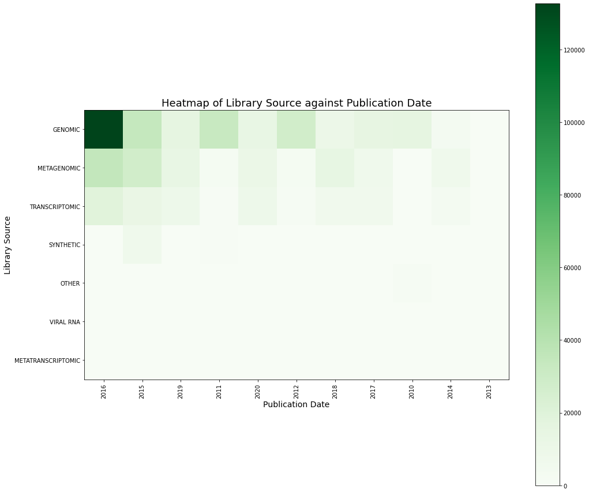

.. _quickstart:

##########
Quickstart
##########

===============
Install pysradb
===============

To install stable version using `pip`:

.. code-block:: bash

   pip install pysradb

Alternatively, you may use conda:

.. code-block:: bash

   conda install -c bioconda pysradb

This step will install all the dependencies.
If you have an existing environment with a lot of pre-installed packages,
conda might be `slow <https://github.com/bioconda/bioconda-recipes/issues/13774>`_.
Consider creating a new virtual enviroment for ``pysradb``:

.. code-block:: bash

   conda create -c bioconda -n pysradb PYTHON=3 pysradb

Installing pysradb from source files:

.. code-block:: bash

   pip install -U pandas tqdm requests xmltodict
   git clone https://github.com/saketkc/pysradb.git
   cd pysradb
   pip install -e .

==========================================================================

=============
Using pysradb
=============

Most features in pysradb are accessible both from the command-line and as
a python package. pysradb usage on the two platforms will be displayed by
selecting the corresponding tab below.

.. note:: If you have any questions along the way, please head over to the
    :doc:`python-api-usage`
    or the :doc:`cmdline`
    for more information. You may also wish to refer to the :doc:`commands`

---------------------------------------------------------------------------

|

**Retrieving metadata by accession number**:

.. tabs::

   .. code-tab:: console

        $ pysradb metadata SRP276671

   .. code-tab:: py

      from pysradb.sraweb import SRAweb

      db = SRAweb()
      df = db.sra_metadata('SRP016501')
      df

Output:
::

    study_accession experiment_accession    experiment_title        experiment_desc organism_taxid  organism_name   library_strategy        library_source  library_selection       sample_accession        sample_title    instrument      total_spots     total_size      run_accession   run_total_spots run_total_bases
    SRP276671       SRX8978626      hCov-19/Canada/ON/VIDO01/2020 (EPI ISL 413015)  hCov-19/Canada/ON/VIDO01/2020 (EPI ISL 413015)  2697049 Severe acute respiratory syndrome coronavirus 2 WGS     GENOMIC RT-PCR  SRS7233795      MinION  96202  79690689 SRR12486810     96202   86575096
    SRP276671       SRX8909137      hCoV-19/Canada/ON-VIDO-01/2020 (EPI_ISL_425177) hCoV-19/Canada/ON-VIDO-01/2020 (EPI_ISL_425177) 2697049 Severe acute respiratory syndrome coronavirus 2 WGS     GENOMIC RT-PCR  SRS7166526      Illumina MiSeq 866225   173474986       SRR12412952     866225  338457239

|

.. note:: `pysradb`, when used in python, returns the retrieved metadata as a
    `pandas` DataFrame, with all regular select/query operations available
    through `pandas`.

|

For more detailed metadata (including download URLs), we can include the
`detailed` flag:

.. tabs::

   .. code-tab:: console

        $ pysradb metadata SRP276671 --detailed

   .. code-tab:: py

      from pysradb.sraweb import SRAweb

      db = SRAweb()
      df = db.sra_metadata('SRP016501', detailed=True)
      df

Output:
::

    study_accession experiment_accession    experiment_title        experiment_desc organism_taxid  organism_name   library_strategy        library_source  library_selection       sample_accession        sample_title    instrument      total_spots     total_size      run_accession   run_total_spots run_total_bases run_alias       sra_url_alt     sra_url experiment_alias        isolate collected_by    collection_date geo_loc_name    host    host_disease    isolation_source       lat_lon  host_sex        host_subject_id passage_history BioSampleModel  sra_url_alt1    sra_url_alt2    sra_url_alt3   ena_fastq_http   ena_fastq_ftp
    SRP276671       SRX8978626      hCov-19/Canada/ON/VIDO01/2020 (EPI ISL 413015)  hCov-19/Canada/ON/VIDO01/2020 (EPI ISL 413015)  2697049 Severe acute respiratory syndrome coronavirus 2 WGS     GENOMIC RT-PCR  SRS7233795      N/A     MinION 96202    79690689        SRR12486810     96202   86575096        VIDO-01.tar.gz  https://sra-download.ncbi.nlm.nih.gov/traces/sra1/SRZ/012486/SRR12486810/VIDO-01.tar.gz https://sra-download.ncbi.nlm.nih.gov/traces/sra78/SRR/012194/SRR12486810       N/A     ON-VIDO-01-P3   Public Health Ontario   2020-01-23      Canada: Ontario Homo sapiens    COVID-19       missing  missing male    VIDO-01 Vero E6 P3      Pathogen.cl     N/A     N/A     N/A     http://ftp.sra.ebi.ac.uk/vol1/fastq/SRR124/010/SRR12486810/SRR12486810_1.fastq.gz       era-fasp@fasp.sra.ebi.ac.uk:vol1/fastq/SRR124/010/SRR12486810/SRR12486810_1.fastq.gz
    SRP276671       SRX8909137      hCoV-19/Canada/ON-VIDO-01/2020 (EPI_ISL_425177) hCoV-19/Canada/ON-VIDO-01/2020 (EPI_ISL_425177) 2697049 Severe acute respiratory syndrome coronavirus 2 WGS     GENOMIC RT-PCR  SRS7166526      N/A     Illumina MiSeq  866225  173474986       SRR12412952     866225  338457239       SP-2_R1.fastq.gz        N/A     https://sra-download.ncbi.nlm.nih.gov/traces/sra48/SRR/012122/SRR12412952       N/A     ON-VIDO-01-P2   Public Health Ontario   2020-01-23      Canada: Ontario Homo sapiens    COVID-19        missing missing male    VIDO-01 Vero E6 P2      Pathogen.cl    gs://sra-pub-src-10/SRR12412952/SP-2_R2.fastq.1  s3://sra-pub-src-10/SRR12412952/SP-2_R2.fastq.1 https://sra-pub-sars-cov2.s3.amazonaws.com/sra-src/SRR12412952/SP-2_R2.fastq.1  http://ftp.sra.ebi.ac.uk/vol1/fastq/SRR124/052/SRR12412952/SRR12412952.fastq.gz era-fasp@fasp.sra.ebi.ac.uk:vol1/fastq/SRR124/052/SRR12412952/SRR12412952.fastq.gz

---------------------------------------------------------------------------

|

**Searching SRA/ENA databases and retrieving metadata**:

Let's take for example we are interested in coronavirus sequences published
on Short Reads Archive (SRA) in the first week of August 2020.

.. tabs::

   .. code-tab:: console

        $ pysradb search -q coronavirus --publication-date 01-08-2020:07-08-2020 --max 10000

   .. code-tab:: py

      from pysradb.search import SraSearch

      instance = SraSearch(return_max=10000, query="coronavirus", publication_date="01-08-2020:07-08-2020")
      instance.search()
      instance.get_df()

Output (showing only the first 10 entries):
::

    study_accession  experiment_accession    experiment_title        sample_taxon_id sample_scientific_name  experiment_library_strategy     experiment_library_source       experiment_library_selection    sample_accession        sample_alias    experiment_instrument_model     pool_member_spots       run_1_size     run_1_accession  run_1_total_spots       run_1_total_bases       pmid
    SRP270658       SRX8679965      GSM4658808: SARS-CoV-2-infected 24h 3; Chlorocebus sabaeus; Severe acute respiratory syndrome coronavirus 2; RNA-Seq    60711   Chlorocebus sabaeus     RNA-Seq TRANSCRIPTOMIC  cDNA    SRS6959042      GSM4658808      NextSeq 500     104223040       9743267247      SRR12164500     104223040       31475358080     11295714
    SRP270658       SRX8679964      GSM4658807: SARS-CoV-2-infected 24h 2; Chlorocebus sabaeus; Severe acute respiratory syndrome coronavirus 2; RNA-Seq    60711   Chlorocebus sabaeus     RNA-Seq TRANSCRIPTOMIC  cDNA    SRS6959041      GSM4658807      NextSeq 500     92813819        8703506222      SRR12164499     92813819        28029773338     11295713
    SRP253798       SRX8677889      Severe acute respiratory syndrome coronavirus 2 2697049 Severe acute respiratory syndrome coronavirus 2 AMPLICON        VIRAL RNA       PCR     SRS6956975      hCoV-19/Australia/VIC1898/2020  NextSeq 500    456828   51422072        SRR12162149     456828  130280958       11292876
    SRP253798       SRX8677888      Severe acute respiratory syndrome coronavirus 2 2697049 Severe acute respiratory syndrome coronavirus 2 AMPLICON        VIRAL RNA       PCR     SRS6956974      hCoV-19/Australia/VIC1886/2020  NextSeq 500    268832   29923966        SRR12162150     268832  75885223        11292875
    SRP253798       SRX8677887      Severe acute respiratory syndrome coronavirus 2 2697049 Severe acute respiratory syndrome coronavirus 2 AMPLICON        VIRAL RNA       PCR     SRS6956973      hCoV-19/Australia/VIC1890/2020  NextSeq 500    483526   54629557        SRR12162151     483526  139019404       11292874
    SRP253798       SRX8677886      Severe acute respiratory syndrome coronavirus 2 2697049 Severe acute respiratory syndrome coronavirus 2 AMPLICON        VIRAL RNA       PCR     SRS6956971      hCoV-19/Australia/VIC1888/2020  NextSeq 500    473895   53675126        SRR12162152     473895  136058655       11292873
    SRP253798       SRX8677885      Severe acute respiratory syndrome coronavirus 2 2697049 Severe acute respiratory syndrome coronavirus 2 AMPLICON        VIRAL RNA       PCR     SRS6956972      hCoV-19/Australia/VIC1891/2020  NextSeq 500    482373   53331905        SRR12162153     482373  135769259       11292872
    SRP253798       SRX8677884      Severe acute respiratory syndrome coronavirus 2 2697049 Severe acute respiratory syndrome coronavirus 2 AMPLICON        VIRAL RNA       PCR     SRS6956970      hCoV-19/Australia/VIC1816/2020  NextSeq 550    357052   41111134        SRR12162154     357052  103693201       11292871
    SRP253798       SRX8677883      Severe acute respiratory syndrome coronavirus 2 2697049 Severe acute respiratory syndrome coronavirus 2 AMPLICON        VIRAL RNA       PCR     SRS6956969      hCoV-19/Australia/VIC1815/2020  NextSeq 550    307106   35306959        SRR12162155     307106  89866234        11292870
    SRP253798       SRX8677882      Severe acute respiratory syndrome coronavirus 2 2697049 Severe acute respiratory syndrome coronavirus 2 AMPLICON        VIRAL RNA       PCR     SRS6956968      hCoV-19/Australia/VIC1814/2020  NextSeq 550    353704   40652239        SRR12162156     353704  103366580       11292869

|

To query European Nucleotide Archive (ENA) instead:

.. tabs::

   .. code-tab:: console

        $ pysradb search --db ena -q coronavirus --publication-date 01-08-2020:07-08-2020 --max 10000

   .. code-tab:: py

      from pysradb.search import EnaSearch

      instance = EnaSearch(return_max=10000, query="coronavirus", publication_date="01-08-2020:07-08-2020")
      instance.search()
      instance.get_df()

Output (showing only the first 10 entries):
::

    study_accession experiment_accession    experiment_title        description     tax_id  scientific_name library_strategylibrary_source  library_selection       sample_accession        sample_title    instrument_model        run_accession  read_count       base_count
    PRJEB12126      ERX1264364      Illumina HiSeq 2000 sequencing; Analysis of coronavirus and infected host-cell gene expression through RNA sequencing and ribosome profiling    Illumina HiSeq 2000 sequencing; Analysis of coronavirus and infected host-cell gene expression through RNA sequencing and ribosome profiling    10090   Mus musculus    OTHER   TRANSCRIPTOMIC  other   SAMEA3708907    Sample 1        Illumina HiSeq 2000     ERR1190989      38883498        1161289538
    PRJEB12126      ERX1264365      Illumina HiSeq 2000 sequencing; Analysis of coronavirus and infected host-cell gene expression through RNA sequencing and ribosome profiling    Illumina HiSeq 2000 sequencing; Analysis of coronavirus and infected host-cell gene expression through RNA sequencing and ribosome profiling    10090   Mus musculus    OTHER   TRANSCRIPTOMIC  other   SAMEA3708908    Sample 10       Illumina HiSeq 2000     ERR1190990      55544297        1779600908
    PRJEB12126      ERX1264366      Illumina HiSeq 2000 sequencing; Analysis of coronavirus and infected host-cell gene expression through RNA sequencing and ribosome profiling    Illumina HiSeq 2000 sequencing; Analysis of coronavirus and infected host-cell gene expression through RNA sequencing and ribosome profiling    10090   Mus musculus    OTHER   TRANSCRIPTOMIC  other   SAMEA3708909    Sample 11       Illumina HiSeq 2000     ERR1190991      54474851        1713994365
    PRJEB12126      ERX1264367      Illumina HiSeq 2000 sequencing; Analysis of coronavirus and infected host-cell gene expression through RNA sequencing and ribosome profiling    Illumina HiSeq 2000 sequencing; Analysis of coronavirus and infected host-cell gene expression through RNA sequencing and ribosome profiling    10090   Mus musculus    OTHER   TRANSCRIPTOMIC  other   SAMEA3708910    Sample 12       Illumina HiSeq 2000     ERR1190992      78497711        2489092061
    PRJEB12126      ERX1264368      Illumina HiSeq 2000 sequencing; Analysis of coronavirus and infected host-cell gene expression through RNA sequencing and ribosome profiling    Illumina HiSeq 2000 sequencing; Analysis of coronavirus and infected host-cell gene expression through RNA sequencing and ribosome profiling    10090   Mus musculus    RNA-Seq TRANSCRIPTOMIC  RANDOM  SAMEA3708911    Sample 13       Illumina HiSeq 2000     ERR1190993      84955423        2627276298
    PRJEB12126      ERX1264369      Illumina HiSeq 2000 sequencing; Analysis of coronavirus and infected host-cell gene expression through RNA sequencing and ribosome profiling    Illumina HiSeq 2000 sequencing; Analysis of coronavirus and infected host-cell gene expression through RNA sequencing and ribosome profiling    10090   Mus musculus    RNA-Seq TRANSCRIPTOMIC  RANDOM  SAMEA3708912    Sample 14       Illumina HiSeq 2000     ERR1190994      75097651        2293097872
    PRJEB12126      ERX1264370      Illumina HiSeq 2000 sequencing; Analysis of coronavirus and infected host-cell gene expression through RNA sequencing and ribosome profiling    Illumina HiSeq 2000 sequencing; Analysis of coronavirus and infected host-cell gene expression through RNA sequencing and ribosome profiling    10090   Mus musculus    RNA-Seq TRANSCRIPTOMIC  RANDOM  SAMEA3708913    Sample 15       Illumina HiSeq 2000     ERR1190995      67177553        2060926619
    PRJEB12126      ERX1264371      Illumina HiSeq 2000 sequencing; Analysis of coronavirus and infected host-cell gene expression through RNA sequencing and ribosome profiling    Illumina HiSeq 2000 sequencing; Analysis of coronavirus and infected host-cell gene expression through RNA sequencing and ribosome profiling    10090   Mus musculus    RNA-Seq TRANSCRIPTOMIC  RANDOM  SAMEA3708914    Sample 16       Illumina HiSeq 2000     ERR1190996      62940694        2061757111
    PRJEB12126      ERX1264372      Illumina HiSeq 2000 sequencing; Analysis of coronavirus and infected host-cell gene expression through RNA sequencing and ribosome profiling    Illumina HiSeq 2000 sequencing; Analysis of coronavirus and infected host-cell gene expression through RNA sequencing and ribosome profiling    10090   Mus musculus    RNA-Seq TRANSCRIPTOMIC  RANDOM  SAMEA3708915    Sample 17       Illumina HiSeq 2000     ERR1190997      80591061        2475034240
    PRJEB12126      ERX1264373      Illumina HiSeq 2000 sequencing; Analysis of coronavirus and infected host-cell gene expression through RNA sequencing and ribosome profiling    Illumina HiSeq 2000 sequencing; Analysis of coronavirus and infected host-cell gene expression through RNA sequencing and ribosome profiling    10090   Mus musculus    RNA-Seq TRANSCRIPTOMIC  RANDOM  SAMEA3708916    Sample 18       Illumina HiSeq 2000     ERR1190998      68575621        2149386138

|

If the number of returned entries is large, it might be troublesome to
filter through the metadata to find any information of interest. As a
starting point, we can use the search feature to generate summary
statistics and graphs for the search result:

|

Statistics:

.. tabs::

   .. code-tab:: console

        $ pysradb search --db ena --organism "Severe acute respiratory syndrome coronavirus 2" --max 10000 -s

   .. code-tab:: py

      from pysradb.search import EnaSearch
      instance = EnaSearch(return_max=10000, organism="Severe acute respiratory syndrome coronavirus 2")
      instance.search()
      instance.show_result_statistics()

Output:
::

      Statistics for the search query:
      =================================
      Number of unique studies: 7
      Number of unique experiments: 10000
      Number of unique runs: 10000
      Number of unique samples: 9797
      Mean base count of samples: 238380171.626
      Median base count of samples: 164470138.000
      Sample base count standard deviation: 261654776.053
      Date range:
          2020-04:  1299
          2020-05:  2518
          2020-06:  6181
          2020-07:  2

      Organisms:
          Severe acute respiratory syndrome coronavirus 2:  10000

      Platform:
          ILLUMINA:  5175
          OXFORD_NANOPORE:  4825

      Library strategy:
          AMPLICON:  9789
          RNA-Seq:  1
          Targeted-Capture:  202
          WGS:  8

      Library source:
          GENOMIC:  8
          METATRANSCRIPTOMIC:  1
          TRANSCRIPTOMIC:  1
          VIRAL RNA:  9990

      Library selection:
          PCR:  9789
          RANDOM:  9
          other:  202

      Library layout:
          PAIRED:  5059
          SINGLE:  4941

|

Graphs:

.. tabs::

   .. code-tab:: console

        $ pysradb search --db ena -q e --max 500000 -g

   .. code-tab:: py

      from pysradb.search import EnaSearch

      instance = EnaSearch(return_max=500000, "e")
      instance.search()
      instance.visualise_results()

Output: Graphs generated will automatically be saved under `./search_plots/`.
Optionally, graphs can be shown in python by including the argument `show=True`
Here are some of the available graphs that will be generated:

.. image:: _static/e1.png
   :width: 600

.. image:: _static/e2.png
   :width: 600

---------------------------------------------------------------------------

|

**Downloading sequencing data**:

Downloading via accession number:

.. tabs::

   .. code-tab:: console

        $ pysradb download SRP098789

   .. code-tab:: py

      from pysradb.sraweb import SRAweb

      db = SRAweb()
      db.download("SRP098789")

|

It is also possible to pipe the dataframe from `metadata` or `search` to
download, after filtering the dataframe entries:

.. tabs::

   .. code-tab:: console

        $ pysradb metadata SRP276671 --detailed | pysradb download

   .. code-tab:: py

      from pysradb.sraweb import SRAweb
      db = SRAweb()
      df = db.sra_metadata('SRP016501', detailed=True)
      db.download(df=df)

|

Ultrafast fastq downloads:

With `aspera-client <https://downloads.asperasoft.com/en/downloads/8?list>`_ installed, `pysradb` can perform ultra fast downloads:

To download all original fastqs with `aspera-client` installed utilizing 8 threads:

.. tabs::

   .. code-tab:: console

        $ pysradb download -t 8 --use_ascp -p SRP002605

   .. code-tab:: py

      from pysradb.sraweb import SRAweb

      db = SRAweb()
      db.download("SRP098789", use_ascp=True, threads=8)

Refer to the notebook for `(shallow) time benchmarks <https://colab.research.google.com/github/saketkc/pysradb/blob/master/notebooks/08.pysradb_ascp_multithreaded.ipynb>`_.

---------------------------------------------------------------------------

|

**Converting between accession numbers**:

Convert SRP to SRX:

.. tabs::

   .. code-tab:: console

        $ pysradb srp-to-srx SRP098789

   .. code-tab:: py

      from pysradb.sraweb import SRAweb

      db = SRAweb()
      df = db.srp-to-srx("SRP098789")
      df

Output:
::

    study_accession experiment_accession    experiment_title        experiment_desc organism_taxid  organism_name   library_strategy        library_source  library_selection       sample_accession        sample_title    instrument      total_spots     total_size      run_accession   run_total_spots run_total_bases study_accesssion
    SRP098789       SRX2536428      GSM2476022: vehicle, 60 min, rep 5-mRNAseq; Homo sapiens; RNA-Seq       GSM2476022: vehicle, 60 min, rep 5-mRNAseq; Homo sapiens; RNA-Seq       9606    Homo sapiens    RNA-Seq TRANSCRIPTOMIC  cDNA    SRS1956378      Illumina HiSeq 2500     69422931        1545681856      SRR5227313      69422931        3540569481      SRP098789
    SRP098789       SRX2536427      GSM2476021: PF-06446846, 60 min, rep 5 -mRNA-seq; Homo sapiens; OTHER   GSM2476021: PF-06446846, 60 min, rep 5 -mRNA-seq; Homo sapiens; OTHER   9606    Homo sapiens    OTHER   TRANSCRIPTOMIC  other   SRS1956377      Illumina HiSeq 2500     58065134        1302369810      SRR5227312      58065134        2961321834      SRP098789
    SRP098789       SRX2536426      GSM2476020: vehicle, 60 min, rep 4-mRNAseq; Homo sapiens; RNA-Seq       GSM2476020: vehicle, 60 min, rep 4-mRNAseq; Homo sapiens; RNA-Seq       9606    Homo sapiens    RNA-Seq TRANSCRIPTOMIC  cDNA    SRS1956376      Illumina HiSeq 2500     63720205        1416818619      SRR5227311      63720205        3249730455      SRP098789
    SRP098789       SRX2536425      GSM2476019: PF-06446846, 60 min, rep 4 -mRNA-seq; Homo sapiens; OTHER   GSM2476019: PF-06446846, 60 min, rep 4 -mRNA-seq; Homo sapiens; OTHER   9606    Homo sapiens    OTHER   TRANSCRIPTOMIC  other   SRS1956375      Illumina HiSeq 2500     66363585        1482728577      SRR5227310      66363585        3384542835      SRP098789
    SRP098789       SRX2536424      GSM2476018: vehicle, 60 min, rep 5-Ribo-seq; Homo sapiens; RNA-Seq      GSM2476018: vehicle, 60 min, rep 5-Ribo-seq; Homo sapiens; RNA-Seq      9606    Homo sapiens    RNA-Seq TRANSCRIPTOMIC  cDNA    SRS1956374      Illumina HiSeq 2500     40062613        904488287       SRR5227309      40062613        2043193263      SRP098789
    SRP098789       SRX2536423      GSM2476017: 1.5 ?M PF-067446846, 60 min, rep 5 -riboseq; Homo sapiens; OTHER    GSM2476017: 1.5 ?M PF-067446846, 60 min, rep 5 -riboseq; Homo sapiens; OTHER    9606    Homo sapiens    OTHER   TRANSCRIPTOMIC other    SRS1956373      Illumina HiSeq 2500     65591217        1499668100      SRR5227308      65591217        3345152067      SRP098789
    SRP098789       SRX2536422      GSM2476016: Vehicle, 60 min, rep 4-ribo-seq; Homo sapiens; RNA-Seq      GSM2476016: Vehicle, 60 min, rep 4-ribo-seq; Homo sapiens; RNA-Seq      9606    Homo sapiens    RNA-Seq TRANSCRIPTOMIC  cDNA    SRS1956372      Illumina HiSeq 2500     66480991        1564636133      SRR5227307      66480991        3390530541      SRP098789
    SRP098789       SRX2536421      GSM2476015: 1.5 ?M PF-067446846, 60 min, rep 4 -riboseq; Homo sapiens; OTHER    GSM2476015: 1.5 ?M PF-067446846, 60 min, rep 4 -riboseq; Homo sapiens; OTHER    9606    Homo sapiens    OTHER   TRANSCRIPTOMIC other    SRS1956371      Illumina HiSeq 2500     57588015        1357395400      SRR5227306      57588015        2936988765      SRP098789
    SRP098789       SRX2536420      GSM2476014: vehicle, 60 min rep 3; Homo sapiens; OTHER  GSM2476014: vehicle, 60 min rep 3; Homo sapiens; OTHER  9606    Homo sapiens    OTHER   TRANSCRIPTOMIC  other   SRS1956370      Illumina HiSeq 2000    48405034 1530784033      SRR5227305      48405034        2420251700      SRP098789
    SRP098789       SRX2536419      GSM2476013: vehicle, 60 min rep 2; Homo sapiens; OTHER  GSM2476013: vehicle, 60 min rep 2; Homo sapiens; OTHER  9606    Homo sapiens    OTHER   TRANSCRIPTOMIC  other   SRS1956369      Illumina HiSeq 2000    47139057 1489018603      SRR5227304      47139057        2356952850      SRP098789
    SRP098789       SRX2536418      GSM2476012: vehicle, 60 min rep 1; Homo sapiens; OTHER  GSM2476012: vehicle, 60 min rep 1; Homo sapiens; OTHER  9606    Homo sapiens    OTHER   TRANSCRIPTOMIC  other   SRS1956368      Illumina HiSeq 2000    50956178 1495757884      SRR5227303      50956178        2547808900      SRP098789
    SRP098789       SRX2536417      GSM2476011: 0.3 ?M PF-067446846, 60 min, rep 3; Homo sapiens; OTHER     GSM2476011: 0.3 ?M PF-067446846, 60 min, rep 3; Homo sapiens; OTHER     9606    Homo sapiens    OTHER   TRANSCRIPTOMIC  other   SRS1956367      Illumina HiSeq 2000     44258180        1404548468      SRR5227302      44258180        2212909000      SRP098789
    SRP098789       SRX2536416      GSM2476010: 0.3 ?M PF-067446846, 60 min, rep 2; Homo sapiens; OTHER     GSM2476010: 0.3 ?M PF-067446846, 60 min, rep 2; Homo sapiens; OTHER     9606    Homo sapiens    OTHER   TRANSCRIPTOMIC  other   SRS1956366      Illumina HiSeq 2000     49129512        1536091510      SRR5227301      49129512        2456475600      SRP098789
    SRP098789       SRX2536415      GSM2476009: 0.3 ?M PF-067446846, 60 min, rep 1; Homo sapiens; OTHER     GSM2476009: 0.3 ?M PF-067446846, 60 min, rep 1; Homo sapiens; OTHER     9606    Homo sapiens    OTHER   TRANSCRIPTOMIC  other   SRS1956365      Illumina HiSeq 2000     30043362        903983724       SRR5227300      30043362        1502168100      SRP098789
    SRP098789       SRX2536414      GSM2476008: 1.5 ?M PF-067446846, 60 min, rep 3; Homo sapiens; OTHER     GSM2476008: 1.5 ?M PF-067446846, 60 min, rep 3; Homo sapiens; OTHER     9606    Homo sapiens    OTHER   TRANSCRIPTOMIC  other   SRS1956364      Illumina HiSeq 2000     48766213        1530350854      SRR5227299      48766213        2438310650      SRP098789
    SRP098789       SRX2536413      GSM2476007: 1.5 ?M PF-067446846, 60 min, rep 2; Homo sapiens; OTHER     GSM2476007: 1.5 ?M PF-067446846, 60 min, rep 2; Homo sapiens; OTHER     9606    Homo sapiens    OTHER   TRANSCRIPTOMIC  other   SRS1956363      Illumina HiSeq 2000     49334392        1475414353      SRR5227298      49334392        2466719600      SRP098789
    SRP098789       SRX2536412      GSM2476006: 1.5 ?M PF-067446846, 60 min, rep 1; Homo sapiens; OTHER     GSM2476006: 1.5 ?M PF-067446846, 60 min, rep 1; Homo sapiens; OTHER     9606    Homo sapiens    OTHER   TRANSCRIPTOMIC  other   SRS1956362      Illumina HiSeq 2000     60381365        1801283052      SRR5227297      60381365        3019068250      SRP098789
    SRP098789       SRX2536411      GSM2476005: vehicle, 10 min rep 3; Homo sapiens; OTHER  GSM2476005: vehicle, 10 min rep 3; Homo sapiens; OTHER  9606    Homo sapiens    OTHER   TRANSCRIPTOMIC  other   SRS1956361      Illumina HiSeq 2000    52737784 1644829192      SRR5227296      52737784        2636889200      SRP098789
    SRP098789       SRX2536410      GSM2476004: vehicle, 10 min rep 2; Homo sapiens; OTHER  GSM2476004: vehicle, 10 min rep 2; Homo sapiens; OTHER  9606    Homo sapiens    OTHER   TRANSCRIPTOMIC  other   SRS1956360      Illumina HiSeq 2000    46137148 1455541408      SRR5227295      46137148        2306857400      SRP098789
    SRP098789       SRX2536409      GSM2476003: vehicle, 10 min rep 1; Homo sapiens; OTHER  GSM2476003: vehicle, 10 min rep 1; Homo sapiens; OTHER  9606    Homo sapiens    OTHER   TRANSCRIPTOMIC  other   SRS1956359      Illumina HiSeq 2000    76002122 1552821132      SRR5227294      76002122        3800106100      SRP098789
    SRP098789       SRX2536408      GSM2476002: 0.3 ?M PF-067446846, 10 min, rep 3; Homo sapiens; OTHER     GSM2476002: 0.3 ?M PF-067446846, 10 min, rep 3; Homo sapiens; OTHER     9606    Homo sapiens    OTHER   TRANSCRIPTOMIC  other   SRS1956358      Illumina HiSeq 2000     42709138        1338829352      SRR5227293      42709138        2135456900      SRP098789
    SRP098789       SRX2536407      GSM2476001: 0.3 ?M PF-067446846, 10 min, rep 2; Homo sapiens; OTHER     GSM2476001: 0.3 ?M PF-067446846, 10 min, rep 2; Homo sapiens; OTHER     9606    Homo sapiens    OTHER   TRANSCRIPTOMIC  other   SRS1956357      Illumina HiSeq 2000     60552437        1875910244      SRR5227292      60552437        3027621850      SRP098789
    SRP098789       SRX2536406      GSM2476000: 0.3 ?M PF-067446846, 10 min, rep 1; Homo sapiens; OTHER     GSM2476000: 0.3 ?M PF-067446846, 10 min, rep 1; Homo sapiens; OTHER     9606    Homo sapiens    OTHER   TRANSCRIPTOMIC  other   SRS1956356      Illumina HiSeq 2000     41143319        843881081       SRR5227291      41143319        2057165950      SRP098789
    SRP098789       SRX2536405      GSM2475999: 1.5 ?M PF-067446846, 10 min, rep 3; Homo sapiens; OTHER     GSM2475999: 1.5 ?M PF-067446846, 10 min, rep 3; Homo sapiens; OTHER     9606    Homo sapiens    OTHER   TRANSCRIPTOMIC  other   SRS1956355      Illumina HiSeq 2000     40462973        1287284933      SRR5227290      40462973        2023148650      SRP098789
    SRP098789       SRX2536404      GSM2475998: 1.5 ?M PF-067446846, 10 min, rep 2; Homo sapiens; OTHER     GSM2475998: 1.5 ?M PF-067446846, 10 min, rep 2; Homo sapiens; OTHER     9606    Homo sapiens    OTHER   TRANSCRIPTOMIC  other   SRS1956354      Illumina HiSeq 2000     41657461        1360366732      SRR5227289      41657461        2082873050      SRP098789
    SRP098789       SRX2536403      GSM2475997: 1.5 ?M PF-067446846, 10 min, rep 1; Homo sapiens; OTHER     GSM2475997: 1.5 ?M PF-067446846, 10 min, rep 1; Homo sapiens; OTHER     9606    Homo sapiens    OTHER   TRANSCRIPTOMIC  other   SRS1956353      Illumina HiSeq 2000     42082855        916745706       SRR5227288      42082855        2104142750      SRP098789

|

Convert GSE to SRP:

.. tabs::

   .. code-tab:: console

        $ pysradb srp-to-srx SRP098789

   .. code-tab:: py

      from pysradb.sraweb import SRAweb

      db = SRAweb()
      df = db.srp-to-srx("SRP098789")
      df

Output:
::

    study_accession experiment_accession    experiment_title        experiment_desc organism_taxid  organism_name   library_strategy        library_source  library_selection       sample_accession        sample_title    instrument      total_spots     total_size      run_accession   run_total_spots run_total_bases study_accesssion
    SRP098789       SRX2536428      GSM2476022: vehicle, 60 min, rep 5-mRNAseq; Homo sapiens; RNA-Seq       GSM2476022: vehicle, 60 min, rep 5-mRNAseq; Homo sapiens; RNA-Seq       9606    Homo sapiens    RNA-Seq TRANSCRIPTOMIC  cDNA    SRS1956378      Illumina HiSeq 2500     69422931        1545681856      SRR5227313      69422931        3540569481      SRP098789
    SRP098789       SRX2536427      GSM2476021: PF-06446846, 60 min, rep 5 -mRNA-seq; Homo sapiens; OTHER   GSM2476021: PF-06446846, 60 min, rep 5 -mRNA-seq; Homo sapiens; OTHER   9606    Homo sapiens    OTHER   TRANSCRIPTOMIC  other   SRS1956377      Illumina HiSeq 2500     58065134        1302369810      SRR5227312      58065134        2961321834      SRP098789
    SRP098789       SRX2536426      GSM2476020: vehicle, 60 min, rep 4-mRNAseq; Homo sapiens; RNA-Seq       GSM2476020: vehicle, 60 min, rep 4-mRNAseq; Homo sapiens; RNA-Seq       9606    Homo sapiens    RNA-Seq TRANSCRIPTOMIC  cDNA    SRS1956376      Illumina HiSeq 2500     63720205        1416818619      SRR5227311      63720205        3249730455      SRP098789
    SRP098789       SRX2536425      GSM2476019: PF-06446846, 60 min, rep 4 -mRNA-seq; Homo sapiens; OTHER   GSM2476019: PF-06446846, 60 min, rep 4 -mRNA-seq; Homo sapiens; OTHER   9606    Homo sapiens    OTHER   TRANSCRIPTOMIC  other   SRS1956375      Illumina HiSeq 2500     66363585        1482728577      SRR5227310      66363585        3384542835      SRP098789
    SRP098789       SRX2536424      GSM2476018: vehicle, 60 min, rep 5-Ribo-seq; Homo sapiens; RNA-Seq      GSM2476018: vehicle, 60 min, rep 5-Ribo-seq; Homo sapiens; RNA-Seq      9606    Homo sapiens    RNA-Seq TRANSCRIPTOMIC  cDNA    SRS1956374      Illumina HiSeq 2500     40062613        904488287       SRR5227309      40062613        2043193263      SRP098789
    SRP098789       SRX2536423      GSM2476017: 1.5 ?M PF-067446846, 60 min, rep 5 -riboseq; Homo sapiens; OTHER    GSM2476017: 1.5 ?M PF-067446846, 60 min, rep 5 -riboseq; Homo sapiens; OTHER    9606    Homo sapiens    OTHER   TRANSCRIPTOMIC other    SRS1956373      Illumina HiSeq 2500     65591217        1499668100      SRR5227308      65591217        3345152067      SRP098789
    SRP098789       SRX2536422      GSM2476016: Vehicle, 60 min, rep 4-ribo-seq; Homo sapiens; RNA-Seq      GSM2476016: Vehicle, 60 min, rep 4-ribo-seq; Homo sapiens; RNA-Seq      9606    Homo sapiens    RNA-Seq TRANSCRIPTOMIC  cDNA    SRS1956372      Illumina HiSeq 2500     66480991        1564636133      SRR5227307      66480991        3390530541      SRP098789
    SRP098789       SRX2536421      GSM2476015: 1.5 ?M PF-067446846, 60 min, rep 4 -riboseq; Homo sapiens; OTHER    GSM2476015: 1.5 ?M PF-067446846, 60 min, rep 4 -riboseq; Homo sapiens; OTHER    9606    Homo sapiens    OTHER   TRANSCRIPTOMIC other    SRS1956371      Illumina HiSeq 2500     57588015        1357395400      SRR5227306      57588015        2936988765      SRP098789
    SRP098789       SRX2536420      GSM2476014: vehicle, 60 min rep 3; Homo sapiens; OTHER  GSM2476014: vehicle, 60 min rep 3; Homo sapiens; OTHER  9606    Homo sapiens    OTHER   TRANSCRIPTOMIC  other   SRS1956370      Illumina HiSeq 2000    48405034 1530784033      SRR5227305      48405034        2420251700      SRP098789
    SRP098789       SRX2536419      GSM2476013: vehicle, 60 min rep 2; Homo sapiens; OTHER  GSM2476013: vehicle, 60 min rep 2; Homo sapiens; OTHER  9606    Homo sapiens    OTHER   TRANSCRIPTOMIC  other   SRS1956369      Illumina HiSeq 2000    47139057 1489018603      SRR5227304      47139057        2356952850      SRP098789
    SRP098789       SRX2536418      GSM2476012: vehicle, 60 min rep 1; Homo sapiens; OTHER  GSM2476012: vehicle, 60 min rep 1; Homo sapiens; OTHER  9606    Homo sapiens    OTHER   TRANSCRIPTOMIC  other   SRS1956368      Illumina HiSeq 2000    50956178 1495757884      SRR5227303      50956178        2547808900      SRP098789
    SRP098789       SRX2536417      GSM2476011: 0.3 ?M PF-067446846, 60 min, rep 3; Homo sapiens; OTHER     GSM2476011: 0.3 ?M PF-067446846, 60 min, rep 3; Homo sapiens; OTHER     9606    Homo sapiens    OTHER   TRANSCRIPTOMIC  other   SRS1956367      Illumina HiSeq 2000     44258180        1404548468      SRR5227302      44258180        2212909000      SRP098789
    SRP098789       SRX2536416      GSM2476010: 0.3 ?M PF-067446846, 60 min, rep 2; Homo sapiens; OTHER     GSM2476010: 0.3 ?M PF-067446846, 60 min, rep 2; Homo sapiens; OTHER     9606    Homo sapiens    OTHER   TRANSCRIPTOMIC  other   SRS1956366      Illumina HiSeq 2000     49129512        1536091510      SRR5227301      49129512        2456475600      SRP098789
    SRP098789       SRX2536415      GSM2476009: 0.3 ?M PF-067446846, 60 min, rep 1; Homo sapiens; OTHER     GSM2476009: 0.3 ?M PF-067446846, 60 min, rep 1; Homo sapiens; OTHER     9606    Homo sapiens    OTHER   TRANSCRIPTOMIC  other   SRS1956365      Illumina HiSeq 2000     30043362        903983724       SRR5227300      30043362        1502168100      SRP098789
    SRP098789       SRX2536414      GSM2476008: 1.5 ?M PF-067446846, 60 min, rep 3; Homo sapiens; OTHER     GSM2476008: 1.5 ?M PF-067446846, 60 min, rep 3; Homo sapiens; OTHER     9606    Homo sapiens    OTHER   TRANSCRIPTOMIC  other   SRS1956364      Illumina HiSeq 2000     48766213        1530350854      SRR5227299      48766213        2438310650      SRP098789
    SRP098789       SRX2536413      GSM2476007: 1.5 ?M PF-067446846, 60 min, rep 2; Homo sapiens; OTHER     GSM2476007: 1.5 ?M PF-067446846, 60 min, rep 2; Homo sapiens; OTHER     9606    Homo sapiens    OTHER   TRANSCRIPTOMIC  other   SRS1956363      Illumina HiSeq 2000     49334392        1475414353      SRR5227298      49334392        2466719600      SRP098789
    SRP098789       SRX2536412      GSM2476006: 1.5 ?M PF-067446846, 60 min, rep 1; Homo sapiens; OTHER     GSM2476006: 1.5 ?M PF-067446846, 60 min, rep 1; Homo sapiens; OTHER     9606    Homo sapiens    OTHER   TRANSCRIPTOMIC  other   SRS1956362      Illumina HiSeq 2000     60381365        1801283052      SRR5227297      60381365        3019068250      SRP098789
    SRP098789       SRX2536411      GSM2476005: vehicle, 10 min rep 3; Homo sapiens; OTHER  GSM2476005: vehicle, 10 min rep 3; Homo sapiens; OTHER  9606    Homo sapiens    OTHER   TRANSCRIPTOMIC  other   SRS1956361      Illumina HiSeq 2000    52737784 1644829192      SRR5227296      52737784        2636889200      SRP098789
    SRP098789       SRX2536410      GSM2476004: vehicle, 10 min rep 2; Homo sapiens; OTHER  GSM2476004: vehicle, 10 min rep 2; Homo sapiens; OTHER  9606    Homo sapiens    OTHER   TRANSCRIPTOMIC  other   SRS1956360      Illumina HiSeq 2000    46137148 1455541408      SRR5227295      46137148        2306857400      SRP098789
    SRP098789       SRX2536409      GSM2476003: vehicle, 10 min rep 1; Homo sapiens; OTHER  GSM2476003: vehicle, 10 min rep 1; Homo sapiens; OTHER  9606    Homo sapiens    OTHER   TRANSCRIPTOMIC  other   SRS1956359      Illumina HiSeq 2000    76002122 1552821132      SRR5227294      76002122        3800106100      SRP098789
    SRP098789       SRX2536408      GSM2476002: 0.3 ?M PF-067446846, 10 min, rep 3; Homo sapiens; OTHER     GSM2476002: 0.3 ?M PF-067446846, 10 min, rep 3; Homo sapiens; OTHER     9606    Homo sapiens    OTHER   TRANSCRIPTOMIC  other   SRS1956358      Illumina HiSeq 2000     42709138        1338829352      SRR5227293      42709138        2135456900      SRP098789
    SRP098789       SRX2536407      GSM2476001: 0.3 ?M PF-067446846, 10 min, rep 2; Homo sapiens; OTHER     GSM2476001: 0.3 ?M PF-067446846, 10 min, rep 2; Homo sapiens; OTHER     9606    Homo sapiens    OTHER   TRANSCRIPTOMIC  other   SRS1956357      Illumina HiSeq 2000     60552437        1875910244      SRR5227292      60552437        3027621850      SRP098789
    SRP098789       SRX2536406      GSM2476000: 0.3 ?M PF-067446846, 10 min, rep 1; Homo sapiens; OTHER     GSM2476000: 0.3 ?M PF-067446846, 10 min, rep 1; Homo sapiens; OTHER     9606    Homo sapiens    OTHER   TRANSCRIPTOMIC  other   SRS1956356      Illumina HiSeq 2000     41143319        843881081       SRR5227291      41143319        2057165950      SRP098789
    SRP098789       SRX2536405      GSM2475999: 1.5 ?M PF-067446846, 10 min, rep 3; Homo sapiens; OTHER     GSM2475999: 1.5 ?M PF-067446846, 10 min, rep 3; Homo sapiens; OTHER     9606    Homo sapiens    OTHER   TRANSCRIPTOMIC  other   SRS1956355      Illumina HiSeq 2000     40462973        1287284933      SRR5227290      40462973        2023148650      SRP098789
    SRP098789       SRX2536404      GSM2475998: 1.5 ?M PF-067446846, 10 min, rep 2; Homo sapiens; OTHER     GSM2475998: 1.5 ?M PF-067446846, 10 min, rep 2; Homo sapiens; OTHER     9606    Homo sapiens    OTHER   TRANSCRIPTOMIC  other   SRS1956354      Illumina HiSeq 2000     41657461        1360366732      SRR5227289      41657461        2082873050      SRP098789
    SRP098789       SRX2536403      GSM2475997: 1.5 ?M PF-067446846, 10 min, rep 1; Homo sapiens; OTHER     GSM2475997: 1.5 ?M PF-067446846, 10 min, rep 1; Homo sapiens; OTHER     9606    Homo sapiens    OTHER   TRANSCRIPTOMIC  other   SRS1956353      Illumina HiSeq 2000     42082855        916745706       SRR5227288      42082855        2104142750      SRP098789

===========================================================================

==============================================
The full list of possible `pysradb` operations
==============================================

::

    $ pysradb
    usage: pysradb [-h] [--version] [--citation]
                   {metadb,metadata,download,search,gse-to-gsm,gse-to-srp,gsm-to-gse,gsm-to-srp,gsm-to-srr,gsm-to-srs,gsm-to-srx,srp-to-gse,srp-to-srr,srp-to-srs,srp-to-srx,srr-to-gsm,srr-to-srp,srr-to-srs,srr-to-srx,srs-to-gsm,srs-to-srx,srx-to-srp,srx-to-srr,srx-to-srs}
                   ...

    pysradb: Query NGS metadata and data from NCBI Sequence Read Archive.
    Citation: 10.12688/f1000research.18676.1

    optional arguments:
      -h, --help            show this help message and exit
      --version             show program's version number and exit
      --citation            how to cite

    subcommands:
      {metadb,metadata,download,search,gse-to-gsm,gse-to-srp,gsm-to-gse,gsm-to-srp,gsm-to-srr,gsm-to-srs,gsm-to-srx,srp-to-gse,srp-to-srr,srp-to-srs,srp-to-srx,srr-to-gsm,srr-to-srp,srr-to-srs,srr-to-srx,srs-to-gsm,srs-to-srx,srx-to-srp,srx-to-srr,srx-to-srs}
        metadb              Download SRAmetadb.sqlite
        metadata            Fetch metadata for SRA project (SRPnnnn)
        download            Download SRA project (SRPnnnn)
        search              Search SRA/ENA for matching text
        gse-to-gsm          Get GSM for a GSE
        gse-to-srp          Get SRP for a GSE
        gsm-to-gse          Get GSE for a GSM
        gsm-to-srp          Get SRP for a GSM
        gsm-to-srr          Get SRR for a GSM
        gsm-to-srs          Get SRS for a GSM
        gsm-to-srx          Get SRX for a GSM
        srp-to-gse          Get GSE for a SRP
        srp-to-srr          Get SRR for a SRP
        srp-to-srs          Get SRS for a SRP
        srp-to-srx          Get SRX for a SRP
        srr-to-gsm          Get GSM for a SRR
        srr-to-srp          Get SRP for a SRR
        srr-to-srs          Get SRS for a SRR
        srr-to-srx          Get SRX for a SRR
        srs-to-gsm          Get GSM for a SRS
        srs-to-srx          Get SRX for a SRS
        srx-to-srp          Get SRP for a SRX
        srx-to-srr          Get SRR for a SRX
        srx-to-srs          Get SRS for a SRX

.. toctree::
   :maxdepth: 1

   commands/download
   commands/metadata
   commands/search
   commands/gse-to-gsm
   commands/gse-to-srp
   commands/srp-to-gse
   commands/srp-to-srr
   commands/srp-to-srs
   commands/srp-to-srx
   commands/srr-to-srs
   commands/srr-to-srx
   commands/srs-to-srx
   commands/srx-to-srr
   commands/srx-to-srs

